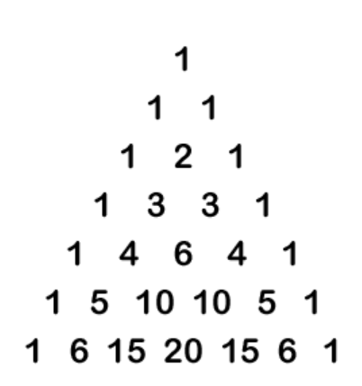
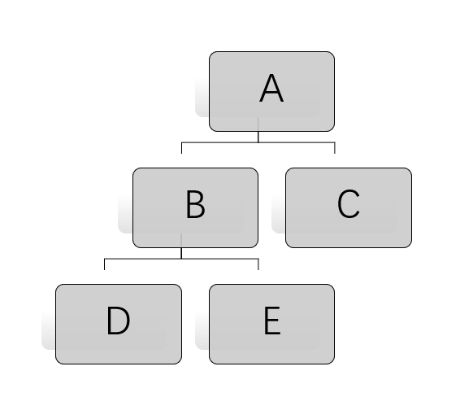
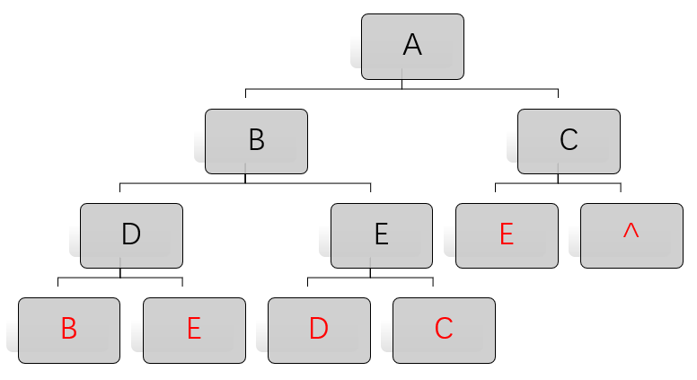
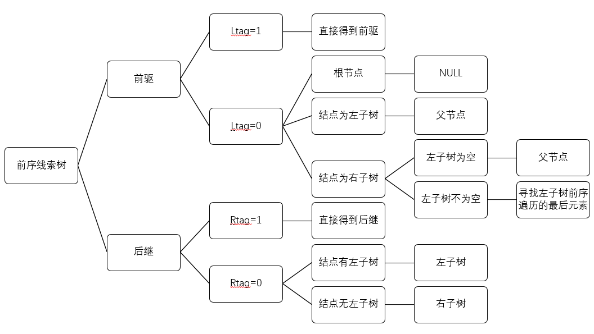
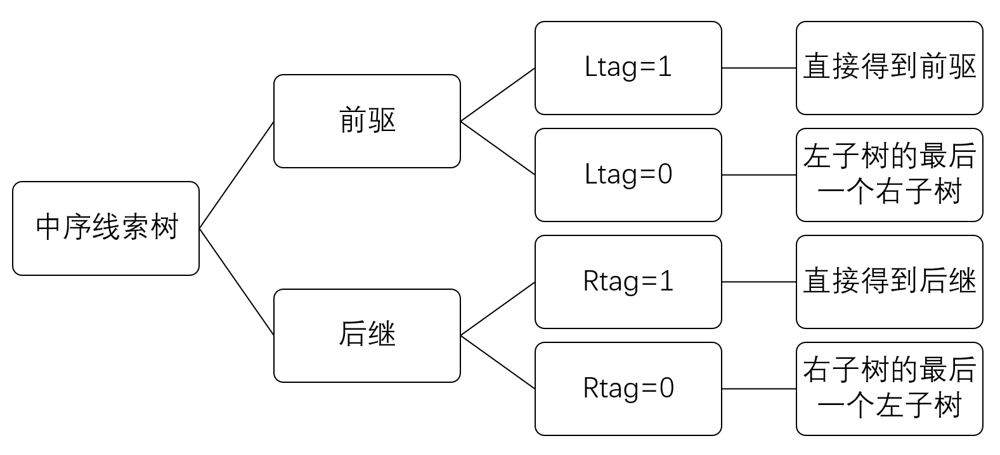
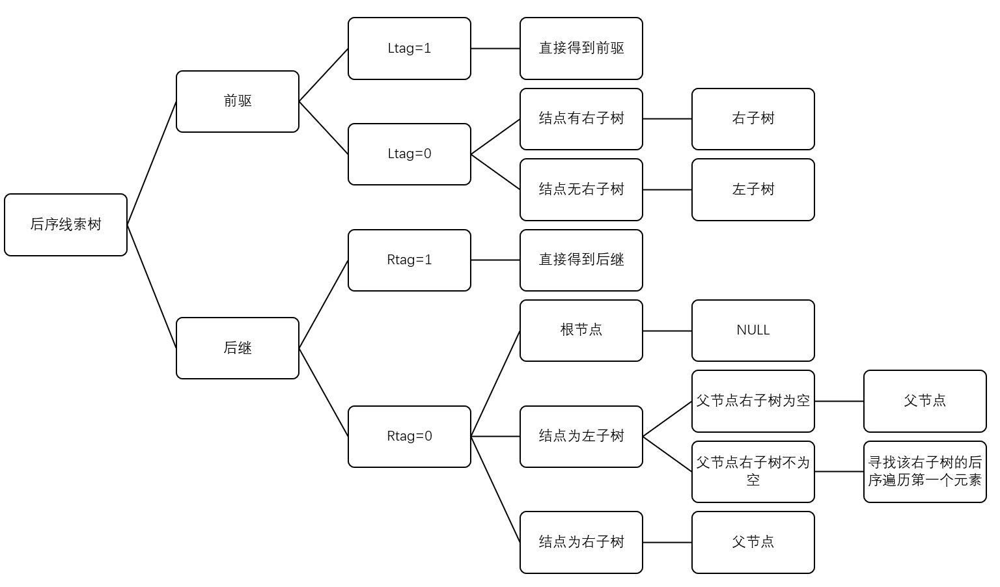
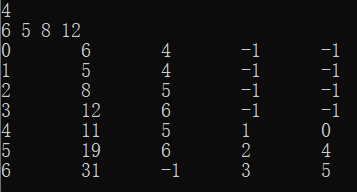

# 引言

这篇博文记录大二数据结构与算法课程的内容，不定时更新。

# 栈

## 一、Ackerman函数

 Ackerman函数有$A(n,m)$有两个独立的整变量$m\ge0,n\ge0$，其定义如下

$A(1,0)=2$

$A(0,m)=1 ,m\ge0$

$A(n,0)=n+2, n\ge2$

$A(n,m)=A(A(n-1,m),m-1), n\ge1且m\ge1$

根据定义式可以简单地写出它的递归代码：

```cpp
int Ackerman(int n,int m){
  if(n<0 || m<0)return -1;	//无定义
	if(n==1 && m==0)return 2;
	if(n==0)return 1;
	if(m==0)return n+2;
  return Ackerman(Ackerman(n-1,m),m-1);
}
```


# 字符串

## 一、子串定位：KMP算法

### 1、算法思路

定义主串串为**目标串S**，子串为**模式串P**。在朴素模式匹配算法中，每次匹配不成功之后，模式串只是向后移动1位，即存在**大量回溯**；我们可以利用**部分匹配**的结果，让模式串在不匹配时可以往后移动**尽量远**的距离，减少匹配次数。

KMP算法只针对模式串进行分析，对模式串求出数组Next[j]，在模式串第j位比较失败之后利用Next[j]得到往后移几位。

Next数组的实质是找模式串中的最长相同的前缀和后缀（前缀不包括最后一个字符，后缀不包括第一个字符），实际意义为**k=模式串第j位前的子串最长相同的前缀和后缀的长度+1**，即将子串移动至第k位再次进行比较，如图所示。


$$
Next[j] =\begin{cases}
0, j=1时 \\
Max \{ k | 1<k<j \ and\  p_1p_2…p_{k-1}= p_{j-k+1}…p_{j-1} \} \\
1,其它情况 
\end{cases}
$$

| j          | 1    | 2    | 3    | 4    | 5    | 6    | 7    |
| ---------- | ---- | ---- | ---- | ---- | ---- | ---- | ---- |
| S          | a    | b    | a    | c    | a    | b    | c    |
| Next[j]    | 0    | 1    | 1    | 2    | 1    | 2    | 3    |
| NextVal[j] | 0    | 1    | 0    | 2    | 0    | 1    | 3    |

根据上式，假设我们已经求出了next[j]数组，再将下标j按照C++的规则从0开始，就可以得到KMP算法的基本代码：

```cpp
int KMP(string s,string t){
	int i=0,j=0;
	int n=s.size(),m=t.size();
	while(i<n && j<m){
		if(j==-1 || s[i]==t[j]){
			i++;
			j++；
		}
		else{
			j=next[j];
		}
	}
	if(j==m)return i-j;
	else return -1;
}

```

### 2、Next数组

我们的代码依赖了数组next[j]，next数组的定义上面已经说明，但它的求法更加精妙，首先我们贴出它的代码：

```cpp
/*
这个算法得出的next[i]为最长前后缀的长度，即代表最长前缀的下一个字符的位置
*/
void getNext(string s){
    next[0]=-1;
    next[1]=0;
    int i=2;//i代表填充next数组的i位置
    int cn=0;//cn始终代表字符串i-1位置前面的字符串的最长前缀的下一个字符的位置
    while (i<s.size()){
  	  if(s[i-1]==s[cn])//如果字符串i-1位置上的字符等于字符串cn位置上的字符的话，直接在next[i]的基础上加1即可
  	 	 next[i++]=++cn;
 	  else if(cn>0)//这个条件满足，说明可以往前跳，让cn往前跳
         cn=next[cn];
  	  else
  	 	 next[i++]=0;//字符串i位置前面的字符串没有前缀
  	  }
}
```

以abacabc为例：

0. next[0]=-1
1. next[1]=0
2. i=2，cn=0，s[1]!=s[0]，且cn==0，next[2]=0
3. i=3，cn=0，s[2]==s[0]，next[3]=++cn=1
4. i=4，cn=1，s[3]!=s[1]，且cn>0，cn=next[1]=0，重复一次循环，i=4，cn=0，s[3]!=s[0]，next[4]=0
5. i=5，cn=0，s[4]==s[0]，next[4]=++cn=1
6. i=6，cn=0，s[5]==s[0]，next[5]=++cn=2

比较难理解的为`cn=next[cn]`这段代码，实际为将当前前缀长度跳回到cn这一字符的最长前缀，由于next[cn]的前后缀必相同，只需继续再次比较cn与i-1的字符即可，如图：


### 3、NextVal数组

观察s[4],当它不匹配时，按照next行回溯到s[1]也为字母a，这时再匹配a是徒劳的，因为已知a不匹配，所以就继续退回到s[1]字母a的next[1]=0。为了进行优化，就有了nextval:

若要求nextval[i]，将next[i]的值对应的位的值与i的值进行比较：
若相等，nextval[i]=nextval[ next[i] ]；
若不相等，则nextval[i]=next[i]。

代码如下：

```cpp
int get_nextval(string T){
//求模式串T的next函数修正值并存入数组nextval。
	for(int i=1;i<T.size();i++){
		if(T[next[i]] == T[i])
			nextval[i]=nextval[next[i]];
		else nextval[i]=next[i];
	}
}//get_nextval
```

***


# 数组

## 一、快速转置算法

### 1、稀疏矩阵的三元组存储

矩阵本身的数据：行、列、元素个数

矩阵元素的数据：行序号、列序号、元素值

```cpp
struct Triple{ 
  int I,j;
  elementtype e;
};	//矩阵元素

struct TSMatrix{
	Triple data[Max+1];
  int mu,nu,tu;
}; //矩阵
```

而由于稀疏矩阵的数据排列是行对齐的（根据行的顺序排列），所以如果进行转置，需要重新对数据进行排列，快速转置则是在尽可能少次数地遍历矩阵的情况下完成转置。

### 2、算法思路

首先我们给出一个$5\times5$的稀疏矩阵：

数组data |5/行|5/列|6/元素个数
-|-|-|-
0|1 |1| 3
1|1| 5| 7
2 |2| 3 |-1
3 |3 |1 |-1
4 |3| 2 |-2
5 |5 |4 |2

经过转置后，它的排列需要是这样：

数组data |5/行|5/列|6/元素个数
-|-|-|-
0|1| 1| 3
1| 1 |3| -1
2 |2 |3 |-2
3 |3 |2 |-1
4 |4 |5 |2
5 |5| 1 |7

为了预先确定矩阵M中的**每一列的第一个非零元素在数组中的位置**，需要先求得矩阵M中的**每一列中非零元素的个数**。为此，需要设置两个一维数组num[1..n]和cpot[1..n]，其中n为**矩阵列数**。

- num[]：储存每一列非零元素的个数

- cpot[]：储存每一列的**第一个**非零元素在数组中的位置

通过这两个数组，我们可以在仅遍历数组两次的情况下完成矩阵的转置：

1. 在第一次遍历时，通过对列的遍历，我们可以得到num[]。
2. cpot[1]=0
   cpot[col]=cpot[col-1]+num[col-1]
3. 第二次遍历即可根据cpot开始元素的转置：每读取一个元素，若列为i，则将行列调换，放入新的data[cpot[data[i].j]]]之中，并将cpot[i]+1。
4. 完成第二次遍历，完成算法。

### 3、代码实现

```cpp
TSMatrix trans(TSMatrix mat){
	TSMatrix nmat;
	nmat.mu=mat.nu;
	nmat.nu=mat.mu;
	nmat.tu=mat.tu;
	int num[10]={0};
	int cpot[mat.nu];
	for(int i=0;i<mat.tu;i++){
		num[mat.data[i].j]++;
	}
	cpot[0]=0;
	for(int i=1;i<mat.nu;i++){
		cpot[i]=cpot[i-1]+num[i-1];
	}
	for(int i=0;i<mat.tu;i++){
		nmat.data[cpot[mat.data[i].j]].I=mat.data[i].j;
		nmat.data[cpot[mat.data[i].j]].j=mat.data[i].I;
		nmat.data[cpot[mat.data[i].j]].e=mat.data[i].e;
		cpot[mat.data[i].j]++;
	}
	return nmat;
}
```
## 二、求杨辉三角系数

### 1、数学模型

杨辉三角是二项式系数在三角形中的一种几何排列，即我们熟知的二项式系数$(a+b)^n=C^0_na^n+C^1_na^{n-1}b^1+\dots+C^n_nb^n$中的$C^k_n$。



如图，对于n次二项式，设第一行为n=0的系数，则n次二项式共有n+1个系数，设为0~n。

那么，我们可以发现，对于每一个n，$a_n[0]=a_n[n]=1$，且对于$0<k<n$，$a_n[k]=a_{n-1}[k-1]+a_{n-1}[k]$。

### 2、代码实现

这样一来，建立一个数组进行递归计算，可以简单的求出n次二项式的二次项系数。

```cpp
void coff(int *a,int n){ //arr的大小为n+1
	if(n==1){
		a[0]=a[1]=1;
	}
	else{
		coff(a,n-1);
		a[n]=1;
		for(int i=n-1;i>0;i--){ //从最后一个开始，可以直接修改数组内容且不影响计算
			a[i]=a[i]+a[i-1];
		}
	}
}
```

### 3、测试函数

```cpp
#define N 10
int arr[N+1];
 
int main()
{
   	coff(arr,N);
		for(int i=0;i<=N;i++){
			cout<<arr[i]<<endl;
		} 
    return 0;
}
```

# 树

## 一、树的存储设计

### 1、双亲表示法（数组）

简单的数组储存，数组内容为：

| adr  | info | parent |
| ---- | ---- | ------ |
| 0    | A    | -1     |
| 1    | B    | 0      |
| 2    | C    | 0      |
| 3    | D    | 2      |

```cpp
class Tree{
		elemtype info;
    int par;
};
```

### 2、子女表示法（链表）

每个元素对应一个child链表，按顺序指向每一个孩子：

| adr  | info | child  |
| ---- | ---- | ------ |
| 0    | A    | ->1->2 |
| 1    | B    | ^      |
| 2    | C    | ->3    |
| 3    | D    | ^      |

```cpp
class Tree{
		elemtype info;
    node* child;
};
```

### 3、子女兄弟表示法

每个元素拥有两个指针，一个指向它的第一个孩子，另一个指向它的下一个兄弟：

| FirstChild | info | NextSibling |
| ---------- | ---- | ----------- |
| B          | A    | ^           |
| ^          | B    | C           |
| D          | C    | ^           |
| ^          | D    | ^           |

```cpp
class  TreeNode{
		elemtype info;
    TreeNode *FirstChild,*NextSibling;
};
```

## 二、二叉树遍历

### 1、二叉树存储结构：

```cpp
class TreeNode{
	elemtype data;
  TreeNode *lchild,*rchild;
  TreeNode(elemtype D,TreeNode *lc=NULL,TreeNode *rc=NULL){
  	data=D;
  	lchild=lc;
  	rchild=rc;
  }
};
```

### 2、遍历：

```cpp
/*
前序遍历
*/
void PreTra(TreeNode *T){
    if(T==NULL)return;
    cout<<T->data;//此处对结点进行操作
    PreTra(T->lchild);
    PreTra(T->rchild);
    return;
}
```
```cpp
/*
中序遍历
*/
void InTra(TreeNode *T){
    if(T==NULL)return;
    InTra(T->lchild);
    cout<<T->data;//此处对结点进行操作
    InTra(T->rchild);
    return;
}
```
```cpp
/*
后序遍历
*/
void PosTra(TreeNode *T){
    if(T==NULL)return;
    PosTra(T->lchild);
    PosTra(T->rchild);
    cout<<T->data;//此处对结点进行操作
    return;
}
```
除了先序遍历、中序遍历、后序遍历外，还可以对二叉树进行**层序遍历**。层序遍历就是从所在二叉树的根节点出发，自上而下，自左至右逐层访问树的结点的过程。

层序遍历的实现需要利用队列结构，首先将**根节点入队**，当队列中有元素时，执行以下操作：将队首元素出队，**对该元素进行操作，并将该元素的左子树、右子树依次入队。**

层序遍历并不需要用到递归。

```cpp
/*
层序遍历
*/
void LevelTra(TreeNode *T){
    if(T==NULL)return;
    queue<TreeNode*> Q;
    Q.push(T);
    while(!Q.empty()){
    		TreeNode *S=Q.front();
    		Q.pop();
    		cout<<S->data;//对元素进行操作
    		if(S->lchild))Q.push(S->lchild);
    		if(S->rchild))Q.push(S->rchild);
    }
    return;
}
```

## 三、线索二叉树

### 1、存储设计

线索二叉树的存储与普通二叉树类似，但是左指针、右指针多了标识符`rtag`和，`ltag`，当`rtag`为1时，`rchild`表示后继，当`rtag`为0时，`rchild`表示右子树，左标识符同理。总而言之，**只利用二叉树的空指针表示线索**。

对一个确定的二叉树，分别有前序、中序、后序三种线索树，以下列二叉树为例：



它的前序遍历为ABDEC，则其前序线索树为：



### 2、线索化

```cpp
/*
假设已经构建好二叉树T，构建中序线索树
*/
TreeNode *pre=NULL;//用于前驱线索的构建
void InitTheading(Tree *T){
		if(T){
				InitTheading(T->lchild);
				//L
				if(T->ltag==1) T->lchild=pre;//前驱
				if(pre && pre->rtag==1) pre->rchild=T;//后继
				pre=t;
				//N
				InitTheading(T->lchild);
				//R
		}
		return;
}
```

线索化代码需要注意的细节是前驱后继的处理，这里使用了全局变量pre存储当前操作结点的前驱，并以此得到**结点T的前驱**与**结点pre的后继**。

为了得到前序/后序线索树，只需要将上述代码的LNR交换位置。

### 3、任一结点前驱后继的查找

对**前序线索树**来说，判断流程如下：



```cpp
//前驱：
  if (p->ltag==1) pre=p->lchild;
  else //如图
//后继：
  if (p->rtag==1) next=p->rchild;
  else{
      if (p->ltag==0) next=p->lchild;
      else next=p->rchild;
  }
```

对**中序线索树**来说，判断流程如下：



```cpp
//前驱：
  if (p->ltag==1) pre=p->lchild;
  else {
  		pre=p->lchild;
  		while(pre->rchild){
  				pre=pre->rchild;
      }
  }
//后继：
  if (p->rtag==1) next=p->rchild;
  else{
      next=p->rchild;
  		while(next->lchild){
  				next=next->lchild;
      }
  }
```

对**后序线索树**来说，判断流程如下：



```cpp
//前驱：
  if (p->ltag==1) pre=p->lchild;
  else {
  	if(p->rtag==0)pre=p->rchild;
  	else pre=p->lchild;
  }
//后继：
  if (p->rtag==1) next=p->rchild;
  else //如图
```

## 四、哈夫曼树

给定N个权值作为N个叶子结点，构造一棵二叉树，若该树的带权路径长度达到最小，称这样的二叉树为哈夫曼树(Huffman Tree)。哈夫曼树是带权路径长度最短的树，权值较大的结点离根较近。

哈夫曼树可用于编码，在编码时，让使用频率高的用短码，使用频率低的用长码，以优化整个编码。

其带权路径长度可以表示为$WPL=\sum_{k=1}^nw_kl_k$

### 1、存储设计

为了得到哈夫曼树，我们需要使用一种存储方式存储各个结点，为了便于算法计算，我们利用如下的结构作为结点：

```cpp
class TreeNode{
		int weight;
		int par;
		int lc,rc;
};
```
而且我们知道，当一棵哈夫曼树有$N$个叶结点时，它的结点总数为$2N-1$，所以数组`TreeNode arr[2*n-1]`就是我们的哈夫曼树。

### 2、算法描述

假设我们得到了如下的叶结点，我们要一步一步构造哈夫曼树：

| Adr  | weight | par  | lc   | rc   |
| ---- | ------ | ---- | ---- | ---- |
| 0    | 6      | -1   | -1   | -1   |
| 1    | 5      | -1   | -1   | -1   |
| 2    | 8      | -1   | -1   | -1   |
| 3    | 12     | -1   | -1   | -1   |
| 4    | 0      | -1   | -1   | -1   |
| 5    | 0      | -1   | -1   | -1   |
| 6    | 0      | -1   | -1   | -1   |

为了得到每一个结点，我们需要做如下步骤：

* 找到当前已有结点（0~k）中**无父结点中**最小的两个结点A、B，令其父节点为第k+1个结点。
* 第k+1个结点的权值为A与B的权值之和，令其左右子结点分别为A、B。
* 更新已有结点个数：k+=1。
* 将以上步骤循环n-1次，得到n-1个新结点，完成构造。

以上面为例，给出每一步的结果：

| Adr  | weight | par  | lc   | rc   |
| ---- | ------ | ---- | ---- | ---- |
| 0    | 6      | 4    | -1   | -1   |
| 1    | 5      | 4    | -1   | -1   |
| 2    | 8      | -1   | -1   | -1   |
| 3    | 12     | -1   | -1   | -1   |
| 4    | 11     | -1   | 0    | 1    |
| 5    | 0      | -1   | -1   | -1   |
| 6    | 0      | -1   | -1   | -1   |


| Adr  | weight | par  | lc   | rc   |
| ---- | ------ | ---- | ---- | ---- |
| 0    | 6      | 4    | -1   | -1   |
| 1    | 5      | 4    | -1   | -1   |
| 2    | 8      | 5    | -1   | -1   |
| 3    | 12     | -1   | -1   | -1   |
| 4    | 11     | 5    | 0    | 1    |
| 5    | 19     | -1   | 2    | 4    |
| 6    | 0      | -1   | -1   | -1   |


| Adr  | weight | par  | lc   | rc   |
| ---- | ------ | ---- | ---- | ---- |
| 0    | 6      | 4    | -1   | -1   |
| 1    | 5      | 4    | -1   | -1   |
| 2    | 8      | 5    | -1   | -1   |
| 3    | 12     | 6    | -1   | -1   |
| 4    | 11     | 5    | 0    | 1    |
| 5    | 19     | 6    | 2    | 4    |
| 6    | 31     | -1   | 3    | 5    |

### 3、代码实现

```cpp
#include <iostream>
#include <string>
#include <algorithm>

using namespace std;
 
class TreeNode{
	public:
	int info,par,lc,rc;
	TreeNode(){
     info=0; 
	 par=lc=rc=-1;
	}
};

void FindMin(int &min1,int &min2,int k,TreeNode *num){
//找到当前已有结点（0~k）中无父结点中最小的两个结点A、B
	for(int i=0;i<k;i++){
		if(num[i].par==-1){
			if(num[min1].info>num[i].info){
				min1=i;
			}
		}
	}
	for(int i=0;i<k;i++){
		if(num[i].par==-1 && i!=min1){
			if(num[min2].info>num[i].info){
				min2=i;
			}
		}
	}
	return;
}

int main(){
  int n;
	cin>>n;
	TreeNode num[2*n-1];
	for(int i=0;i<n;i++){
		cin>>num[i].info;
	}
	num[2*n-1].info=1000;
	int min1=2*n-1,min2=2*n-1;
	for(int i=0;i<n-1;i++){
	//- 更新已有结点个数：k+=1,将以上步骤循环n-1次.
		FindMin(min1,min2,n+i,num);
		num[min1].par=n+i;
		num[min2].par=n+i;
		num[n+i].info=num[min1].info+num[min2].info;
		num[n+i].lc=min1;
		num[n+i].rc=min2;
//第k+1个结点的权值为A与B的权值之和，令其左右子结点分别为A、B。
		min1=min2=2*n-1;
	}
	for(int i=0;i<2*n-1;i++){
		cout<<i<<"\t"<<num[i].info<<"\t"<<num[i].par<<"\t"<<num[i].lc<<"\t"<<num[i].rc<<endl;
	}
  return 0;
}
```

得到的输出和上面的表格相同



## 五、AVL树

