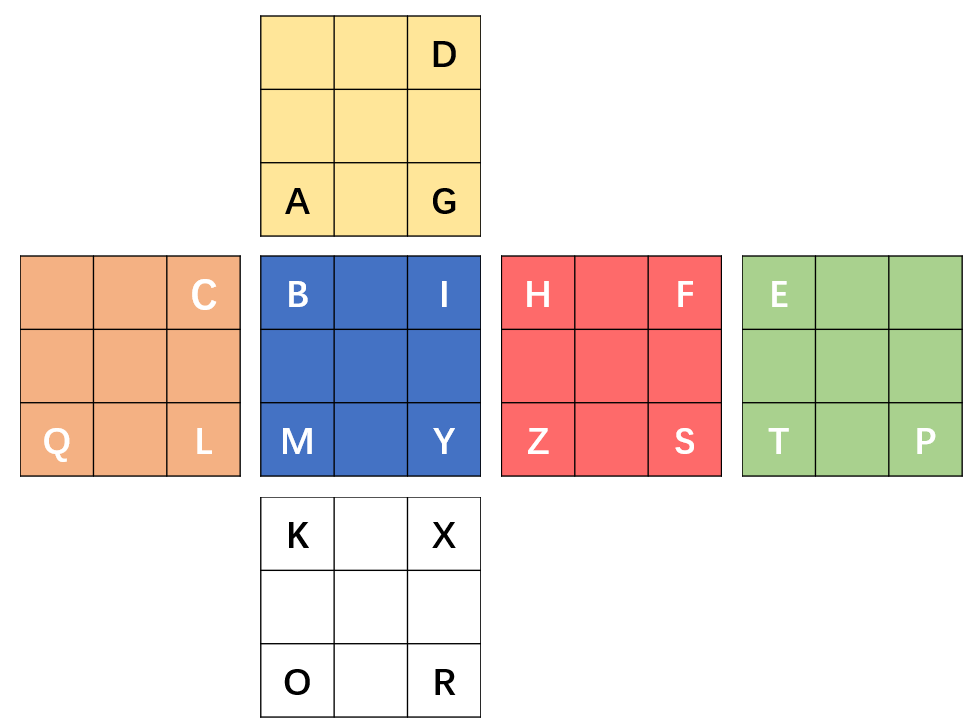
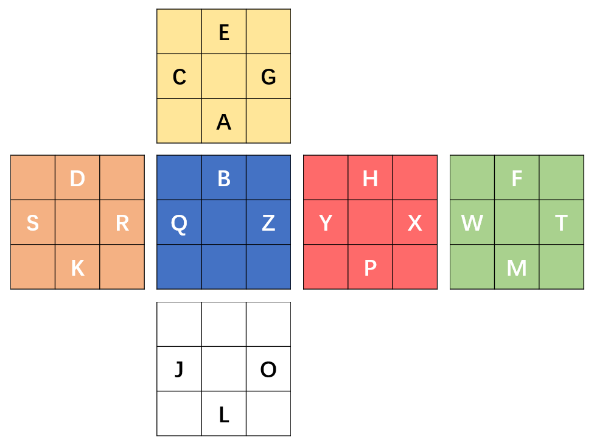

***

# 引言

三盲的练习总是断断续续的，每次想练三盲，总得花很多时间去找以前的编码方式和公式之类的，这次直接将自己三盲的方法直接记录在这里，便于以后的自己查阅。

## 一、编码方式

角块编码：

棱块编码：

## 二、公式

棱块：

将对应的面移动至E的位置，且保持**除E所对应棱块之外的M层所有棱块**不变。

角块：

将对应的面移动至Z的位置，且转动时**只转动R、D、F三层**。

## 三、、记忆方式

记忆时先棱后角，还原时先角后棱。

棱块使用联想记忆，角块直接读音记忆。

## 四、奇偶校验

如果出现奇偶校验，

