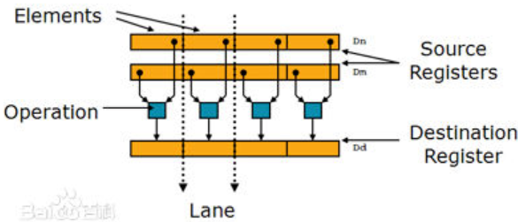
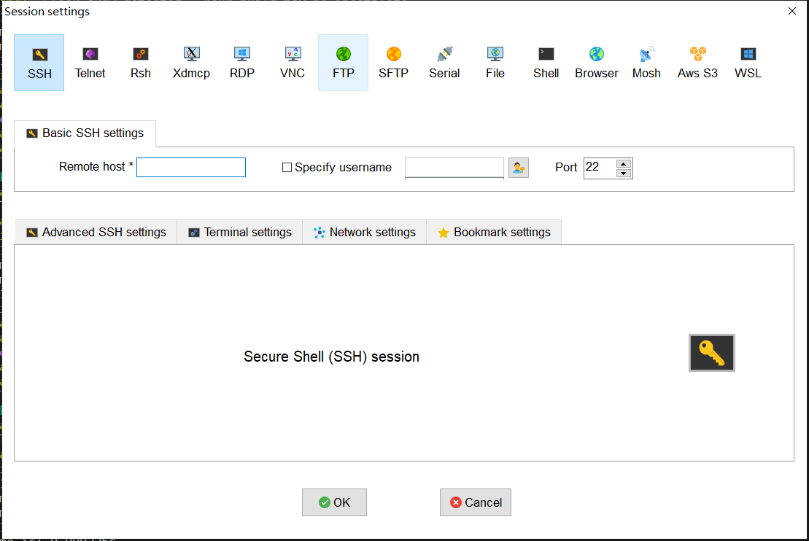
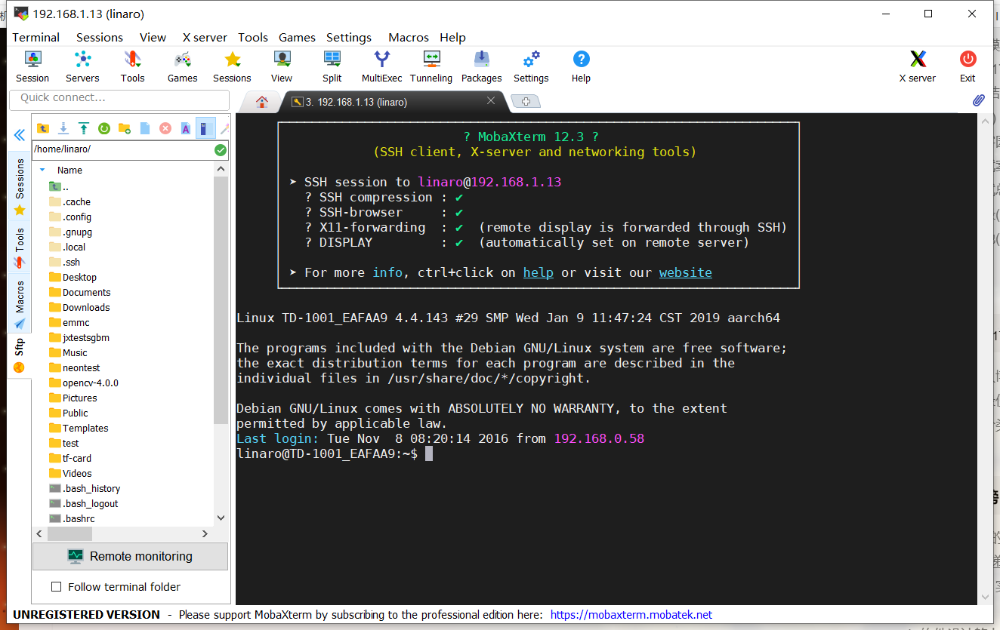

# 前言

这几个星期在实验室里的任务是**对OpenCV源码里某部分代码使用NEON指令集进行优化**，在实际操作的过程中对OpenCV环境的配置、NEON指令集、OpenCV源码都有了一定的理解，在这里将所学到的知识分享出来。

## 一、NEON指令集

### 1、概念

NEON是ARM架构下的一种优化的指令集，主要是为了实现SIMD（Single Instruction Multiple Data，单指令多数据流），简单来说就是将多个操作数打包在大型寄存器中、在一条指令下**同时操作多个操作数**的指令集。在处理一些**简单、重复性高的**算法的时候，可以并行处理，大大提高效率。



### 2、数据类型、基本操作

为了更加直观地理解NEON指令集的功能，我们先介绍几个NEON的基本数据类型与操作函数，然后给出一个简单的例子，说明NEON是如何进行性能优化的。

#### 数据类型：

NEON的数据类型遵循以下的命名格式：`type size x num _t` ，其中：

- type：数据类型，int、uint、float
- size：每个元素的数据长度，整型长度为8、16、32、64，浮点型为32。
- num：元素个数，在NEON中，每个寄存器都是64位或者128位，即size与num的乘积必须为64或128。

比如`uint32x4_t`为由4个32位无符号整型组成的128位寄存器，`float32x2_t`为由4个32位浮点数组成的64位寄存器。

#### 操作函数：

NEON指令的一般格式为：

`v op dt_type`。其中：

- v：NEON函数的标记符；
- op：操作，add、sub、and等；
- dt：表示所操作寄存器等长度，当寄存器为64位，dt为空；当寄存器为128位，dt为q；
- type：对应数据类型的缩写，比如u8（uint8）、s16（int16）、f32（float32）。


Neon支持加减乘除、比较大小、左移右移、绝对值、加载保存数值、拆分、组合等操作。

例如，将两个uint8x16_t的寄存器相加，最终返回一个uint8x16_t的寄存器，函数原型如下：

```cpp
uint8x16_t vaddq_u8 (uint8x16_t __a, uint8x16_t __b);
```

下面再给出几个常用的函数：

```cpp
int8x8_t vsub_s8 (int8x8_t __a, int8x8_t __b);
//减法，ri = ai - bi

int32x2_t vld1_s32 (const int32_t * __a);
//从内存a取出数据至寄存器中

void vst1_f32 (float32_t * __a, float32x2_t __b);
//把寄存器b中的数据存入内存a中

int16x4_t vdup_n_s16 (int16_t __a);
//将寄存器中的数据初始化为常数，ri = a
```

### 3、简单例子

那么接下来，我们直接给出一个例子，来看看NEON是如何进行并行优化的：

```cpp
#include <opencv2/opencv.hpp>
#include<iostream>
#include<pthread.h>
#include <ctime>

using namespace std;
using namespace cv;

int main()
{
/*
普通的for循环
*/
    clock_t startTime,endTime;
    startTime = clock();//计时开始  
    for(int m=0; m<10000; m++){
        short num[8] = {1,2,3,4,5,6,7,8};
        for(int i=0; i<8; i++){
            num[i] += 12;
        }
    }
    endTime = clock();//计时结束
    cout << "The run time without neon is: \t" <<(double)(endTime - startTime) / CLOCKS_PER_SEC << "s" << endl;

/*
使用NEON指令集
*/
    startTime = clock();//计时开始  
    for(int m=0; m<10000; m++){
        short num[8] = {1,2,3,4,5,6,7,8};
        int16x8_t v0,v1;
        v0 = vld1q_s16(num); //将数组num中的数存入NEON寄存器v0
        v1 = vdupq_n_s16(12); //将8个常数12存入NEON寄存器v1
        v0 = vaddq_s16(v0, v1); //加法操作
        vst1q_s16(num, v0); //将NEON寄存器v0的值存回数组num中
    }
    endTime = clock();//计时结束
    cout << "The run time with neon is: \t" <<(double)(endTime - startTime) / CLOCKS_PER_SEC << "s" << endl;
    return 0;
}
```
输出结果：


可以看到在简单的for循环中使用NEON进行并行优化，运行速度有了大幅度提升。

由于OpenCV环境里内置了NEON指令集，只需要在搭建了OpenCV的环境下引用头文件`<opencv2/opencv.hpp>`即可使用NEON指令集。

如果需要查找NEON函数，可以参考以下[知乎链接](https://zhuanlan.zhihu.com/p/24702989)或者[电子书](http://images.china-pub.com/ebook4705001-4710000/4707250/ch02.pdf)。

同时，OpenCV源码里对NEON指令集又进行了一层封装，也有了更多功能的函数可以使用，封装好的NEON函数和数据类型可以在[OpenCV官网](https://docs.opencv.org/3.4/df/d91/group__core__hal__intrin.html#ga0ddb5e64df5fa0633f13c32bbfac4378)中查找到。


## 二、OpenCV环境配置

这次的实验环境为搭载了ubuntu系统的RK3399的嵌入式开发板，我需要先通过远程连接到开发板的操作系统，在操作系统中安装好OpenCV的环境并打开NEON指令集。

远程连接主要使用`WinSCP`和`MobaXterm`两个软件，下面简单介绍一下它的用法：

#### WinSCP：

它的主要功能是在本地与远程计算机间安全的复制文件，支持与其它系统，比如linux系统的连接。


登录后即可查看到远程计算机中的文件，并进行传输等操作。


#### MobaXterm：

它也是一个远程连接工具，单击左上角的**Session**按钮，选择**SSH**选项并填写相关信息进行登录，登录后可以就看到控制台界面和图形化界面，并在上面进行操作了。





远程连接到开发板上，接下来开始搭建OpenCV环境。

### 1、安装依赖包

使用`sudo apt-get install`命令安装cmake和所需依赖包，代码如下：

```
sudo apt-get install cmake
sudo apt-get install build-essential libgtk2.0-dev libavcodec-dev libavformat-dev libjpeg.dev libtiff4.dev libswscale-dev libjasper-dev
```

安装依赖包的过程中，发现`libjasper-dev`依赖包无法成功安装，报错为：

```
errorE: unable to locate libjasper-dev
```

解决方法是安装另一个依赖包，命令如下，其中`libjasper1`是`libjasper-dev`的依赖包：

```
sudo add-apt-repository "deb http://security.ubuntu.com/ubuntu xenial-security main"
sudo apt update
sudo apt install libjasper1 libjasper-dev
```

### 2、下载OpenCV库

OpenCV库只需要到[官网](https://opencv.org/releases/)下载即可，这里我们选择了OpenCV4.0.0版本，下载其`source`版本；在Ubuntu系统上，也可以使用命令下载：

```
git clone https://github.com/Itseez/opencv.git
git clone https://github.com/Itseez/opencv_contrib.git
```

如果是直接通过官网下载，得到压缩文件后复制到准备安装的目录中，解压，进入opencv目录，开始下一步操作。

### 3、编译、执行

在opencv目录中，我们先执行`mkdir build`命令创建一个编译文件夹`build`，进入编译文件夹中，cmake一下。

```cmake
cmake -D CMAKE_INSTALL_PREFIX=/usr/local -D CMAKE_BUILD_TYPE=Release -D OPENCV_EXTRA_MODULES_PATH=../opencv_contrib/modules ..
```

接下来是耗时最长的步骤，执行编译（-j4是同时进行四线程操作，可以加速编译）：

```
sudo make -j4
```

编译完成后，执行安装命令：

```
sudo make install
```

执行完毕后，OpenCV编译过程就结束了。

### 4、配置环境


### 5、测试

程序测试下：
首先建立一个文件夹`OpenCV_Code`，下面新建一个cpp文件，名为`test.cpp`

```cpp
#include <stdio.h>
#include <opencv2/opencv.hpp>
using namespace cv;
int main(int argc, char** argv )
{
    if ( argc != 2 )
    {
        printf("usage: DisplayImage.out <Image_Path>\n");
        return -1;
    }
    Mat image;
    image = imread( argv[1], 1 );
    if ( !image.data )
    {
        printf("No image data \n");
        return -1;
    }
    namedWindow("Display Image", WINDOW_AUTOSIZE );
    imshow("Display Image", image);
    waitKey(0);
    return 0;
}
```

再此文件夹下继续新建一个文件，名为 `CMakeLists.txt`：

```cmake
cmake_minimum_required(VERSION 2.8)
project( test )
find_package( OpenCV REQUIRED )
add_executable( test test.cpp )
target_link_libraries( test ${OpenCV_LIBS} )
```

之后在此文件夹下命令行执行： 

```
cmake .
make
```
此时OpenCV_Code文件夹中已经产生了可执行文件test，找一张图片命名为t.jpg放在OpenCV_Code下，运行：

```
./test t.jpg
```

如果弹出窗口显示图片，那么我们的OpenCV环境配置成功。

同样，我们可以测试NEON指令集是否打开，将cpp代码修改为上面给出的NEON例子，重新执行`make`和`./test`指令，如果成功运行，说明NEON指令集已经打开。

在实际配置环境的时候我还是花了不少时间，在配置时遇到了存储空间不足、操作权限不够等问题，在长时间的编译那一步时，有时还因为和开发板的连接中断而需要重来。最后在师兄的帮助下成功完成了环境配置，开始代码优化和测试。

## 三、OpenCV源码

这次需要修改的OpenCV源码，是在**双目匹配**的**图像校正**步骤中使用到的`remap`函数。简单来说，在执行`remap`函数之前，我们已经通过计算得到了关于图像的一个映射，`remap`函数是**将映射应用到实际图像上的一步操作**。

可以想象，根据一个函数对一幅图像进行映射，里面一定涉及大量重复的计算操作（例如在一个区域内对每一个像素点进行统一的操作），代码中重复计算的部分可以使用NEON进行优化提速。

对`remap`函数和相关步骤更细致的介绍可以看[我的这篇博文](https://437436999.github.io/2019/12/18/%E5%8F%8C%E7%9B%AE%E5%8C%B9%E9%85%8D/)里图像矫正的那部分。

### 1、修改内容

`remap`函数定义的位置为`opencv-4.0.0\modules\imgproc\src\imgwarp.cpp`，文件中，而其中使用了一个`RemapInvoker`的类，这个类的括号运算符重载`operator()`是我们修改的目标，同样位于当前文件中。

重载函数中最外层有几个for循环，如下：

```cpp
//first
short* XY = bufxy.ptr<short>(y1);
const short* sXY = m1->ptr<short>(y+y1) + x*2;
const ushort* sA = m2->ptr<ushort>(y+y1) + x;
x1 = 0;
for( ; x1 < bcols; x1++ )
{
  int a = sA[x1] & (INTER_TAB_SIZE2-1);
  XY[x1*2] = sXY[x1*2] + NNDeltaTab_i[a][0];
  XY[x1*2+1] = sXY[x1*2+1] + NNDeltaTab_i[a][1];
}

//second
short* XY = bufxy.ptr<short>(y1);
const float* sX = m1->ptr<float>(y+y1) + x;
const float* sY = m2->ptr<float>(y+y1) + x;
x1 = 0;
for( ; x1 < bcols; x1++ )
{
  XY[x1*2] = saturate_cast<short>(sX[x1]);
  XY[x1*2+1] = saturate_cast<short>(sY[x1]);
}

//third
bufxy = (*m1)(Rect(x, y, bcols, brows));
const ushort* sA = m2->ptr<ushort>(y+y1) + x;
x1 = 0;
for( ; x1 < bcols; x1++ ){
	A[x1] = (ushort)(sA[x1] & (INTER_TAB_SIZE2-1));
}

//forth
const float* sX = m1->ptr<float>(y+y1) + x;
const float* sY = m2->ptr<float>(y+y1) + x;
x1 = 0;
for( ; x1 < bcols; x1++ )
{
  int sx = cvRound(sX[x1]*INTER_TAB_SIZE);
  int sy = cvRound(sY[x1]*INTER_TAB_SIZE);
  int v = (sy & (INTER_TAB_SIZE-1))*INTER_TAB_SIZE + (sx & (INTER_TAB_SIZE-1));
  XY[x1*2] = saturate_cast<short>(sx >> INTER_BITS);
  XY[x1*2+1] = saturate_cast<short>(sy >> INTER_BITS);
  A[x1] = (ushort)v;
}

//fifth
const float* sXY = m1->ptr<float>(y+y1) + x*2;
x1 = 0;

for( ; x1 < bcols; x1++ )
{
  int sx = cvRound(sXY[x1*2]*INTER_TAB_SIZE);
  int sy = cvRound(sXY[x1*2+1]*INTER_TAB_SIZE);
  int v = (sy & (INTER_TAB_SIZE-1))*INTER_TAB_SIZE + (sx & (INTER_TAB_SIZE-1));
  XY[x1*2] = saturate_cast<short>(sx >> INTER_BITS);
  XY[x1*2+1] = saturate_cast<short>(sy >> INTER_BITS);
  A[x1] = (ushort)v;
}
```

### 2、使用NEON进行修改

在后来对函数的分析的时候，发现外层的for循环有几个已经在源码中进行了NEON优化，最后决定尝试对还没被优化过的第一个循环进行优化：

```cpp
//first
short* XY = bufxy.ptr<short>(y1);
const short* sXY = m1->ptr<short>(y+y1) + x*2;
const ushort* sA = m2->ptr<ushort>(y+y1) + x;
x1 = 0;
for( ; x1 < bcols; x1++ )
{
  int a = sA[x1] & (INTER_TAB_SIZE2-1);
  XY[x1*2] = sXY[x1*2] + NNDeltaTab_i[a][0];
  XY[x1*2+1] = sXY[x1*2+1] + NNDeltaTab_i[a][1];
}
```

不过在分析这一部分的优化可能性中，又发现了一个难点：它在每一个循环中都计算得出了一个变量`a`，而变量`a`又作为`NNDeltaTab_i`的地址使用，这样导致访问的数据不是连续的。**在上面对NEON的介绍中，我们也知道NEON更多的是对地址连续的数据进行并行操作**，这也让这部分代码的优化变得比较难。

为了解决这一问题，我们找到了一个OpenCV封装的NEON函数：`v_lut()`，


```cpp
#if CV_SIMD128

int mod = bcols % 16;

for( ; x1 < mod; x1++ )
{
  int a = sA[x1] & (INTER_TAB_SIZE2-1);
  XY[x1*2] = sXY[x1*2] + NNDeltaTab_i[a][0];
  XY[x1*2+1] = sXY[x1*2+1] + NNDeltaTab_i[a][1];
}
v_uint16x8 v = v_setall_u16(INTER_TAB_SIZE2-1);

for( ; x1 < bcols; x1+=16 ){
  v_uint16x8 v0 = v_load(sA + x1);
  v0 = v0 & v;//对应int a = sA[x1] & (INTER_TAB_SIZE2-1);
  v_uint16x8 v2 = v_load(sA + x1 + 8);
  v2 = v2 & v;//对应int a = sA[x1] & (INTER_TAB_SIZE2-1);

  v_int16x8 vX1,vY1;
  v_load_deinterleave(sXY + x1 * 2, vX1, vY1);//间隔取出sXY
  v_int16x8 vX2,vY2;
  v_load_deinterleave(sXY + (x1 + 8) * 2, vX2, vY2);//间隔取出sXY

  v_int8x16 temp1 = v_lut_X(NNDeltaTab_i,v0,v2,0);
  v_int16x8 tX1,tX2;
  v_expand(temp1, tX1, tX2);//8x16 => 16x8 + 16x8

  tX1 = tX1 + vX1;
  tX2 = tX2 + vX2;//对应sXY[x1*2] + NNDeltaTab_i[a][0];

  v_int8x16 temp2 = v_lut_X(NNDeltaTab_i,v0,v2,1);
  v_int16x8 tY1,tY2;
  v_expand(temp2, tY1, tY2);//8x16 => 16x8 + 16x8

  tY1 = tY1 + vY1;
  tY2 = tY2 + vY2;//对应sXY[x1*2+1] + NNDeltaTab_i[a][1];

  v_store_interleave(XY + x1 * 2, tX1, tY1);//存回XY
  v_store_interleave(XY + (x1 + 8) * 2, tX2, tY2);//存回XY
}

#endif
```

