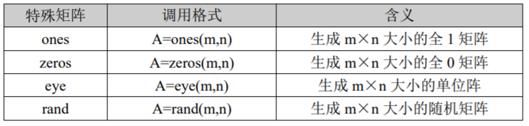
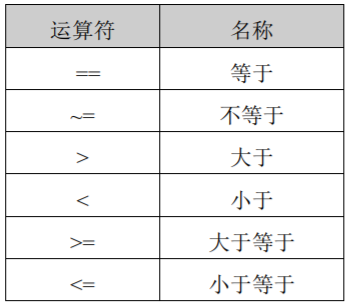
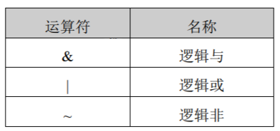
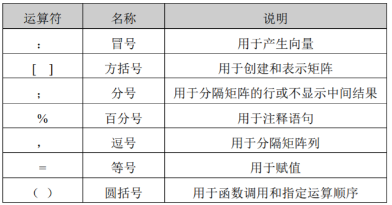
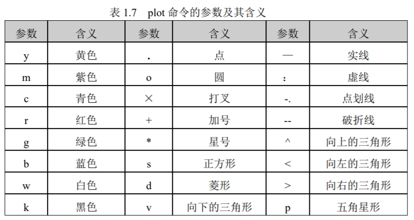
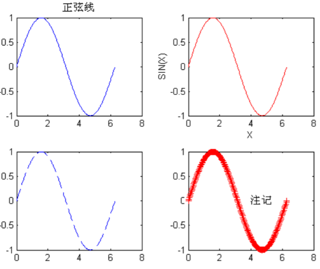
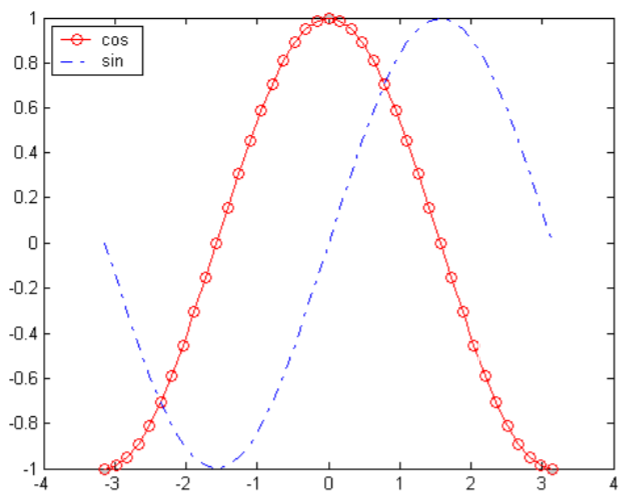

## 指令

` 表达式 ;`：不显示运算结果（指令之后加上分号`;`，不显示计算结果。）

` clc`：清屏

` help window`：帮助菜单，可输入`help 关键字`查询

## 算术运算

- 三角函数：sin(),cos(),tan()
- 开方：sqrt()
- 对数：log(),log2(),log10()
- e：exp(1)

## 变量

变量：大小写敏感，以字母开头，**关键词不能作为变量名。**声明方式：` A=10`<br>
` who`：查看变量信息<br>
` whos`：查看变量详细信息<br>
` clear Variable`：**移除变量**Variable<br>
` clear`：清除所有变量<br>`A = ‘string’`：字符赋值

变量优先级：
- Variable
- Built-in function
- Subfunction
- Private function:
• MEX-file
• P-file
• M-file

## 关键词

预定义变量名 | 含义
-|-
ans | 计算结果变量名
pi | Π 
eps | 计算机最小数，当数字小于该值，认为为0（2.2204e-016） 
inf/Inf | 正无穷 
NaN/nan | not a number，常为0/0、∞/∞ 
i/j | 虚数单位，$\sqrt{-1}$ 
why | 提供问题的简洁回答 

` iskeyword`：查看关键词


## 格式设定

Style | Result| Example
-|-|-
short| Short, fixed-decimal format with 4 digits after thedecimal point.|3.1416
long |Long, fixed-decimal format with 15 digits after the decimalpoint fordouble values, and 7 digits afterthe decimal point for single values.|3.141592653589793
shortE| Short scientific notation with 4 digits after thedecimal point.|3.1416e+00
longE| Long scientific notation with 15 digits after thedecimal point fordouble values, and 7 digits after the decimal point for single values.|3.14159265358979e+00
bank |Currency format with 2 digits after the decimalpoint.|3.14
hex |Hexadecimal representation of a binary doubleprecisionnumber.|400921fb54442d18
rat| Ratio of small integers. |355/113

` format Style`：设定数字显示格式

## 向量、矩阵

### 1、输入：

` A=[1 2 3 4]` $[1,2,3,4]$

` A=[1;2;3;4]` $\begin{bmatrix}1 \\ 2 \\ 3 \\ 4\end{bmatrix}$ 

```matlab
A = [
1 2 3 4
5 6 7 8
9 10 11 12
]
B = [ 1 2 3; 4 5 6; 7 8 9]
```

$A=\begin{bmatrix}a_{11} & a_{12} & \cdots  & a_{1n} \\ a_{21} & a_{22} & \cdots  & a_{2n} \\ \cdots & \cdots & \cdots  & \cdots\\ a_{n1} & a_{n2} & \cdots  & a_{nn}\end{bmatrix}$

### 2、特殊矩阵：



### 3、矩阵元素：

`A(i,j)` **先行后列**（元素从1开始）

```matlab
对矩阵A = [
1 2 3 4
5 6 7 8
9 10 11 12
]

A(1,2)=2
A(4)=2
A([1 2 4])=[1 5 2]
A([1,2;1,2])=[1 5;1 5]
A([1 2],[1 2])=[1 2;5 6]
//第1、2行和第1、2列的交集
```

### 4、数组运算：

| 运算符 | 名称 | 含义                |
| ------ | ---- | ------------------- |
| +      | 加   | A+B                 |
| -      | 减   | A-B                 |
| *      | 乘   | A*B，需满足乘法条件 |
| ^      | 乘方 | A^B，B为常数        |
| \      | 左除 | Ax = B的解          |
| /      | 右除 | xB = A的解          |
| .*     |      |                     |
| .^     |      |                     |
| .\     |      |                     |
| ./     |      |                     |
| ,      |      |                     |








### 5、特殊函数：

1）size( )函数

size( )函数用于计算矩阵的行数和列数，其调用格式为：

d=size(a) 将矩阵 a 的行数和列数赋值给变量 

d[m,n]=size(a) 将矩阵 a 的行数赋值给 m、列数赋值给 n

2）length( )函数

length( )函数用于计算矩阵的长度（列数），其调用格式为：

a= length(b) 将矩阵 b 的列数赋值给变量 a

3）sum( )函数

sum( )函数用于实现矩阵元素的求和运算，其调用格式为：

sum(a) 若 a 为向量，则该调用格式将计算出向量 a 所有元素之和。若 a 为矩阵，则该调用格式将产生一行向量，其元素分别为矩阵 a 的各列元素之和。

4）max( )函数

max ( )函数用于求出矩阵元素的最大值，其调用格式为：

max (a) 若 a 为向量，则该调用格式求出向量 a 所有元素的最大值。若 a 为矩阵，则

该调用格式将产生一行向量，其元素分别为矩阵 a 的各列元素的最大值。

## 文件

### 1、数据文件

数据文件格式.mat

```
save 路径\文件名 变量名
保存数据，多个数据可用空格隔开
例：save c:\my a b
```

```
load 路径
读取数据文件
例：load c:\my
```

### 2、M文件

.M文件是保存一段代码的文件，类似于C语言中的一个函数体；这也是MATLAB中最常见的文件保存格式之一。


M文件在命令窗口执行，输入M文件名进行执行。系统会搜索该文件，如果存在，则执行该文件语句。

“work”目录是系统 M 文件的默认保存目录。若用户的 M 文件保存在“work”目录以
外的其他位置，则可通过如下两种方式在 MATLAB 命令窗口中直接调用该 M 文件。

方式一：启动 MATLAB 后，用“CD”命令将当前工作目录更改为 M 文件的保存目录，
 `cd A:\mydata`

方式二：用“path”命令将 M 文件的保存目录添加到 MATLAB 的默认搜索路径中。
待执行的 M 文件的保存位置为“D:\myfile”，则添加的搜索路径的命令为：
`path(path,’D:\myfile’)`

运行该命令后，即可直接在 MATLAB 命令窗口中直接调用并执行 D:\myfile 目录下的所有 M 文件。

### 3、函数文件

函数文件是Ｍ文件的另一种类型，需要满足以下规则：

1. 函数**文件内容**必须以关键字＂function＂开头；

2. 函数**文件名**应与用户定义的函数名一致；

3. 函数文件的第 1 行为函数说明语句，其格式为：

   ```
   function [返回参数 1，返回参数 2，…]
   =函数名（传入参数 1，传入参数 2，…）
   语句段
   ```

用户可通过函数说明语句中的返回参数及传入参数来实现函数参数传递。返回参数和传入参数并不是必需的。

例：函数文件`pjz.m`

```
function [s,m]=pjz(a) 
%定义函数文件 pjz.m，a 为传入参数，m、s 为返回参数

l=length(a); %计算传入向量长度

s=sum(a); %对传入向量a求和并赋值给s

m=s/l; %计算传入向量的平均值并赋值给返回向量m
```

用户可通过如下所示的命令调用该函数：

```
a=1:9;
[s,m]=pjz(a)
```

## 程序流程

### 1、循环

1）for 循环
```
for 变量=表达式（i=m:p:n）
语句组
end
```
end 是必需的，不可默认。表达式是一个矩阵，语句组则是一组合法的MATLAB 命令。

其中 m 为循环起始值，（**p 为步长值，默认为1**），n 为循环终止值。

```
例：
for i=1:99 (等价于i = 1:1:99)
 s=s+i;
end
```

2）while循环

```
while 关系表达式
语句组
end
```

在 while 语句中，end 也是必需的，不可默认。

while 语句的执行过程是：**首先判断关系表达式是否成立**，如果成立则运行语句组中的语句，否则停止循环。

通常是通过在语句中对关系表达式进行改变来控制循环是否结束。

### 2、条件

1） if 语句

```matlab
if 表达式
语句组 1
else
语句组 2
end


if 表达式 1
语句组 1
elseif 表达式 2
语句组 2
else
语句组 3
end
```

2）switch 语句

```matlab
switch 控制变量
case 变量 1
语句组 1
case 变量 2
语句组 2
case 变量 3
语句组 3
…
otherwise
语句组 n
end
```

end 是必需的，不可默认。

## 数据可视化

### 1、figure 语句

figure 语句有两种用法：

只用一句 `figure` 命令，会创建一个新的图形窗口，并返回一个整数型的窗口编号。

`figure(n)`表示将第 n 号图形窗口作为当前的图形窗口，并将其显示在所有窗口最前面；如果该图形窗口不存在，则新建一个窗口，并辅以编号 n。

### 2、plot 语句

线型绘图函数，将点和点之间用直线段连接。

`plot(x,y,’s’)`，参数 x 为横轴变量，y 为纵轴变量，s 用以控制图形的基本特征如颜色、粗细，通常可以省略。常用方法如下：




### 3、stem 语句

绘制离散序列图，常用格式 `stem(y)`和 `stem(x,y)`分别和相应的 plot 的函数绘图规则相同，只是用 stem 命令绘制的是**离散序列图**。

### 4、subplot 语句

`subplot(m,n,i)` 图形显示时分割窗口命令，把一个图形窗口分为 m 行，n 列，m×ｎ个小窗口，并指定第 i 个小窗口为当前窗口。

### 5、绘图修饰命令

在绘制图形时，我们通常需要为图形添加各种标注以增加可读性。

在 `plot` 语句后使用`title（’标题’）`可以在图形上方添加标题；

 `xlabel(‘标记’)`或 `ylabel(‘标记’)`为 X 轴和 Y 轴添加说明；

 `text(X 值、Y 值、’标示’)`可以在图形中任意位置添加标示；

`axis([xmin,xmax,ymin,ymax])`设置坐标轴的最小最大值；

`gtext(‘string’)`利用鼠标添加说明性文本信息；

`grid on(off)`给当前图形标记添加（取消）网格。

例：用 MATLAB 语句绘正弦图

```matlab
x=0:0.01*pi:2*pi; 	%定义 x 向量
figure(1); 					%创建一个新的图形窗口,编号为 1
subplot(2,2,1); 		%将窗口划分为 2 行 2 列,在第 1 个窗口中作图
plot(x,sin(x)); 		%画图
title('正弦线'); 		%给图形加标题
subplot(2,2,2); 		%在第 2 个窗口中作图
plot(x,sin(x),'r'); %画一正弦波,红色
xlabel('X'); 				%给 x 轴加说明
ylabel('SIN(X)');		%给 y 轴加说明
subplot(2,2,3); 		%在第 3 个窗口中作图
plot(x,sin(x),'--'); %画一正弦波,破折线
subplot(2,2,4);			 %在第 4 个窗口中作图
plot(x,sin(x),'r+'); %画一正弦波,红色加号
text(4,0,'注记'); 		%在位置(4,0)处加一注记
```




### 6、添加图利函数 legend( )

基本格式：`legend(‘string1’,’string2’,…,pos)`

功能：给图加图例，对于每个已经画出的曲线，可以配置想要的图例。

参数：`‘string1’,’string2’,…`——解释图例的字符串

`pos` —— 决定放置图例的位置
pos= -1 将图例放在轴边距外右边
pos= 0 将图例放在轴边距内右边占用尽量少的点
pos= 1 将图例放在轴的右上方（缺省值）
pos= 2 将图例放在轴的左上方
pos= 3 将图例放在轴的左下方
pos= 4 将图例放在轴的右下方

```matlab
x=-pi:pi/20:pi;
plot(x,cos(x),'-ro',x,sin(x),'-.b')
h=legend('cos','sin',2)
```



## 有向图、无向图

在 MATLAB 中，`graph` 和 `digraph` 函数用于构建表示**无向图**和**有向图**的对象。

创建图的主要方式包括使用邻接矩阵或边列表。

### 邻接矩阵

要在 MATLAB 中构建无向图，可以输入：

```matlab
A = [
0 1 2;
1 0 3; 
2 3 0
]
node_names = {'A','B','C'}
G = graph(A,node_names)
```

### 边列表

边列表通过列举边来表示一个图，但如果该图有断开的节点，边列表中将不会列出这些节点，需要单独指定它们。

在 MATLAB 中，边列表按列划分为源节点和目标节点。对于有向图，边的方向（从源到目标）很重要；但对于无向图，源节点和目标节点是**可以互换**的。

使用边列表构建该图的一种方法是，对源节点、目标节点和边权重使用单独的输入：

```matlab
 source_nodes = {'A','A','B'};
 target_nodes = {'B','C','C'};
 edge_weights = [1 2 3];
 G = graph(source_nodes, target_nodes, edge_weights);
//起点、终点、（边的权值：可选）
```

下面可以创建一个有向图。`s` 和 `t` 中的对应元素用于定义图中每条边的源节点和目标节点。

```matlab
 s = [1 1 2 2 3];
 t = [2 4 3 4 4];
 G = digraph(s,t)
```

### 图的属性编辑、查看

构建图 `G` 后，可以通过`G.Nodes` 查看节点。通过将变量 `Name` 添加到 `G.Nodes` 表中来向图中添加节点名称。

```matlab
 G.Nodes.Name = {'First' 'Second' 'Third' 'Fourth'}';
```

也可以使用命令 `G.Edges` 查看边（源节点、目标节点、权值）。这些边在 `G.Edges` 中的顺序首先按源节点排列，其次按目标节点排列。对于无向图，**索引较小的节点列为源节点**，索引较大的节点列为目标节点。

```matlab
 P.Edges

ans =

  6×2 table

     EndNodes     Weight
    __________    ______

    'A'    'B'    1     
    'A'    'C'    2     
    'B'    'A'    1     
    'B'    'C'    3     
    'C'    'A'    2     
    'C'    'B'    3 
```

### 添加自定义属性

原则上，我们可以将任何变量添加到 `G.Nodes` 和 `G.Edges` 中，来定义图节点或边的属性。

例如，可以向 `G.Edges` 添加名为 `Power` 的变量，来指示每条边是 `'on'` 还是 `'off'`。

```matlab
 G.Edges.Power = {'on' 'on' 'on' 'off' 'off'}';
 G.Edges
ans=5×3 table
          EndNodes          Weight    Power
    ____________________    ______    _____

    'First'     'Second'      10      'on' 
    'First'     'Fourth'      20      'on' 
    'Second'    'Third'       30      'on' 
    'Second'    'Fourth'      40      'off'
    'Third'     'Fourth'      50      'off'
```

### 图节点 ID

默认情况下，系统会对使用 `graph` 或 `digraph` 创建的图的所有节点进行编号，**编号从1开始**。因此，可以通过数值节点索引（即编号）来引用它们。

如果图具有节点名称（`'A'`），则还可以使用节点名称来表示图中的节点。因此，可以通过节点索引或节点名称来表示图中的已命名节点。

### 常用函数

图的常用函数如下：

| 函数                                                         | 功能                     |
| ------------------------------------------------------------ | ------------------------ |
| [`addedge`](https://ww2.mathworks.cn/help/matlab/ref/graph.addedge.html) | 在图中添加一条或多条边   |
| [`rmedge`](https://ww2.mathworks.cn/help/matlab/ref/graph.rmedge.html) | 从图中删除一条或多条边   |
| [`addnode`](https://ww2.mathworks.cn/help/matlab/ref/graph.addnode.html) | 在图中添加一个或多个节点 |
| [`rmnode`](https://ww2.mathworks.cn/help/matlab/ref/graph.rmnode.html) | 从图中删除一个或多个节点 |
| [`findnode`](https://ww2.mathworks.cn/help/matlab/ref/graph.findnode.html) | 查找图中的特定节点       |
| [`findedge`](https://ww2.mathworks.cn/help/matlab/ref/graph.findedge.html) | 查找图中的特定边         |
| [`numnodes`](https://ww2.mathworks.cn/help/matlab/ref/graph.numnodes.html) | 计算图中的节点数         |
| [`numedges`](https://ww2.mathworks.cn/help/matlab/ref/graph.numedges.html) | 计算图中的边数           |
| [`findnode`](https://ww2.mathworks.cn/help/matlab/ref/graph.findnode.html) | 查找图中的特定节点 |
| [`findedge`](https://ww2.mathworks.cn/help/matlab/ref/graph.findedge.html) | 查找图中的特定边   |

### 添加节点

在G中添加五个节点

```matlab
 G = addnode(G,5)
G = 
  graph with properties:

    Edges: [4x1 table]
    Nodes: [9x0 table]
```

### 删除节点

删除节点 3、5 和 6,对图中剩余的六个节点重新进行编号，以反映新的节点数量。

```matlab
 G = rmnode(G,[3 5 6])
G = 
  graph with properties:

    Edges: [2x1 table]
    Nodes: [6x0 table]
```

### 添加边

使用 `addedge` 向 `G` 添加两条边。第一条边位于**节点 1 和节点 5** 之间，第二条边位于**节点 2 和节点 5** 之间。该命令将向 `G.Edges` 添加两个新行。

```matlab
 G = addedge(G,[1 2],[5 5]) //(图,起点,终点)
G = 
  graph with properties:

    Edges: [4x1 table]
    Nodes: [6x0 table]
```

### 删除边

使用 `rmedge` 删除节点 1 和节点 3 之间的边。。

```matlab
 G = rmedge(G,1,3)
G = 
  graph with properties:

    Edges: [3x1 table]
    Nodes: [6x0 table]
```

### 查找边

确定节点 1 和 5 之间的边的边索引。边索引 `ei` 是 `G.Edges` 中的行号。

```matlab
 ei = findedge(G,1,5)
ei = 2
```

### 查找节点

在图中添加节点名称，然后确定节点 `'d'` 的节点索引。数值节点索引 `ni` 是 `G.Nodes` 中的行号。

```matlab
 G.Nodes.Name = {'a' 'b' 'c' 'd' 'e' 'f'}';
 ni = findnode(G,'d')
ni = 4
```

### 图的绘制

我们使用 `plot` 函数绘制 `graph` 和 `digraph` 对象。

默认情况下，`plot` 会检查图的大小和类型，以确定要使用的布局。

如果调用 `plot` 并指定输出参数，则此函数将返回 `GraphPlot` 对象的句柄。

随后，我们可以使用该对象调整绘图的属性。例如，可以更改边的颜色或样式、节点的大小和颜色等。

```matlab
 A = [
0 1 2;
1 0 3; 
2 3 0
];
 G=graph(A) //创建3x3无向图
 G.Nodes.Name = {'First' 'Second' 'Third' }';//节点命名
 p=plot(G) //绘图
```


同时，我们可以看到对象句柄的属性：

```matlab
  GraphPlot - 属性:

     NodeColor: [0 0.4470 0.7410] 
    MarkerSize: 4
        Marker: 'o'
     EdgeColor: [0 0.4470 0.7410]
     LineWidth: 2
     LineStyle: '-'
     NodeLabel: {'First'  'Second'  'Third'}
     EdgeLabel: {}
         XData: [-0.3454 -0.7305 1.0759]
         YData: [1.0429 -0.8206 -0.2223]
         ZData: [0 0 0]
```

`GraphPlot` 属性控制所绘制图的外观和行为。通过更改属性值，可以修改图显示的各个方面。以下列出几个比较简单的属性，具体可查阅[GraphPlot属性](https://ww2.mathworks.cn/help/matlab/ref/matlab.graphics.chart.primitive.graphplot-properties.html)。

`NodeLabel` -节点标签，`EdgeLabel`-边标签：用于显示边、节点相关信息。

```matlab
 plot(G,'NodeLabel',G.Nodes.Name) 
//将节点名称作为其标签
 plot(G,'EdgeLabel',G.Edges.Weight)
//将边标签指定为权值（即显示权值）
```
`ShowArrows` - 切换显示有向边上的箭头，指定为 'on' 或 'off'。

对于有向图，默认值为 'on'，即显示箭头，但您可以指定值 'off'，以隐藏有向边上的箭头。对于无向图，ShowArrows 始终为 'off'。

| 颜色名称    | 短名称 | RGB 三元组 | 十六进制颜色代码 | 外观                                                         |
| :---------- | :----- | :--------- | :--------------- | :----------------------------------------------------------- |
| `'red'`     | `'r'`  | `[1 0 0]`  | `'#FF0000'`      |  |
| `'green'`   | `'g'`  | `[0 1 0]`  | `'#00FF00'`      |  |
| `'blue'`    | `'b'`  | `[0 0 1]`  | `'#0000FF'`      |  |
| `'cyan'`    | `'c'`  | `[0 1 1]`  | `'#00FFFF'`      |  |
| `'magenta'` | `'m'`  | `[1 0 1]`  | `'#FF00FF'`      |  |
| `'yellow'`  | `'y'`  | `[1 1 0]`  | `'#FFFF00'`      |  |
| `'black'`   | `'k'`  | `[0 0 0]`  | `'#000000'`      |  |
| `'white'`   | `'w'`  | `[1 1 1]`  | `'#FFFFFF'`      |  |

### 突出显示最短路径

以红色高亮显示沿此路径的边，并增大路径的节点的大小。输入如下：

```matlab
p=plot(G)
highlight(p,[1,2])
highlight(p,[1,2],'EdgeColor','r')
```


### 绘图模板

```matlab
A=[
1 0 3;
2 0 1;
3 3 1;
]
G=digraph(A,{'A','B','C'})
p=plot(G,'EdgeLabel',G.Edges.Weight,'LineWidth',0.5)
```


```matlab
s = {'A','A','B'}
t = {'B','C','C'}
G = graph(s, t)
p=plot(G)
```


***
