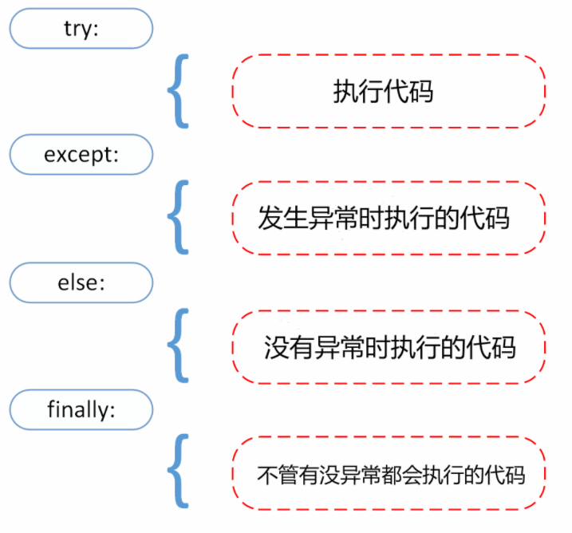

## 一、文件

### 1、打开文件

`open()` 方法用于打开一个文件，并返回**文件对象**，在对文件进行处理过程都需要使用到这个函数，如果该文件无法被打开，会抛出 OSError。

**注意：**使用 `open()` 方法一定要保证关闭文件对象，即调用 `close()` 方法。

`open()` 函数常用形式是接收两个参数：文件名(file)和模式(mode)。

```
open(file, mode='r')
```

完整的语法格式为：

```
open(file, mode='r', buffering=-1, encoding=None, errors=None, newline=None, closefd=True, opener=None)
```

参数说明:

- file: 必需，文件路径（相对或者绝对路径）。
- mode: 可选，文件打开模式
- buffering: 设置缓冲
- encoding: 一般使用utf8
- errors: 报错级别
- newline: 区分换行符
- closefd: 传入的file参数类型

mode 参数有：

| 模式 | 描述                                                         |
| :--- | :----------------------------------------------------------- |
| t    | 文本模式 (默认)。                                            |
| b    | 二进制模式。                                                 |
| r    | 以只读方式打开文件。文件的指针将会放在文件的开头。这是默认模式。 |
| r+   | 打开一个文件用于读写。文件指针将会放在文件的开头。           |
| w    | 打开一个文件只用于写入。如果该文件已存在则打开文件，并从开头开始编辑，即原有内容会被删除。如果该文件不存在，创建新文件。 |
| a    | 打开一个文件用于追加。如果该文件已存在，文件指针将会放在文件的结尾。也就是说，新的内容将会被写入到已有内容之后。如果该文件不存在，创建新文件进行写入。 |


默认为文本模式，如果要以二进制模式打开，加上 **b** 。

一般操作文件的格式为：

```
with open('file_name') as file_obj:
	# code
```

### 2、文件路径

调用`open()`时，Python会在当前程序文件的目录下查找文件，若文件在其他路径，需要说明**相对路径**或**绝对路径**：

在Linux和OS X中，在文件路径中使用的是斜杠（/）：

```
with open('text_files/filename.txt') as file_object:
```

在Windows系统中，在文件路径中使用反斜杠（\）而不是斜杠（/）：

```
with open('text_files\filename.txt') as file_object: 
```

在Linux和OS X中，绝对路径类似于下面这样：

```
file_path = '/home/ehmatthes/other_files/text_files/filename.txt'
with open(file_path) as file_object:
```

而在Windows系统中，它们类似于下面这样：

```
file_path = 'C:\Users\ehmatthes\other_files\text_files\filename.txt'
with open(file_path) as file_object: 
```

### 3、读取

**read()** 用于从文件读取指定的字节数，如果未给定参数或参数为负则读取所有；

语法如下：

```
fileObject.read(size); 
```

- **size** -- 从文件中读取的字节数。
- 返回从字符串中读取的字节。

**readline()** 用于从文件读取整行，包括 "\n" 字符。如果指定了一个非负数的参数，则返回指定大小的字节数，包括 "\n" 字符。

语法如下：

```
fileObject.readline(size); 
```

- **size** -- 从文件中读取的字节数。
- 返回从字符串中读取的字节。

**readlines()** 读取所有行(直到结束符 EOF)并返回列表，该列表可以由 Python 的 `for... in ...` 结构进行处理。 如果碰到结束符 EOF 则返回空字符串。

语法如下：

```
fileObject.readlines( );
```

返回列表，包含所有的行。

示例：

```python
filename = 'index/file.txt'

with open(filename) as file_object:
	lines = file_object.readlines()
	
pi_string = ''
for line in lines:
	pi_string += line.rstrip() 
```

**读取时将文本解读为字符串。**

### 4、写入

写入时，要记得在`open()`将模式设置为'r'或者'a'；

**write()** 方法用于向文件中写入指定字符串。

在文件关闭前或缓冲区刷新前，字符串内容存储在缓冲区中，这时在文件中是看不到写入的内容的。

如果文件打开模式带 b，那写入文件内容时，str (参数)要用 `encode` 方法转为 bytes 形式；

语法如下：

```
fileObject.write( [ str ])
```

- **str** -- 要写入文件的字符串。
- 返回的是写入的字符长度。

**writelines()** 用于向文件中写入一序列的字符串。

这一序列字符串可以是一个字符串列表、元组等。

换行需要制定换行符 \n。

语法如下：

```
fileObject.writelines( [ str ])
```

- **str** -- 要写入文件的字符串序列。
- 没有返回值。

```python
# 打开文件
fo = open("test.txt", "w")
seq = ["line1\n", "line2\n","line3"]
fo.writelines( seq )
```

## 二、异常

### 1、捕捉异常

异常捕捉可以使用 **try/except** 语句。



```python
try:
	# code
except AssertionError as error:
  print(error)
	# code
else:
	# code
finally:
	# code
```

如果在执行 try 子句的过程中发生了异常，那么 try 子句**余下的部分将被忽略**。如果异常的类型和 except 之后的名称相符，那么对应的 except 子句将被执行。

如果一个异常没有与任何的 except 匹配，那么这个异常将会传递给上层的 try 中。

一个except子句可以同时处理多个异常，这些异常将被放在一个括号里成为一个元组:

```python
except (RuntimeError, TypeError, NameError):
	pass
```

最后一个except子句可以忽略异常的名称，它将被当作通配符使用:

```python
except RuntimeError:
	# code
except TypeError:
	# code
except NameError:
	# code
except:
	# code
```

### 2、常见异常类型

异常 | 含义
-|-
BaseException         |              　　　　所有异常的基类
SystemExit　　　　　　|　　 　　　　解释器请求退出
KeyboardInterrupt　　|　　 　　　　用户中断执行(通常是输入^C)
Exception　　　　　　|　　　　　	常规错误的基类
StopIteration	　　　|　　　　　　　　　迭代器没有更多的值
GeneratorExit	　　　|　　　　　　　生成器(generator)发生异常来通知退出
StandardError　　　　|　　　	　　所有的内建标准异常的基类
ArithmeticError　　　|　　　　　　	所有数值计算错误的基类
FloatingPointError	　|　　　　　　　浮点计算错误
OverflowError	　　　|　　　　　　　数值运算超出最大限制
ZeroDivisionError　　|　　　	　　除(或取模)零 (所有数据类型)
AssertionError　　　　|　　　　	　　断言语句失败
AttributeError	　　　|　　　　　　　对象没有这个属性
EOFError	　　　　　|　　　　　　　没有内建输入,到达EOF 标记
EnvironmentError　　　|　　　	　　操作系统错误的基类
IOError　　　　　　　|　　　　	输入/输出操作失败
OSError　　　　　　　|　　　　	操作系统错误
WindowsError	　　　|　　　　　　　系统调用失败
ImportError　　　　　|　　　　	导入模块/对象失败
LookupError　　　　　|　　　　	无效数据查询的基类
IndexError	　　　　　|　　　　　序列中没有此索引(index)
KeyError　　　　　　　|　　　　　	映射中没有这个键
MemoryError　　　　　|　　　　	内存溢出错误(对于Python 解释器不是致命的)
NameError	　　　　　|　　　　　未声明/初始化对象 (没有属性)
UnboundLocalError	　|　　　　　　　访问未初始化的本地变量
ReferenceError　　　　|　　　　	弱引用(Weak reference)试图访问已经垃圾回收了的对象
RuntimeError　　　　　|　　　　　	一般的运行时错误
NotImplementedError	　|　　　　　　　尚未实现的方法
SyntaxError	Python　　|　　　　　　 语法错误
IndentationError　　　|　　　　　　　	缩进错误
TabError	Tab　　　|　　　　　　 和空格混用
SystemError	　　　　　|　　　　　　　一般的解释器系统错误
TypeError　　　　　　|　　　　　	对类型无效的操作
ValueError	　　　　　|　　　　　　　传入无效的参数
UnicodeError	Unicode　　　　|　　　　 相关的错误
UnicodeDecodeError	Unicode　　|　　 解码时的错误
UnicodeEncodeError	Unicode　　|　　 编码时错误
UnicodeTranslateError	Unicode 　|　　　转换时错误
Warning　　　　　　　　　　　|　　　	警告的基类
DeprecationWarning　　　　　|　　　	关于被弃用的特征的警告
FutureWarning	　　　　　　|　　　　　　关于构造将来语义会有改变的警告
OverflowWarning　　　　　　　|　　　　 旧的关于自动提升为长整型(long)的警告
PendingDeprecationWarning　　|　　　　	关于特性将会被废弃的警告
RuntimeWarning	　　　　　　|　　　　　可疑的运行时行为(runtime behavior)的警告
SyntaxWarning　　　　　　　　|　　	可疑的语法的警告
UserWarning	　　　　　　|　　　　用户代码生成的警告