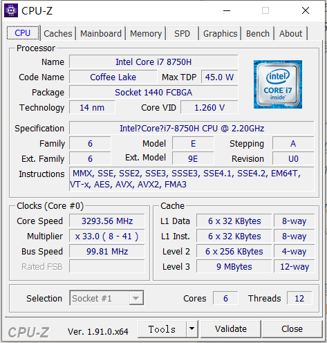

## 一、AVX指令集

CPU依靠指令来计算和控制系统，指令集是指CPU能执行的所有指令的集合，每一类CPU都有其支持的指令集。比如说目前intel和AMD的绝大部分处理器都使用X86指令集，因为它们都源自于X86架构。

但无论CPU有多快，X86指令也只能一次处理一个数据，但这种单指令单数据（SISD）的指令集效率并不高，因此，为了提高CPU的工作效率，需要增加一些特殊的指令满足时代进步的需求，这些新增的指令就构成了扩展指令集。

S一条指令操作多个数据（SIMD）．是CPU基本指令集的扩展．主要用于提供fine grain parallelism，即小碎数据的并行操作．比如说图像处理。Intel的SIMD指令集有MMX、SSE、SSE2、SSE4指令集，AVX指令集也是Intel的一类SIMD指令集。

> AVX指令集是Sandy Bridge和Larrabee架构下的新指令集。AVX是在之前的128位扩展到和256位的单指令多数据流。而Sandy Bridge的单指令多数据流演算单元扩展到256位的同时数据传输也获得了提升，所以从理论上看CPU内核浮点运算性能提升到了2倍。
>
> Intel AVX指令集，在单指令多数据流计算性能增强的同时也沿用了的MMX/SSE指令集。不过和MMX/SSE的不同点在于增强的AVX指令，从指令的格式上就发生了很大的变化。x86(IA-32/Intel 64)架构的基础上增加了prefix(Prefix)，所以实现了新的命令，也使更加复杂的指令得以实现，从而提升了x86 CPU的性能。
>
> AVX（Advanced Vector Extensions，高级矢量扩展）指令集借鉴了一些AMD SSE5的设计思路，进行扩展和加强，形成一套新一代的完整SIMD指令集规范。

指令集需要CPU的支持才能执行，在Linux系统下可以执行以下指令查看CPU支持的指令集，而Windows可以使用CPU-Z软件查看。

```
gcc -march=native -Q --help=target|grep march
或
cat /proc/cpuinfo
```



## 二、AVX编程

### 1、数据类型

数据类型 | 描述
-|-
__m128 | 包含4个float类型数字的向量
__m128d | 包含2个double类型数字的向量
__m128i | 包含若干个整型数字的向量
__m256 | 包含8个float类型数字的向量
__m256d | 包含4个double类型数字的向量 
__m256i | 包含若干个整型数字的向量

每一种类型，由2个下划线开头，接一个m，然后是vector的位长度。

两种浮点向量被单独列出：`__m128`，`__m256`，每个数由`4byte`的`float`构成；

`d`后缀表示双精度浮点数，例如`__m128d`，`__m256d`，每个数由`8byte`的`double`构成。

而`__m128i`，`__m256i`是由整型构成的向量，`char`，`short`，`int`，`long`均属于整型(以及`unsigned`以上类型)，所以例如`__m256i`就可以由32个`char`，或者16个`short`，或者8个`int`，又或者4个`long`构成，这些整型可以是有符号类型也可以是无符号类型。

### 2、函数名称

```
_mm<bit_width>_<name>_<data_type>
```

函数由`_mm`开头，后面接上向量长度、操作类型、参数类型：

`<bit_width>` 表明了向量的位长度，对于128位的向量，这个参数为空，对于256位的向量，这个参数为256。

`<name>`描述了内联函数的算术操作。

`<data_type>` 标识函数主参数的数据类型，参数含义如下：

1. `ps`：里面都是float，把32bits当成一个数看
2. `pd`：里面都是double，把64bits当成一个数看
3. `epi8`/`epi16`/`epi32`/`epi64`：向量里每个数都是整型，一个整型8bit/16bit/32bit/64bit
4. `epu8`/`epu16`/`epu32`/`epu64`：向量里每个数都是无符号整型(unsigned)，一个整型8bit/16bit/32bit/64bit
5. `m128`/`m128i`/`m128d`/`m256`/`m256i`/`m256d`：输入值与返回类型不同时会出现 ，例如`__m256i_mm256_setr_m128i(__m128ilo,__m128ihi)`，输入两个`__m128i`向量 ，把他们拼在一起，变成一个`__m256i`返回 。另外这种结尾只见于`load`
6. `si128`/`si256`：不care向量里到底都是些啥类型，反正128bit/256bit，例如：`
__m256i _mm_broadcastsi128_si256 (__m128i a)`

### 3、基本函数

### （1）初始化

用标量值初始化

数据类型 | 描述
-|-
_mm256_setzero_ps/pd | 返回一个全0的float类型的向量
_mm256_setzero_si256 | 返回一个全0的整形向量
_mm256_set1_ps/pd | 用一个float类型的数填充向量
_mm256_set1_epi8/epi16/epi32/epi64x | 用整形数填充向量
_mm256_set_ps/pd | 用8个float或者4个double类型数字初始化向量
_mm256_set_epi8/epi16/epi32/epi64x | 用一个整形数初始化向量
_mm256_set_m128/m128d/m128i	| 用2个128位的向量初始化一个256位向量
_mm256_setr_ps/pd | 用8个float或者4个double的转置顺序初始化向量
_mm256_setr_epi8/epi16/epi32/epi64x | 用若干个整形数的转置顺序初始化向量 

从内存中加载数据

数据类型 | 描述
- | -
_mm256_load_ps/pd | 从对齐的内存地址加载浮点向量
_mm256_load_si256 | 从对齐的内存地址加载整形向量
_mm256_loadu_ps/pd | 从未对齐的内存地址加载浮点向量
_mm256_loadu_si256 | 从未对齐的内存地址加载整形向量
_mm_maskload_ps/pd | 根据掩码加载128位浮点向量的部分
_mm256_maskload_ps/pd | 根据掩码加载256位浮点向量的部分
(2)_mm_maskload_epi32/64 | 根据掩码加载128位整形向量的部分
(2)_mm256_maskload_epi32/64 | 根据掩码加载256位整形向量的部分

最后2个函数前面有一个(2)，**代表这两个函数只在AVX2中支持。**

### （2）算术运算

加减法

数据类型 | 描述
-|-
_mm256_add_ps/pd | 对两个浮点向量做加法
_mm256_sub_ps/pd | 对两个浮点向量做减法
(2)_mm256_add_epi8/16/32/64 | 对两个整形向量做加法
(2)_mm256_sub_epi8/16/32/64 | 对两个整形向量做减法
(2)_mm256_adds_epi8/16 (2)_mm256_adds_epu8/16 | 两个整数向量相加且考虑内存饱和问题
(2)_mm256_subs_epi8/16 (2)_mm256_subs_epu8/16 | 两个整数向量相减且考虑内存饱和问题
_mm256_hadd_ps/pd | 水平方向上对两个float类型向量做加法
_mm256_hsub_ps/pd | 垂直方向上最两个float类型向量做减法
(2)_mm256_hadd_epi16/32 | 水平方向上对两个整形向量做加法
(2)_mm256_hsub_epi16/32 | 水平方向上最两个整形向量做减法
(2)_mm256_hadds_epi16 | 对两个包含short类型的向量做加法且考虑内存饱和的问题
(2)_mm256_hsubs_epi16 | 对两个包含short类型的向量做减法且考虑内存饱和的问题
_mm256_addsub_ps/pd | 加上和减去两个float类型的向量

在水平方向上做加减法的意思如下：


最后一个指令：_mm256_addsub_ps/pd 在偶数位置减去，奇数位置加上，获最后得目标向量。

乘除法

数据类型	描述
-|-
_mm256_mul_ps/pd	对两个float类型的向量进行相乘
(2)_mm256_mul_epi32 (2)_mm256_mul_epu32	将包含32位整数的向量的最低四个元素相乘
(2)_mm256_mullo_epi16/32	Multiply integers and store low halves
(2)_mm256_mulhi_epi16 (2)_mm256_mulhi_epu16	Multiply integers and store high halves
(2)_mm256_mulhrs_epi16	Multiply 16-bit elements to form 32-bit elements
_mm256_div_ps/pd	对两个float类型的向量进行想除

加法乘法混合

数据类型	描述
-|-
(2)_mm_fmadd_ps/pd/ (2)_mm256_fmadd_ps/pd	将两个向量相乘，再将积加上第三个。(res=a*b+c)
(2)_mm_fmsub_ps/pd/ (2)_mm256_fmsub_ps/pd	将两个向量相乘，然后从乘积中减去一个向量。(res=a*b-c)
(2)_mm_fmadd_ss/sd	将向量中最低的元素相乘并相加（res[0]=a[0]*b[0]+c[0])
(2)_mm_fmsub_ss/sd	将向量中最低的元素相乘并相减（res[0]=a[0]*b[0]-c[0])
(2)_mm_fnmadd_ps/pd (2)_mm256_fnmadd_ps/pd	将两个向量相乘，并将负积加到第三个。(res = -(a * b) + c)
(2)_mm_fnmsub_ps/pd/ (2)_mm256_fnmsub_ps/pd	将两个向量相乘，并将负积加到第三个 (res = -(a * b) - c)
(2)_mm_fnmadd_ss/sd	将两个向量的低位相乘，并将负积加到第三个向量的低位。(res[0] = -(a[0] * b[0]) + c[0])
(2)_mm_fnmsub_ss/sd	将最低的元素相乘，并从求反的积中减去第三个向量的最低元素。(res[0] = -(a[0] * b[0]) - c[0])
(2)_mm_fmaddsub_ps/pd/ (2)_mm256_fmaddsub_ps/pd	将两个矢量相乘，然后从乘积中交替加上和减去（res=a*b+/-c)
(2)_mm_fmsubadd_ps/pd/ (2)_mmf256_fmsubadd_ps/pd	将两个向量相乘，然后从乘积中交替地进行减法和加法（res=a*b-/+c）（奇数次方，偶数次方）

###（3）排列和洗牌

排列

数据类型	描述
-|-
_mm_permute_ps/pd _mm256_permute_ps/pd	根据8位控制值从输入向量中选择元素
(2)_mm256_permute4x64_pd/ (2)_mm256_permute4x64_epi64	根据8位控制值从输入向量中选择64位元素
_mm256_permute2f128_ps/pd	基于8位控制值从两个输入向量中选择128位块
_mm256_permute2f128_si256	基于8位控制值从两个输入向量中选择128位块
_mm_permutevar_ps/pd _mm256_permutevar_ps/pd	根据整数向量中的位从输入向量中选择元素
(2)_mm256_permutevar8x32_ps (2)_mm256_permutevar8x32_epi32	使用整数向量中的索引选择32位元素（浮点和整数）

Shuffle

数据类型	描述
-|-
_mm256_shuffle_ps/pd	根据8位值选择浮点元素
_mm256_shuffle_epi8/ _mm256_shuffle_epi32	根据8位值选择整数元素
(2)_mm256_shufflelo_epi16/ (2)_mm256_shufflehi_epi16	基于8位控制值从两个输入向量中选择128位块
对于_mm256_shuffle_pd，只使用控制值的高4位。如果输入向量包含int或float，则使用所有控制位。对于_mm256_shuffle_ps，前两对位从第一个矢量中选择元素，第二对位从第二个矢量中选择元素。


