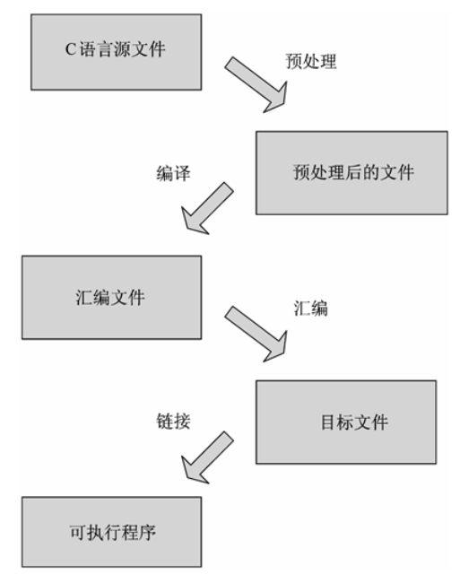

## 一、gcc编译器

GCC 编译器是 Linux 系统下最常用的 C/C++ 编译器，大部分 Linux 发行版中都会默认安装。

GUN 编译器套件包含多种前端处理器，以翻译各种不同语言。GCC 也是一种多目标（multitarget）编译器；换句话说，它通过使用可互换的后端处理器，为**多种不同的计算机架构**生成相应的可执行程序。

正如模块化概念所提倡的，GCC 可被用作交互式编译器；也就是说，可以使用 GCC **对所有设备与操作系统**创建可执行程序，不需要局限于仅仅是运行 GCC 的平台。然而，这么做需要特殊的配置和安装，大多数 GCC 的安装，仅能针对它们的宿主系统编译程序。

GCC 不仅支持C的许多“方言”，也可以区别不同的C语言标准；也就是说，可以使用命令行选项来控制编译器在翻译源代码时应该遵循哪个C标准。  

例如在使用`gcc`指令时加上`-std=c++11`后缀，可以要求编译器根据C++11标准进行编译。

在Linux系统中，可通过指令`gcc --version`查看是否安装。

GCC 编译器在编译一个C语言程序时需要经过以下 4 步：

- 将C语言源程序预处理，生成.i文件。
- 预处理后的.i文件编译成为汇编语言，生成.s文件。
- 将汇编语言文件经过汇编，生成目标文件.o文件。
- 将各个模块的.o文件链接起来生成一个可执行程序文件。



`.i`文件、`.s`文件、`.o`文件可以认为是临时文件，如果使用 GCC 一次性完成C语言程序的编译，那么只能看到最终的可执行文件。

gcc包含大量命令选项，下面开始讨论常用的命令参数。

## 二、gcc参数

### 1、常用参数

`-o`：指定输出文件，其基本格式为`inputfile -o outputfile`；

输入文件可以是源文件，也可以是汇编文件或者是目标文件；输出文件可以是预处理文件、目标文件、可执行文件等；同时，输入输出文件都可以包括多个文件，例如：`gcc main.c func.c -o app.out`

如果不使用 `-o` 选项，那么将采用默认的输出文件，例如，把可执行文件作为输出文件，它的名字默认为 `a.out`。


`-E`：对应源文件的“预处理”步骤，保留预处理器的输出文件，即`.i`文件，同时编译过程在预处理完毕之后即停止。

因为头文件可能相当大，如果源文件包括了多个头文件，那么它的预处理器输出可能会庞杂难读。使用`-C`选项可以阻止预处理器删除源文件和头文件中的注释： `gcc -E -C test.c -o test.c`

对于include目录而言，通常的搜索顺序是：

1. 包含指定源文件的目录（对于在 #include 命令中以引号包括的文件名）。
2. 采用`-iquote`选项指定的目录，依照出现在命令行中的顺序进行搜索。只对 #include 命令中采用引号的头文件名进行搜索。
3. 采用`-I`选型指定的目录，依照出现在命令行中的顺序进行搜索。
4. 采用环境变量 CPATH 指定的目录。
5. 采用`-isystem`选项指定的目录，依照出现在命令行中的顺序进行搜索。
6. 采用环境变量 C_INCLUDE_PATH 指定的目录。
7. 系统默认的 include 目录。


`-S`：  对应“预处理-编译”步骤，编译程序在生成汇编语言输出之后立刻停止，并生成以`.s`作为后缀的**汇编语言文件**。

如果想把C语言变量的名称作为汇编语言语句中的注释，可以加上`-fverbose-asm`选项：`gcc -S -fverbose-asm circle.c`


`-c：`：对应“预处理-编译-汇编”步骤，编译指定的源文件，但是不进行链接；使用`-c`选项可以将每一个源文件编译成对应的目标文件。

例如：`gcc -c func.c main.c`会将两个源文件分别编译生成对应的`.o`文件，但**各文件独立，并没有进行链接**。


`-l`：对应“链接”步骤，让我们手动添加链接库，实现链接器功能。

链接器把多个二进制的目标文件（object file）链接成一个单独的可执行文件。在链接过程中，**它必须把符号（变量名、函数名等一些列标识符）用对应的数据的内存地址（变量地址、函数地址等）替代**，以完成程序中多个模块的外部引用。

而且，链接器也必须将程序中所用到的所有C标准库函数加入其中。对于链接器而言，链接库不过是一个具有许多目标文件的集合，它们在一个文件中以方便处理。  

（链接功能待补充）


warning相关参数：

`-W` ：开启所有 gcc 能提供的警告。 
`-w` ：不生成任何警告信息。 
`-Wall` ：生成所有警告信息。

### 2、-O优化

GCC可以通过参数`-O`控制代码的优化等级，实现不同程度的优化，编译器回尝试以**编译时间和可能的调试程序的能力为代价**来**改进性能**和/或**代码大小**。下面是各优化选项的说明：

`-O0`:  不做任何优化，这是默认的编译选项。 

`-O`和`-O1`: 使用能减少目标代码尺寸以及执行时间并且不会使编译时间明显增加的优化。在编译大型程序的时候会显著增加编译时内存的使用。

`-O2`: 包含-O1的优化，并增加了不需要在目标文件大小和执行速度上进行折中的优化。编译器不执行循环展开以及函数内联。此选项将增加编译时间和目标文件的执行性能。

`-Os`: 可以看成 -O2.5，**专门优化目标文件大小**，执行所有的不增加目标文件大小的-O2优化选项，并且执行专门减小目标文件大小的优化选项。适用于磁盘空间紧张时使用。

`-O3`: 打开所有 -O2 的优化选项外增加 -finline-functions、-funswitch-loops、-fgcse-after-reload 优化选项。相对于 -O2 性能并未有较多提高，编译时间也最长，生成的目标文件也更大更占内存，有时性能不增反而降低，甚至产生不可预知的问题(包括错误)。

各优化级别打开的优化选项可以参考[gcc编译优化-O0 -O1 -O2 -O3 -OS解析](https://blog.csdn.net/wuxing26jiayou/article/details/96132721?depth_1-utm_source=distribute.pc_relevant.none-task&utm_source=distribute.pc_relevant.none-task)。

### 3、补充

`-include file`

包含某个代码,简单来说,就是便以某个文件，需要另一个文件的时候，就可以用它设定，功能就相当于在代码中使用 **#include<filename>**。

```
gcc hello.c -include /root/pianopan.h 　
```

`-imacros file`

将 file 文件的宏，扩展到 gcc/g++ 的输入文件，宏定义本身并不出现在输入文件中。

`-Dmacro`

相当于 C 语言中的 **#define macro**；

`-Dmacro=defn`

相当于 C 语言中的 **#define macro=defn**　；

`-Umacro`

相当于 C 语言中的 **#undef macro**；

`-undef`

取消对任何非标准宏的定义；

## 三、文件类型

编译器支持许多和C语言程序相关的扩展名，对它们的说明如下：

| 扩展名 | 说明                                                         |
| ------ | ------------------------------------------------------------ |
| .c     | C程序源代码，在编译之前要先进行预处理。                      |
| .i     | C程序预处理输出，可以被编译。                                |
| .h     | C程序头文件。（为了节省时间，许多源文件会包含相同的头文件，GCC 允许事先编译好头文件，称为“预编译头文件”，它合适情况下自动被用于编译。） |
| .s     | 汇编语言                                                     |
| .S     | 有C命令的汇编语言，在汇编之前必须先进行预处理。              |

GCC 也支持以下扩展名：`.ii、.cc、.cp、.cxx、.cpp、.CPP、.c++、.C、.hh、.H、.m、.mi、.f、.for、.FOR、.F、.fpp、.FPP、.r、.ads 和 .adb`。这些文件类型涉及 C++、Objective-C、Fortran 或 Ada 等程序的编译。使用其他扩展名的文件会被视为对象文件，以作为链接之用。

## 四、多文件编译

编译多个源代码文件会生成多个目标文件，如果多个源代码文件有所关联，需要先使用`-c`指令生成目标代码文件，再使用`-l`指令进行链接：

GCC 假设扩展名为`.o`的文件是要被链接的目标文件。


## 、makefile

1、基本规则

2、变量$

3、


## 参考资料

[GCC](http://c.biancheng.net/gcc/)

[GCC 参数详解](https://www.runoob.com/w3cnote/gcc-parameter-detail.html)

[跟我一起写Makefile](https://seisman.github.io/how-to-write-makefile/index.html)

[gcc编译优化-O0 -O1 -O2 -O3 -OS解析](https://blog.csdn.net/wuxing26jiayou/article/details/96132721?depth_1-utm_source=distribute.pc_relevant.none-task&utm_source=distribute.pc_relevant.none-task)

