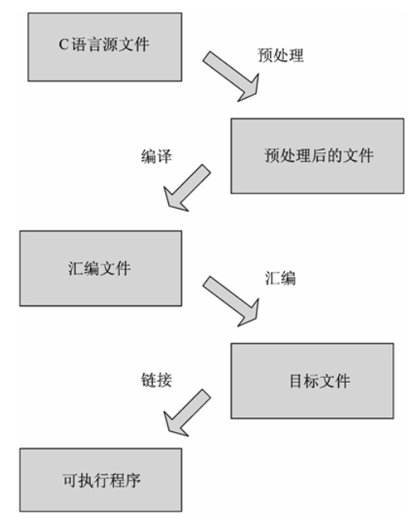

## 一、gcc编译器

GCC 编译器是 Linux 系统下最常用的 C/C++ 编译器，大部分 Linux 发行版中都会默认安装。

GUN 编译器套件包含多种前端处理器，以翻译各种不同语言。GCC 也是一种多目标（multitarget）编译器；换句话说，它通过使用可互换的后端处理器，为**多种不同的计算机架构**生成相应的可执行程序。

正如模块化概念所提倡的，GCC 可被用作交互式编译器；也就是说，可以使用 GCC **对所有设备与操作系统**创建可执行程序，不需要局限于仅仅是运行 GCC 的平台。然而，这么做需要特殊的配置和安装，大多数 GCC 的安装，仅能针对它们的宿主系统编译程序。

GCC 不仅支持C的许多“方言”，也可以区别不同的C语言标准；也就是说，可以使用命令行选项来控制编译器在翻译源代码时应该遵循哪个C标准。  

例如在使用`gcc`指令时加上`-std=c++11`后缀，可以要求编译器根据C++11标准进行编译。

在Linux系统中，可通过指令`gcc --version`查看是否安装。

GCC 编译器在编译一个C语言程序时需要经过以下 4 步：

- 将C语言源程序预处理，生成.i文件。
- 预处理后的.i文件编译成为汇编语言，生成.s文件。
- 将汇编语言文件经过汇编，生成目标文件.o文件。
- 将各个模块的.o文件链接起来生成一个可执行程序文件。



`.i`文件、`.s`文件、`.o`文件可以认为是临时文件，如果使用 GCC 一次性完成C语言程序的编译，那么只能看到最终的可执行文件。

gcc包含大量命令选项，下面开始讨论常用的命令参数。

## 二、gcc参数

`-o`：指定输出文件，其基本格式为`inputfile -o outputfile`；

输入文件可以是源文件，也可以是汇编文件或者是目标文件；输出文件可以是预处理文件、目标文件、可执行文件等；同时，输入输出文件都可以包括多个文件，例如：`gcc main.c func.c -o app.out`

如果不使用 `-o` 选项，那么将采用默认的输出文件，例如，把可执行文件作为输出文件，它的名字默认为 `a.out`。


`-E`：对应源文件的“预处理”步骤，保留预处理器的输出文件，即`.i`文件，同时编译过程在预处理完毕之后即停止。

因为头文件可能相当大，如果源文件包括了多个头文件，那么它的预处理器输出可能会庞杂难读。使用`-C`选项可以阻止预处理器删除源文件和头文件中的注释： `gcc -E -C test.c -o test.c`

对于include目录而言，通常的搜索顺序是：

1. 包含指定源文件的目录（对于在 #include 命令中以引号包括的文件名）。
2. 采用`-iquote`选项指定的目录，依照出现在命令行中的顺序进行搜索。只对 #include 命令中采用引号的头文件名进行搜索。
3. 采用`-I`选型指定的目录，依照出现在命令行中的顺序进行搜索。
4. 采用环境变量 CPATH 指定的目录。
5. 采用`-isystem`选项指定的目录，依照出现在命令行中的顺序进行搜索。
6. 采用环境变量 C_INCLUDE_PATH 指定的目录。
7. 系统默认的 include 目录。


`-S`：  对应“预处理-编译”步骤，编译程序在生成汇编语言输出之后立刻停止，并生成以`.s`作为后缀的**汇编语言文件**。

如果想把C语言变量的名称作为汇编语言语句中的注释，可以加上`-fverbose-asm`选项：`gcc -S -fverbose-asm circle.c`


`-c：`：对应“预处理-编译-汇编”步骤，编译指定的源文件，但是不进行链接；使用`-c`选项可以将每一个源文件编译成对应的目标文件。

例如：`gcc -c func.c main.c`会将两个源文件分别编译生成对应的`.o`文件，但**各文件独立，并没有进行链接**。


`-l`：对应“链接”步骤，让我们手动添加链接库，实现链接器功能。

链接器把多个二进制的目标文件（object file）链接成一个单独的可执行文件。在链接过程中，**它必须把符号（变量名、函数名等一些列标识符）用对应的数据的内存地址（变量地址、函数地址等）替代**，以完成程序中多个模块的外部引用。

而且，链接器也必须将程序中所用到的所有C标准库函数加入其中。对于链接器而言，链接库不过是一个具有许多目标文件的集合，它们在一个文件中以方便处理。  

（链接功能待补充）


**-include file**

包含某个代码,简单来说,就是便以某个文件,需要另一个文件的时候,就可以用它设定,功能就相当于在代码中使用 **#include<filename>**。

例子用法:

　　

```
gcc hello.c -include /root/pianopan.h 
```

　　

**-imacros file**

　　

将 file 文件的宏, 扩展到 gcc/g++ 的输入文件, 宏定义本身并不出现在输入文件中。

　　

**-Dmacro**

相当于 C 语言中的 **#define macro**

　　

**-Dmacro=defn**

相当于 C 语言中的 **#define macro=defn**

　　

**-Umacro**

相当于 C 语言中的 **#undef macro**

**-undef**

取消对任何非标准宏的定义

## 三、文件类型

编译器支持许多和C语言程序相关的扩展名，对它们的说明如下：

| 扩展名 | 说明                                                         |
| ------ | ------------------------------------------------------------ |
| .c     | C程序源代码，在编译之前要先进行预处理。                      |
| .i     | C程序预处理输出，可以被编译。                                |
| .h     | C程序头文件。（为了节省时间，许多源文件会包含相同的头文件，GCC 允许事先编译好头文件，称为“预编译头文件”，它合适情况下自动被用于编译。） |
| .s     | 汇编语言                                                     |
| .S     | 有C命令的汇编语言，在汇编之前必须先进行预处理。              |

GCC 也支持以下扩展名：`.ii、.cc、.cp、.cxx、.cpp、.CPP、.c++、.C、.hh、.H、.m、.mi、.f、.for、.FOR、.F、.fpp、.FPP、.r、.ads 和 .adb`。这些文件类型涉及 C++、Objective-C、Fortran 或 Ada 等程序的编译。使用其他扩展名的文件会被视为对象文件，以作为链接之用。

## 四、多文件编译

编译多个源代码文件会生成多个目标文件，如果多个源代码文件有所关联，需要先使用`-c`指令生成目标代码文件，再使用`-l`指令进行链接：

GCC 假设扩展名为`.o`的文件是要被链接的目标文件。


## 、makefile

1、基本规则

2、变量$

3、


## 参考资料

[GCC](http://c.biancheng.net/gcc/)

[GCC 参数详解](https://www.runoob.com/w3cnote/gcc-parameter-detail.html)

[跟我一起写Makefile](https://seisman.github.io/how-to-write-makefile/index.html)

