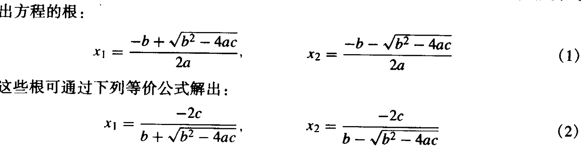

## 一、多项式计算

### 多项式创建

在Matlab中，n次多项式用一个n+1项的行向量表示，系数按照降幂排序。

例如，三元素向量

```matlab
p = [4 2 3];
```

表示多项式$p(x)=4x^2+2x+3$

### 多项式计算

可以使用 `polyval` 函数根据特定值计算多项式。

例如使用 `polyval` 计算 p(3)。

```matlab
polyval(p,3)
ans =

    45
```

也可以使用 `polyvalm` 以矩阵方式计算多项式。也就是说变量x视为方阵X：

$p(x)=4X^2+2X+3I$

其中，`X` 是方阵，`I` 是单位矩阵。

```matlab
X = [2 4 5; -1 0 3; 7 1 5];
polyvalm(p,X)
ans =

   147    60   198
    74    -1    46
   206   134   265
```

我们用Horner方法自己编写一个计算多项式的函数：

```matlab
function [ ans ] = horner( arr, x )
%输入行向量arr，变量x，求多项式结果p(x)
count = length(arr);
ans = arr(1);
for i=2:count
    ans = ans*x +arr(i);
end
end
```

执行，得到结果和polyval相同：

```matlab
>> polyval(p,3)

ans =

    45

>> horner(p,3)

ans =

    45
```


## 二、二次求根

已知二次根式$ax^2+bx+c=0$，求根公式为$(-b\pm\sqrt{b^2-4ac})/(2a)$，公式可化为$(-2c)/(b\pm \sqrt{b^2-4ac})$。



当$\|b\|≈\sqrt{b^2-4ac}$时，上述式子的分子或分母会变得极小，导致结果造成精度损失，所以，在进行运算时要选择计算相应公式，**以减小误差**：

- 当b>0，选择（1）的x2和（2）的x1；
- 当b<0，选择（1）的x1和（2）的x2；

同样，我们自己编写一个函数进行计算：

```matlab
function [ x1 ,x2 ] = FindTheRoot( p )
%输入p = [a b c],求ax^2+bx+c=0的根x1,x2
a = p(1);
b = p(2);
c = p(3);
del = b^2-4*a*c;
x1 = NaN;
x2 = NaN;
if a==0	%一元一次方程
    x1=-c/b;
    x2=-c/b;
    return 
end
if del < 0	%根不存在
    return 
end
if b>0 %大于0
    x1 = (-2*c)/(b+sqrt(del));
    x2 = (-b-sqrt(del))/(2*a);

else 	%小于0
    x1 = (-2*c)/(b-sqrt(del));
    x2 = (-b+sqrt(del))/(2*a);
    
end
return
end
```

测试一下执行结果：

```matlab
>> [a,b] = FindTheRoot([-1 -4 -2])

a =

   -0.5858


b =

   -3.4142

>> [a,b] = FindTheRoot([1 4 2])

a =

   -0.5858


b =

   -3.4142
```


## 三、不动点迭代

不动点指一个实数P，对函数g(x)满足P = g(P)；通过点$p_0$开始，通过$p_{n+1} = g(p_n)$得到一个序列，这一过程称为不动点迭代。

不动点迭代可用于求解方程f(x) = 0，当然，并不是所有的f(x)都可以化为g(x)并求解，需要保证迭代收敛。迭代收敛性的判断不在这里进行说明，下面只给出不动点迭代的Matlab实现：


```matlab
function [ p, k ,err ,P ] = fixpt( g ,p0 ,tole ,max1 )
%input:
%g：g(x)函数
%p0：第一个迭代点
%tole：允许的误差范围
%max1：最大迭代次数

%output:
%k：迭代次数
%p：所求结果
%err：绝对误差大小
%P：迭代序列

P(1) = p0;
for k = 2 : max1
    p = feval(g,P(k-1));
    P(k) = p;
    err = abs(P(k) - P(k-1));
    relerr = err/(abs(P(k))+eps);
    if err<tole | relerr<tole
        break;
    end
end
if k == max1
    disp("规定迭代次数内无法得到结果")
end
```

然后，我们编写一个函数fun1进行测试：

```matlab
function y = fun1( x )
y = 1+0.5*sin(x);
end
```

这个函数与x = y的交点如图：`plot(x,y,x,z,'-.')`


利用不动点迭代求解，得到结果如下：

```matlab
>> [ p, k ,err ,P ] =fixpt('fun1',-1,0.000001,10000)

p =

    1.4987


k =

     8


err =

   1.0668e-06


P =

   -1.0000    0.5793    1.2737    1.4781    
   1.4979    1.4987    1.4987    1.4987
```


## 四、二分法求根

对连续函数f(x)，给定一个区间[a,b]，其中f(a)f(b)<0，通过不断二分求函数的根：

```matlab
function [ c, err ,yc  ] = bisect( f ,a ,b ,tole )
%input:
%f：f(x)函数
%a、b：区间
%tole：允许的误差大小

%output:
%c：根
%err：绝对误差大小
%yc：f(c)

ya = feval(f,a);
yb = feval(f,b);
if ya*yb>0
    disp("不满足f(a)f(b)<0");
    return
end
max1 = 1+(log(b-1)-log(tole))/(log(2));	
%终止条件1：最大迭代次数
for k = 1:max1
    c = (a+b)/2;
    yc = feval(f,c);
    if yc== 0 
        err = 0
       return 
    end
    if yb*yc>0
        b = c;
        yb = yc;
    else
        a = c;
        ya = yc;
    end
    
    if b-a<tole %终止条件2：ab区间大小
        break
    end
end
c = (a+b)/2;
err = abs(b-a);
yc = feval(f,c);
end
```

同样，编写函数`fun1 = x^3`，，执行：

```matlab
>> [ c, err ,yc  ] = bisect( 'fun1' ,-2 ,1 ,0.001 )

c =

  -1.2207e-04


err =

   7.3242e-04


yc =

  -1.8190e-12

>> [ c, err ,yc  ] = bisect( 'fun1' ,-2 ,2 ,0.001 )

err =

     0


c =

     0


err =

     0


yc =

     0
```


## 五、试值法求根

对连续函数f(x)，给定一个区间[a,b]，其中f(a)f(b)<0，通过取(a,f(a))与(b,f(b))的连线与x轴交点(c,0)，得到序列c，用c拟合f(x)=0的根：

```matlab
function [ c, err ,yc  ] = regula( f ,a ,b ,tole,epsilon,max1 )
%input:
%f：f(x)函数
%a、b：区间
%tole：c误差大小
%epsilon：f(c)误差大小
%max1：最大迭代次数

%output:
%c：根
%err：绝对误差大小
%yc：f(c)

ya = feval(f,a);
yb = feval(f,b);
c = NaN;
err = NaN;
yc = NaN;
if ya*yb>0
    disp("不满足f(a)f(b)<0");
    return
end

for k = 1:max1 %最大迭代次数作为终止条件
    bc = yb*(b-a)/(yb-ya);
    c = b-bc;
    ac = c-a;
    yc = feval(f,c);
    if yc== 0 
        err = 0
       return 
    end
    if yb*yc>0
        b = c;
        yb = yc;
    else
        a = c;
        ya = yc;
    end
    dx = min(ac,bc);%c离a、b的距离最小值
    if dx<tole 
        err = abs(b-a)/2;
        return 
    end %x轴区间作为终止条件
    if abs(yc)<epsilon 
        err = abs(b-a)/2;
        return 
    end %y轴区间作为终止条件
end
err = abs(b-a)/2;
yc = feval(f,c);
end
```

与二分法使用同一函数测例：

```matlab
>> [ c, err ,yc  ] = regula( 'fun1' ,-2 ,1 ,0.001 ,0.001,10000)

c =

    0.1529


err =

    1.0765


yc =

    0.0036

>> [ c, err ,yc  ] = regula( 'fun1' ,-2 ,2 ,0.001 ,0.001,10000)

err =

     0


c =

     0


err =

     0


yc =

     0
```


## 六、求解近似根位置

为了粗略估计根在区间中的位置，使用等距采样点将区间分成n个小区间，判断每个区间是否满足根存在的条件：

```matlab
function R = approot (f,X,epsilon)
%Input
%f：输入函数
%X：等距采样点序列x
%epsilon：y的误差

%Output
%R：近似根序列
n=length(X);
for i=1:n
    Y(i) = feval(f,X(i));
end
yrange = max(Y)-min(Y);
epsilon2 = yrange*epsilon;
m=0;%近似根数量
X(n+1)=X(n);%防止溢出
Y(n+1)=Y(n);
for k=2:n
if Y(k-1)*Y(k)<=0 %根存在条件1
    m=m+1; 
    R(m)=(X(k-1)+X(k))/2;
end
s=(Y(k)-Y(k-1))*(Y(k+1)-Y(k));
if (abs(Y(k)) < epsilon2) & (s<=0) %根存在条件2
    m=m+1;
    R(m)=X(k);
end
end
```

测试函数：

```matlab
>> R = approot ('sin',X,0.00001)

R =

    0.0005    3.1415    6.2835    9.4245
```

## 七、牛顿-拉弗森迭代

牛顿法只需要函数f和f的导数，且给定一个起始点，即可开始计算。

```matlab
function [p0, err, k, y] = newton( f, df, p0, delta, eps, max1 )
%Input
%f：输入函数
%df: f的导数
%p0：初始点
%eps：y的误差范围
%delta：p0的误差范围
%max1：最大迭代次数

%Output
%p0：最终结果
%err：最终误差
%k：迭代次数
%y：f(p0)

for k = 1 : max1
    p1 = p0 - feval(f,p0)/feval(df,p0);
    err = abs(p1-p0);
    p0 = p1;
    y = feval(f,p0);
    if (err<delta)|(abs(y)<eps)
        break;
    end
end

end
```

所用的函数：

```matlab
function y = f( x )
y = x^3 - 3*x + 2;
end

function y = df( x )
y = 3*x^2 - 3;
end
```

测试（从p0 = 1.2开始）：

```matlab
>> [p0, err, k, y] = newton('f','df',1.2,0.000000000001,0.0000000001,100)

p0 =

    1.0000


err =

   3.2510e-06


k =

    16


y =

   3.1708e-11
```

## 八、割线法

割线法不必计算f的导数，但是需要两个起始点p0、p1，求割线进行迭代。

```matlab
function [p1, err, k, y] = secant( f, p0, p1, delta, eps, max1 )
%Input
%f：输入函数
%p0、p1：初始点
%eps：y的误差范围
%delta：p0的误差范围
%max1：最大迭代次数

%Output
%p1：最终结果
%err：最终误差
%k：迭代次数
%y：f(p0)

for k = 1 : max1
    y0 =  feval(f,p0);
    y1 =  feval(f,p1);
    p2 = p1 - y1*(p1-p0)/(y1 - y0);
    err = abs(p2-p1);
    p0 = p1;
    p1 = p2;
    y = feval(f,p1);
    if (err<delta)|(abs(y)<eps)
        break;
    end
end

end
```

所用的函数和牛顿法相同，进行测试（从p0 = 1.2开始）：

```matlab
[p1, err, k, y] = secant('f',1.2,1.21, 0.000000000001,0.0000000001,100)

p1 =

    1.0000


err =

   2.9315e-06


k =

    22


y =

   6.7494e-11
```