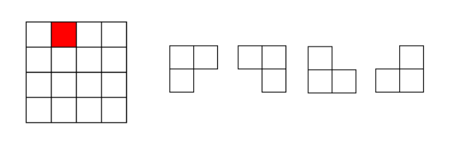

## 一、分治思想

对于一个规模为n的问题P(n)，可以把它**分解为k个规模较小的子问题**，这些子问题**互相独立**，且结构与原来问题的结构相同。在解这些子问题时，又对每一个子问题进行进一步的分解，直到**某个阈值**n0为止。递归地解这些子问题，再把各个子问题的解合并起来，就得到原问题的解。

适用条件：

- 该问题的规模**缩小到一定的程度**就可以容易地解决；
- 该问题可以分解为若干个**规模较小的相同问题**，即该问题具有最优子结构性质；
- 利用该问题分解出的子问题的解可以**合并为该问题的解**；
- 该问题所分解出的各个子问题是相互独立的，即子问题之间不包含公共
  的子问题。

步骤：

- 1)分解：将原问题分解为若干个规模较小，相互独立，与原问题形式相同的子问题；
- 2)解决：若子问题规模较小而容易被解决则直接解，否则再继续分解为更小的子问题，直到容易解决；
- 3)合并：将已求解的各个子问题的解，逐步合并为原问题的解。

## 二、算法实例

### 1、二进制大整数乘法

两个n位大整数x、y相乘：

$x = a+b = a2^{n/2}+b,(a.size=b.size=n/2)$
$y = c+d = c2^{n/2}+d,(c.size=d.size=n/2)$
$xy = ac2^n+(ad+bc)2^{n/2}+bd$

上述式子用了ac、ad、bc、bd四次乘法，可以优化为：

$xy = ac2^n+((a-b)(d-c)+ac+bd)2^{n/2}+bd$

只进行了ac、bd、(a-b)(d-c)三次乘法。

例：多项式乘积

计算两个n阶多项式的乘法：

$p(x) = a_0x^0+a_1x^1+a_2x^2+\dots+a_nx^n$
$q(x) = b_0x^0+b_1x^1+b_2x^2+\dots+b_nx^n$

采用一般的方法计算，需要（n+1)2次乘法运算和n(n+1)次加法运算。

优化：

将一个多项式分为两个：

$p(x) = p_0(x) + p_1(x)x^{n/2}$

$q(x) = q_0(x) + q_1(x)x^{n/2}$

则：

$p(x)q(x) = p_0(x)q_0(x)+[p_0(x)q_1(x)+p_1(x)q_0(x)]x^{n/2}+p_1(x)q_1(x)x^n$

引入：

$r_0(x) = p_0(x)q_0(x)$

$r_1(x) = p_1(x)q_1(x)$

$r_2(x) = [p_0(x)+p_1(x)][q_0(x)+q_1(x)]$$

则可以转化为：

$p(x)q(x) = r_0(x)+[r_2(x)-r_1(x)-r_0(x)]x^{n/2}+r_1(x)x^n$

减少了一次乘法运算。

### 2、棋盘覆盖

在一个$2^k\times 2^k$个方格组成的棋盘中，恰有一个方格与其它方格不同，称该方格为一特殊方格，且称该棋盘为一特殊棋盘。在棋盘覆盖问题中，要用图示的4种不同形态的L型骨牌覆盖给定的特殊棋盘上除特殊方格以外的所有方格，且任何2个L型骨牌不得重叠覆盖。



划分：

将$2^k\times 2^k$棋盘分割为4个$2^{k-1}\times 2^{k-1}$子棋盘(a)所示。特殊方格必位于4个较小子棋盘之一中，其余3个子棋盘中无特殊方格。**为了将这3个无特殊方格的子棋盘转化为特殊棋盘，可以用一个L型骨牌覆盖这3个较小棋盘的会合处，**如 (b)所示，从而将原问题转化为4个较小规模的棋盘覆盖问题。递归地使用这种分割，直至棋盘简化为2×2棋盘。


### 3、Strassen矩阵乘法

矩阵乘法: $AB = C$，一般计算方法如图所示，复杂度为$O(n^3)$：


简单的代码实现如下：

```cpp
for (size_t i = 0; i < x_row; i++)
{
  for (size_t j = 0; j < y_col; j++)
  {
    for (size_t k = 0; k < x_col; k++)
    {
      z1[i][j] += x[i][k] * y[k][j]; 
    }
  }
}
```

矩阵乘法的复杂度主要就是体现在相乘上，而多一两次的加法并不会让复杂度上升太多。故此，我们思考，是否可以让矩阵乘法的运算过程中乘法的运算次数减少，首先，我们尝试用分块矩阵化简：


这样下来，矩阵AB的乘积被分解成ae、bg、af、bh、ce、dg、cf、dh八个矩阵的乘积。完成后的加法计算复杂度为$O(n^2)$，则得到递推式$T(n) = 8T(n/2)+O(n^2)$，复杂度为$O(n^3)$。

为了化简乘法运算，我们进行如下分解：


将乘法运算由8次化简为7次，复杂度则降为$O(n^{log_27}) = O(n^{2.807})$。随着n的变大，Strassen算法是比通用矩阵相乘算法变得更有效率。

在代码实现时，我们可以设置一个**分治门槛，小于这个值时不再进行递归计算，而是采用常规矩阵计算方法**。（即递归的终止条件）

代码实现如下：

```cpp
void add(long**A, long**B, long**res, int Size)
{
    for ( int i = 0; i < Size; i++)
    {
        for ( int j = 0; j < Size; j++)
        {
            res[i][j] = A[i][j] + B[i][j];
        }
    }
	return;
}
 
void sub(long**A, long**B, long**res, int Size)
{
    for ( int i = 0; i < Size; i++)
    {
        for ( int j = 0; j < Size; j++)
        {
            res[i][j] = A[i][j] - B[i][j];
        }
    }
	return;
}
 
void mul(long**A, long**B, long**res, int Size)
{
    for (size_t i = 0; i < Size; i++)
    {
        for (size_t j = 0; j < Size; j++)
        {
            res[i][j] = 0;
            for (size_t k = 0; k < Size; k++)
            {
                res[i][j] += A[i][k] * B[k][j]; 
            }
        }
    }
	return;
}

void Strassen(int N, long**A, long**B, long**C)
{
        int halfSize = N/2;
        int newSize = N/2;
 
        if ( N <= 64 )
        {
            mul(A,B,C,N);
        }
        else
        {
			long** A11;
			long** A12;
			long** A21;
			long** A22;
 
			long** B11;
			long** B12;
			long** B21;
			long** B22;
 
			long** C11;
			long** C12;
			long** C21;
			long** C22;
 
			long** M1;
			long** M2;
			long** M3;
			long** M4;
			long** M5;
			long** M6;
			long** M7;
			long** AResult;
			long** BResult;
 
            //making a 1 diminsional pointer based array.
			A11 = new long *[newSize];
			A12 = new long *[newSize];
			A21 = new long *[newSize];
			A22 = new long *[newSize];
 
			B11 = new long *[newSize];
			B12 = new long *[newSize];
			B21 = new long *[newSize];
			B22 = new long *[newSize];
 
			C11 = new long *[newSize];
			C12 = new long *[newSize];
			C21 = new long *[newSize];
			C22 = new long *[newSize];
 
			M1 = new long *[newSize];
			M2 = new long *[newSize];
			M3 = new long *[newSize];
			M4 = new long *[newSize];
			M5 = new long *[newSize];
			M6 = new long *[newSize];
			M7 = new long *[newSize];
 
			AResult = new long *[newSize];
			BResult = new long *[newSize];

			for ( int i = 0; i < newSize; i++)
			{
				A11[i] = new long[newSize];
				A12[i] = new long[newSize];
				A21[i] = new long[newSize];
				A22[i] = new long[newSize];
 
				B11[i] = new long[newSize];
				B12[i] = new long[newSize];
				B21[i] = new long[newSize];
				B22[i] = new long[newSize];
 
				C11[i] = new long[newSize];
				C12[i] = new long[newSize];
				C21[i] = new long[newSize];
				C22[i] = new long[newSize];
 
				M1[i] = new long[newSize];
				M2[i] = new long[newSize];
				M3[i] = new long[newSize];
				M4[i] = new long[newSize];
				M5[i] = new long[newSize];
				M6[i] = new long[newSize];
				M7[i] = new long[newSize];
 
				AResult[i] = new long[newSize];
				BResult[i] = new long[newSize];

			}
			
            //初始化A11A12A21A22 B11B12B21B22的值
            for (int i = 0; i < N / 2; i++)
            {
                for (int j = 0; j < N / 2; j++)
                {
                    A11[i][j] = A[i][j];
                    A12[i][j] = A[i][j + N / 2];
                    A21[i][j] = A[i + N / 2][j];
                    A22[i][j] = A[i + N / 2][j + N / 2];
 
                    B11[i][j] = B[i][j];
                    B12[i][j] = B[i][j + N / 2];
                    B21[i][j] = B[i + N / 2][j];
                    B22[i][j] = B[i + N / 2][j + N / 2];
 
                }
            }
 
            //M1[][]
            add( A11,A22,AResult, halfSize);
            add( B11,B22,BResult, halfSize);
            Strassen( halfSize, AResult, BResult, M1 ); //now that we need to multiply this , we use the strassen itself .
 
 
            //M2[][]
            add( A21,A22,AResult, halfSize);              //M2=(A21+A22)B11
            Strassen(halfSize, AResult, B11, M2);       //Mul(AResult,B11,M2);
 
            //M3[][]
            sub( B12,B22,BResult, halfSize);              //M3=A11(B12-B22)
            Strassen(halfSize, A11, BResult, M3);       //Mul(A11,BResult,M3);
 
            //M4[][]
            sub( B21, B11, BResult, halfSize);           //M4=A22(B21-B11)
            Strassen(halfSize, A22, BResult, M4);       //Mul(A22,BResult,M4);
 
            //M5[][]
            add( A11, A12, AResult, halfSize);           //M5=(A11+A12)B22
            Strassen(halfSize, AResult, B22, M5);       //Mul(AResult,B22,M5);
 
 
            //M6[][]
            sub( A21, A11, AResult, halfSize);
            add( B11, B12, BResult, halfSize);             //M6=(A21-A11)(B11+B12)
            Strassen( halfSize, AResult, BResult, M6);    //Mul(AResult,BResult,M6);
 
            //M7[][]
            sub(A12, A22, AResult, halfSize);
            add(B21, B22, BResult, halfSize);             //M7=(A12-A22)(B21+B22)
            Strassen(halfSize, AResult, BResult, M7);     //Mul(AResult,BResult,M7);
 
            //C11 = M1 + M4 - M5 + M7;
            add( M1, M4, AResult, halfSize);
            sub( M7, M5, BResult, halfSize);
            add( AResult, BResult, C11, halfSize);
 
            //C12 = M3 + M5;
            add( M3, M5, C12, halfSize);
 
            //C21 = M2 + M4;
            add( M2, M4, C21, halfSize);
 
            //C22 = M1 + M3 - M2 + M6;
            add( M1, M3, AResult, halfSize);
            sub( M6, M2, BResult, halfSize);
            add( AResult, BResult, C22, halfSize);
 
 
            //at this point , we have calculated the c11..c22 matrices, and now we are going to
            //put them together and make a unit matrix which would describe our resulting Matrix.
            for (int i = 0; i < N/2 ; i++)
            {
                for (int j = 0 ; j < N/2 ; j++)
                {
                    C[i][j] = C11[i][j];
                    C[i][j + N / 2] = C12[i][j];
                    C[i + N / 2][j] = C21[i][j];
                    C[i + N / 2][j + N / 2] = C22[i][j];
                }
            }
 
            // dont forget to free the space we alocated for matrices,
			for (int i = 0; i < newSize; i++)
			{
				delete[] A11[i];delete[] A12[i];delete[] A21[i];
				delete[] A22[i];
 
				delete[] B11[i];delete[] B12[i];delete[] B21[i];
				delete[] B22[i];
				delete[] C11[i];delete[] C12[i];delete[] C21[i];
				delete[] C22[i];
				delete[] M1[i];delete[] M2[i];delete[] M3[i];delete[] M4[i];
				delete[] M5[i];delete[] M6[i];delete[] M7[i];
				delete[] AResult[i];delete[] BResult[i] ;
			}
				delete[] A11;delete[] A12;delete[] A21;delete[] A22;
				delete[] B11;delete[] B12;delete[] B21;delete[] B22;
				delete[] C11;delete[] C12;delete[] C21;delete[] C22;
				delete[] M1;delete[] M2;delete[] M3;delete[] M4;delete[] M5;
				delete[] M6;delete[] M7;
				delete[] AResult;
				delete[] BResult;

        }

	return;
}
```

代码来自博客[【算法导论】矩阵乘法strassen算法](https://blog.csdn.net/zhuangxiaobin/article/details/36476769)，感谢博主。

矩阵乘法一般意义上还是选择的是朴素的方法，只有当矩阵变稠密，而且矩阵的阶数很大时，才会考虑使用Strassen算法。

### 4、寻找中位数

## 


