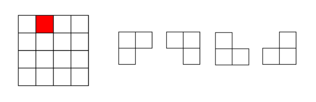

## 一、分治思想

对于一个规模为n的问题P(n)，可以把它**分解为k个规模较小的子问题**，这些子问题**互相独立**，且结构与原来问题的结构相同。在解这些子问题时，又对每一个子问题进行进一步的分解，直到**某个阈值**n0为止。递归地解这些子问题，再把各个子问题的解合并起来，就得到原问题的解。

适用条件：

- 该问题的规模**缩小到一定的程度**就可以容易地解决；
- 该问题可以分解为若干个**规模较小的相同问题**，即该问题具有最优子结构性质；
- 利用该问题分解出的子问题的解可以**合并为该问题的解**；
- 该问题所分解出的各个子问题是相互独立的，即子问题之间不包含公共
  的子问题。

步骤：

- 1)分解：将原问题分解为若干个规模较小，相互独立，与原问题形式相同的子问题；
- 2)解决：若子问题规模较小而容易被解决则直接解，否则再继续分解为更小的子问题，直到容易解决；
- 3)合并：将已求解的各个子问题的解，逐步合并为原问题的解。

### 例：二进制大整数乘法

两个n位大整数x、y相乘：

$x = a+b = a2^{n/2}+b,(a.size=b.size=n/2)$
$y = c+d = c2^{n/2}+d,(c.size=d.size=n/2)$
$xy = ac2^n+(ad+bc)2^{n/2}+bd$

上述式子用了ac、ad、bc、bd四次乘法，可以优化为：

$xy = ac2^n+((a-b)(d-c)+ac+bd)2^{n/2}+bd$

只进行了ac、bd、(a-b)(d-c)三次乘法。

例：多项式乘积

计算两个n阶多项式的乘法：

$p(x) = a_0x^0+a_1x^1+a_2x^2+\dots+a_nx^n$
$q(x) = b_0x^0+b_1x^1+b_2x^2+\dots+b_nx^n$

采用一般的方法计算，需要（n+1)2次乘法运算和n(n+1)次加法运算。

优化：

将一个多项式分为两个：

$p(x) = p_0(x) + p_1(x)x^{n/2}$

$q(x) = q_0(x) + q_1(x)x^{n/2}$

则：

$p(x)q(x) = p_0(x)q_0(x)+[p_0(x)q_1(x)+p_1(x)q_0(x)]x^{n/2}+p_1(x)q_1(x)x^n$

引入：

$r_0(x) = p_0(x)q_0(x)$

$r_1(x) = p_1(x)q_1(x)$

$r_2(x) = [p_0(x)+p_1(x)][q_0(x)+q_1(x)]$$

则可以转化为：

$p(x)q(x) = r_0(x)+[r_2(x)-r_1(x)-r_0(x)]x^{n/2}+r_1(x)x^n$

减少了一次乘法运算。

### 例：棋盘覆盖

在一个$2^k\times 2^k$个方格组成的棋盘中，恰有一个方格与其它方格不同，称该方格为一特殊方格，且称该棋盘为一特殊棋盘。在棋盘覆盖问题中，要用图示的4种不同形态的L型骨牌覆盖给定的特殊棋盘上除特殊方格以外的所有方格，且任何2个L型骨牌不得重叠覆盖。

划分：

将$2^k\times 2^k$棋盘分割为4个$2^{k-1}\times 2^{k-1}$子棋盘(a)所示。特殊方格必位于4个较小子棋盘之一中，其余3个子棋盘中无特殊方格。**为了将这3个无特殊方格的子棋盘转化为特殊棋盘，可以用一个L型骨牌覆盖这3个较小棋盘的会合处，**如 (b)所示，从而将原问题转化为4个较小规模的棋盘覆盖问题。递归地使用这种分割，直至棋盘简化为2×2棋盘。

## 二、复杂度分析

