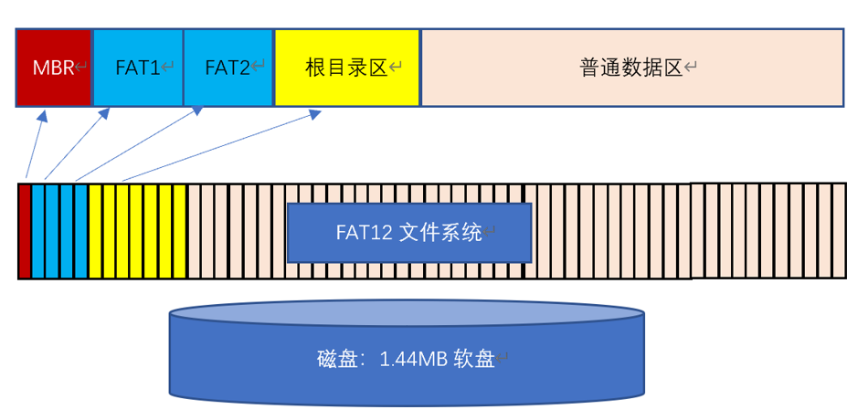
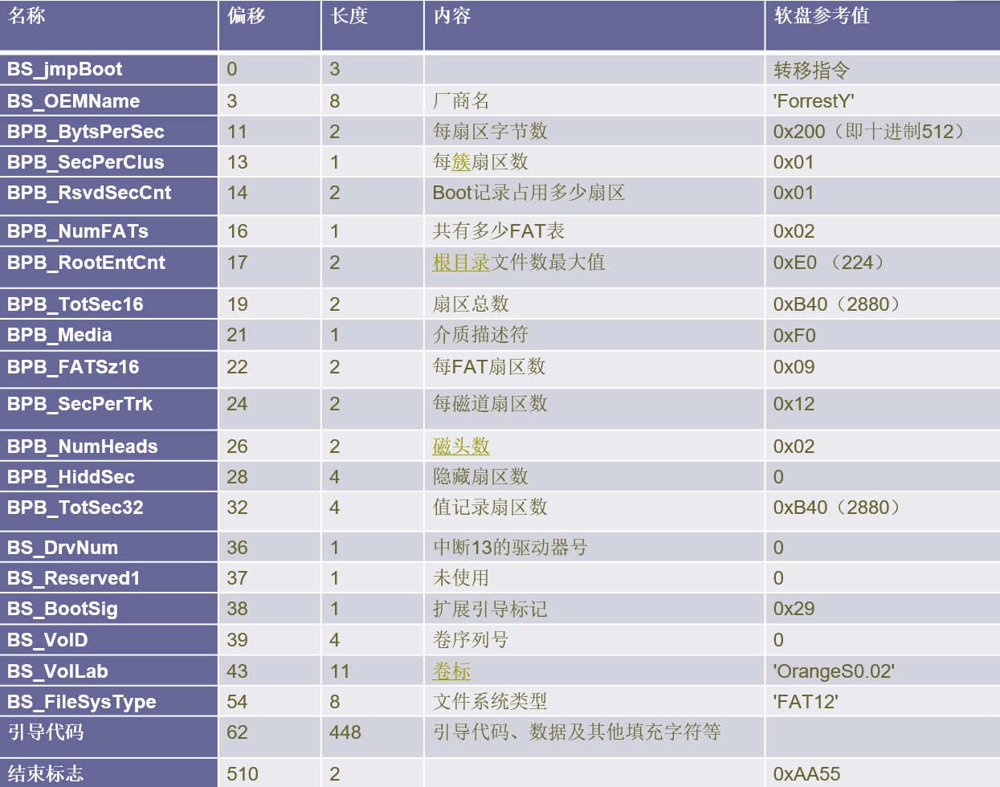
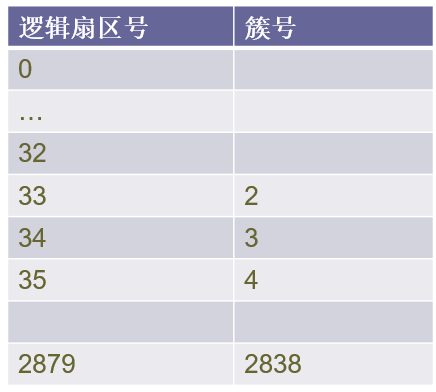
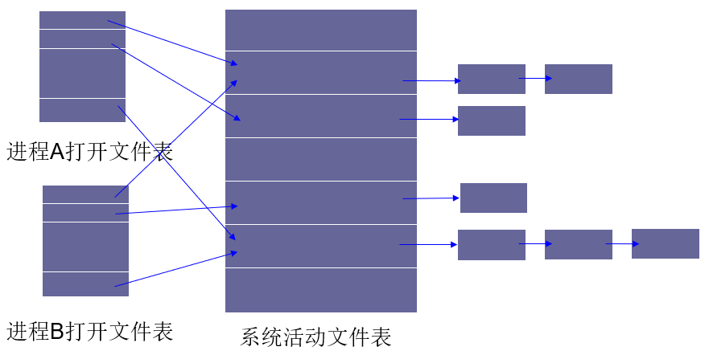

## 一、FAT12文件系统结构



FAT12文件系统结构如上，具有如下性质：

1. 磁盘大小为1.44MB = 1440KB = 2880 x 512B；
2. 一共包括2880个扇区，每个扇区大小为512B；
3. 共分为MBR，FAT表，根目录区，数据区四个部分；

### 1、MBR

位于第一个扇区，在软盘上是0柱面（磁道）0磁头1扇区。存储信息如表所示：



首扇区结构体如下：

```cpp
struct BPB{
    uchar   BS_jmpBOOT[3];  //一个短跳转指令
    uchar    BS_OEMName[8];	       //厂商名	
    ushort  BPB_BytesPerSec;	  //每扇区字节数（Bytes/Sector）	0x200
    uchar   BPB_SecPerClus;	  //每簇扇区数（Sector/Cluster）	0x1
    ushort  BPB_ResvdSecCnt;	  //Boot记录占用多少扇区	ox1
    uchar   BPB_NumFATs;	      //共有多少FAT表	0x2
    ushort  BPB_RootEntCnt;    //根目录区文件最大数	0xE0
    ushort  BPB_TotSec16;	  //扇区总数	0xB40
    uchar    BPB_Media;	      //介质描述符	0xF0
    ushort  BPB_FATSz16;	      //每个FAT表所占扇区数	0x9
    ushort  BPB_SecPerTrk;	  //每磁道扇区数（Sector/track）	0x12
    ushort  BPB_NumHeads;	  //磁头数（面数）	0x2
    uint    BPB_HiddSec;	      //隐藏扇区数	0
    uint    BPB_TotSec32;	  //如果BPB_TotSec16=0,则由这里给出扇区数	0
    uchar   BS_DrvNum;	      //INT 13H的驱动器号	0
    uchar   BS_Reserved1;	  //保留，未使用	0
    uchar   BS_BootSig;	      //扩展引导标记(29h)	0x29
    uint    BS_VolID;	      //卷序列号	0
    uchar   BS_VolLab[11];	      //卷标	'QingFeng'
    uchar   BS_FileSysType[8];	  //文件系统类型	'FAT12'
    uchar   MBR_code[448];	  //引导代码及其他数据
    ushort  end_Sym; //结束标志
};
```

### 2、FAT表

FAT表分为FAT1、FAT2两个表，表示数据块/扇区/簇的链接关系；

每个表包括9个扇区，两个表数据内容相同；

FAT表中一个簇号大小为12bit，**当前簇号位置存储的是下一数据块对应簇号**；簇号与数据区扇区号一一对应，表中前两项用途特别：坏块标志0xFF0、文件结束标志0xFFF，实际簇号从2开始编号；

簇号与逻辑扇区号的换算：`Clus + 31 = DirNum`；



### 3、根目录区

文件系统的根目录区域，一共包含14个扇区，共可存储 14x16=224 个目录项；

一个目录项大小为32B，包含信息如下：


目录项的结构体如下：

```cpp
struct RootEntry{
    uchar DIR_Name[11] = {' ',' ',' ',' ',' ',' ',' ',' ',' ',' ',' '};
    uchar DIR_Attr = 0;
    uchar reserve[10];
    ushort DIR_WrtTime = 0;
    ushort DIR_WrtDate = 0;
    ushort DIR_FstClus = 0xFFF;
    uint DIR_FileSize = 0;
};
```

### 4、数据区

数据区由根目录区目录项的首簇号和FAT表索引，构建出一棵文件目录树；

我们可以使用绝对路径和相对路径，规定以/开头的路径为绝对路径，不以/开头的路径为相对路径，例如：

`/USER/JOIN/A.TXT`

`JOIN/A.TXT`

## 二、相关结构体

将文件系统的结构构建出来后，我们可以对文件进行操作。为了便于操作文件，除了上面的目录项和首扇区外，我们引入下面的结构体；

### 1、当前目录

进行文件操作时，位于某一目录中（根目录或者某一子目录），我们需要利用一个结构来存储当前所在的目录；同时，这一结构体可存储当前时间和日期，用于更新目录项信息：

```cpp
struct CurrentIndex{ //当前目录位置
    ushort firstClus = 0; //首簇号
    string filePath = ""; //文件路径，从根目录开始，以/开头
    short year, month, day; //
    short hour, minu, sec;
};
```

### 2、路径索引

进行文件操作时，命令一定包括一串字符串用于路径索引，索引最终得到一目标文件，我们利用一结构体存储该目标文件的信息：

```cpp
struct DstNode{ //目标文件
    ushort inDir = ROOT_DIR_BEGIN; //文件目录项所在扇区号
    short filePos = -1; //文件目录项所在扇区内位置，
    string fileName, fileType;
};
```

同时，路径索引需要考虑绝对路径和相对路径，对相对路径的处理需结构体要利用`CurrentIndex`。

### 3、文件删除

文件删除后，目录项中文件名首字符ASCII码为`0xE5`；

这类目录项索引了一系列的簇号，这类簇号称为**空闲簇**，需要分配新的空间时，优先选择空闲簇分配给文件使用；

我们使用一个链表结构存储删除文件得到的空闲簇：

```cpp
struct idleNode{ //临时链表
    ushort clus = 0;
    idleNode *next = NULL;
};
```

### 4、文件打开关闭

文件系统常用系统活动文件表和进程打开文件表，仿真使用了这一设计：



进程打开文件表：每个进程都有自己的一个表，每个表项记录文件打开方式、当前读写位置、活动文件表项指针等；

系统活动文件表：系统只有一个表，一个文件只有一个表项，无论多少个进程打开此文件；每个表项记录文件控制块目录项内容、当前共享计数、缓存块队列头指针等；

缓冲块：缓冲块用于文件读写，读写到对应扇区，将该扇区加载至缓冲块中，读写操作都针对缓冲块进行；**当文件完全关闭时，再将缓冲块的数据写回对应扇区；**

```cpp
struct FileBuffer{ //缓冲块
    short inDir = -1;
    char dir[512] = {0};
    FileBuffer *next = NULL;
};

struct ACTIVE_FILE //系统活动文件表
{ 
    short share_counter = 0; //共享计数
    RootEntry* Node = NULL; //目录项
    string filePath = ""; //文件路径，从根目录开始，以/开头，可用Find_Dst_Node找到所在扇区和对应位置
    FileBuffer *buffer = NULL;
};

struct P_FILE //进程打开文件表
{
    int posi = 0;
    short readOrWrite = 0; //读写，0为读，1为写，2为读写
    ACTIVE_FILE *activeFile=NULL;
};
```

## 三、全局变量、宏定义

仿真使用的宏定义如下：

```cpp
#define FDD144_SIZE 1474560
#define FAT1_BEGIN 1
#define FAT2_BEGIN 10
#define ROOT_DIR_BEGIN 19

#define MAX_OPEN_FILEs  10
#define MAX_ACTIVE_FILEs  20
```

部分数据我们会频繁使用，将其设置为全局变量，减少函数调用时参数的传递：

```cpp
ACTIVE_FILE FileActiveList[MAX_ACTIVE_FILEs];
P_FILE pFileOpen[MAX_OPEN_FILEs];
//活动文件表、打开文件表

BPB header[1]; //首扇区
char ramFDD144[FDD144_SIZE]; //软盘文件
CurrentIndex indexPoint[1]; //当前目录
char* const FAT1 = ramFDD144 + FAT1_BEGIN*512;
char* const FAT2 = ramFDD144 + FAT2_BEGIN*512;
idleNode head; //空闲簇链
```

## 四、支持命令

仿真程序所支持命令如下，所有输入均为**大写字母**；

绝对路径格式为 `/USER/JOIN/MUSIC/HOULAI.TXT`

相对路径格式为 `JOIN/MUSIC/HOULAI.TXT` （不含第一个斜杠）

载入程序时，**输入当前时间和当前日期**，在重命名、新建文件、复制文件操作时会将目标文件的最后修改时间、最后修改日期更新为此时输入的时间信息。

`BPB` : 查看首扇区信息；

`DIR` : 查看当前目录下的文件信息；

`INDEX` : 查看从当前目录开始的目录树；

`CD 绝对路径/相对路径`: 进入目录，支持绝对路径、相对路径；

`INFO 绝对路径/相对路径`: 查看单个文件的信息，支持绝对路径、相对路径；

`TYPE 绝对路径/相对路径`: 查看TXT文件的内容，支持绝对路径、相对路径；

`RM 绝对路径/相对路径`: 删除指定路径下的文件，如果是文件夹，将此文件夹内的内容均删除，要求文件未被打开；

`MF 文件名`: 在当前目录下创建文件，若所输入的文件名无后缀，则创建目录文件，并为其分配一个数据块；要求不存在同名文件；

`COPY 源文件名 目标文件名`: 复制源文件，复制结果命名为目标文件；要求不存在同名目标文件，源文件未被打开；

`REN 源文件名 目标文件名`: 重命名源文件为目标文件名；要求不存在同名目标文件，源文件未被打开；

`FILE`:  查看系统活动文件表、进程打开文件表；

`OPEN 绝对路径/相对路径`:  打开文件，需要输入文件打开方式：写/读；

`CLOSE 绝对路径/相对路径`:  关闭文件；

`READ 绝对路径/相对路径`:  读文件，要求文件已打开，从当前文件内指针的位置开始读，需要输入所读字节数；

`WRITE 绝对路径/相对路径`: 写文件，要求文件已打开，从当前文件内指针的位置开始写，需要输入写入的信息，以**空行结束输入**；

`SEEK 绝对路径/相对路径`: 修改文件内指针位置，要求文件已打开，需要输入偏移量（可正可负），和相对参照位置：文件开头/当前文件内指针的位置；

`LINK 源文件名 目标文件名`: 将源文件合并至目标文件的末尾，要求两个文件均已打开

`Q` : 退出。

