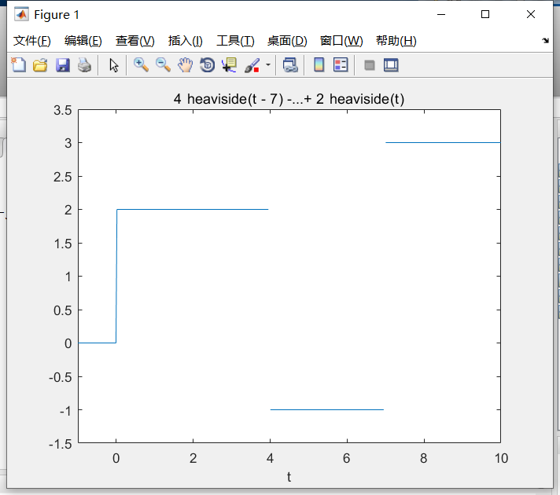
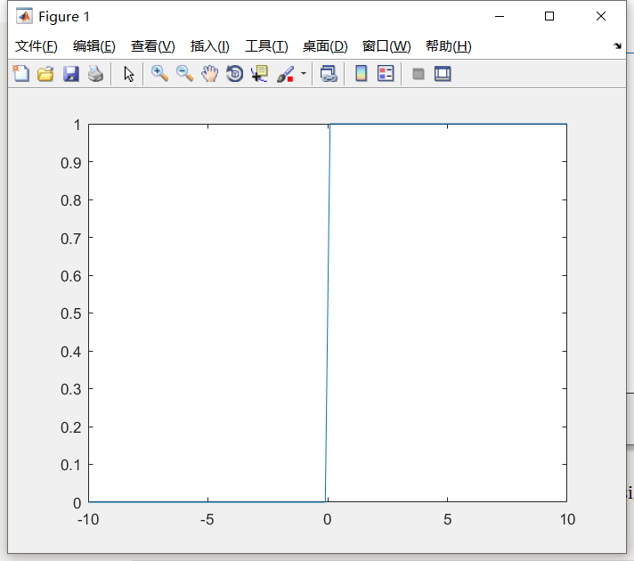
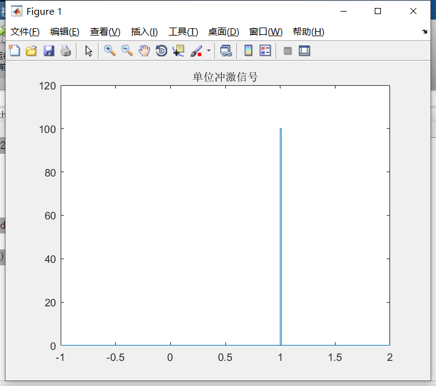
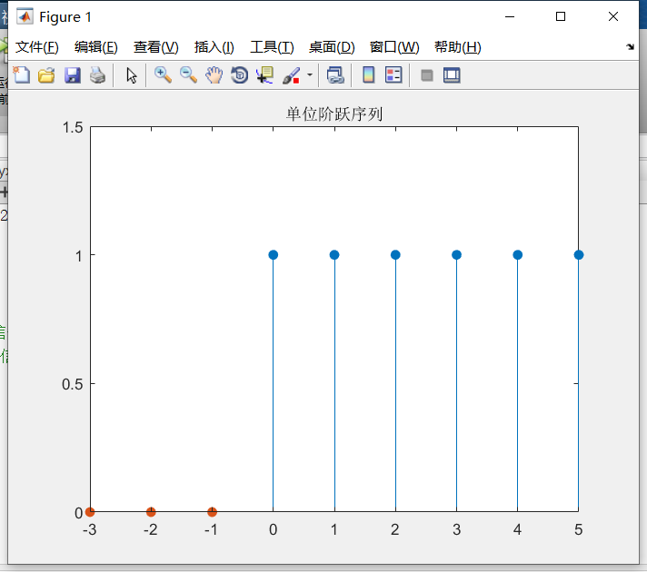
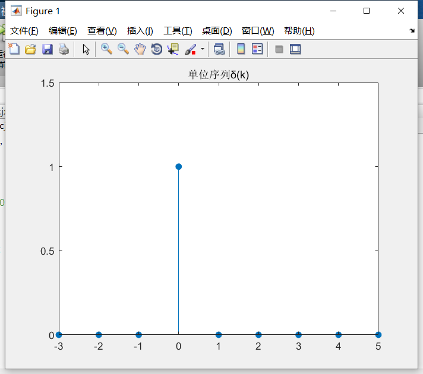

## 一、常用连续信号表示

### 1、单位阶跃信号

heaviside(t)函数用于表示单位阶跃信号，如果我们需要生成多个阶跃信号组合而成的信号图像，可以用如下命令：

```matlab
>> f = sym('2*heaviside(t) - 3*heaviside(t-4) + 4*heaviside(t-7)')
 
f =
 
4*heaviside(t - 7) - 3*heaviside(t - 4) + 2*heaviside(t)
 
>> ezplot(f,[-1,10])
```

效果如图：



或者使用符号函数sgn(t)表示，$u(t) = \frac{1}{2} + \frac{1}{2}sgn(t)$，Matlab中自带sign函数可以实现。

```matlab
>> t = -10:0.1:10;
>> f = sign(t);
>> plot(t,1/2+1/2*f)
```

效果如下：



### 2、单位冲激信号

单位冲激信号需要自己编写函数实现，函数代码如下：

```matlab
function chongji(t1,t2,t0)
dt=0.01;
t=t1:dt:t2;
n=length(t);
x=zeros(1,n);
x(1,(-t0-t1)/dt+1)=1/dt;
stairs(t,x);  #使用stairs画图
axis([t1,t2,0,1.2/dt]) 
title('单位冲激信号')
```

- t1：图像起始时刻
- t2：图像结束时刻
- t0：信号平移量

调用及效果如下：

```matlab
>> chongji(-1,2,-1)
```



### 3、一般信号表示

向量表示：`t = t1 : p : t2`，`f = f(t)` 构成一系列向量，使用`plot(t,f)`画图。

符号表示：`f = sym(f(t))`用表达式表示，直接使用`ezplot(f,[t1,t2])`表示。


## 二、常用离散信号表示

### 1、单位阶跃序列

```matlab
function jyxulie(k1,k2,k0)
k=k1:-k0-1;
kk=-k0:k2;
n=length(k);
nn=length(kk);
u=zeros(1,n); %k0 前信号赋值为零
uu=ones(1,nn); %k0 后信号赋值为一
stem(kk,uu,'filled')
hold on
stem(k,u,'filled')
hold off
axis([k1,k2,0,1.5])
title('单位阶跃序列')
```

- k1：图像起始时刻
- k2：图像结束时刻
- k0：信号平移量



### 2、单位冲激序列

```matlab
function cjxulie(k1,k2,k0)
k=k1:k2;
n=length(k);
f=zeros(1,n);
f(1,-k0-k1+1)=1; %在 k0 时刻，信号赋值为 1
stem(k,f,'filled')
axis([k1,k2,0,1.5])
title('单位序列δ(k)');
```

参数同上；



### 3、一般信号表示

使用`stem(n,f)`进行绘制，构成一系列向量。