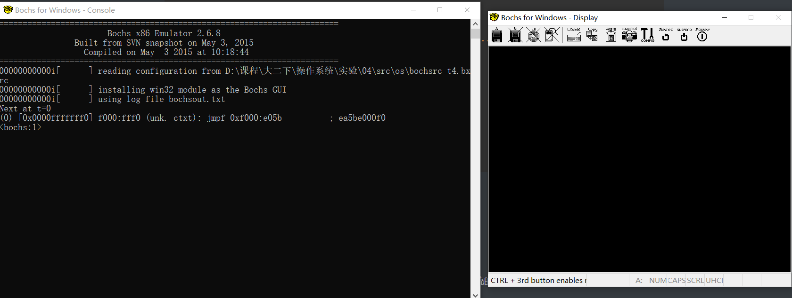

> Bochs是一个x86硬件平台的开源模拟器。它可以模拟各种硬件的配置。Bochs模拟的是整个PC平台，包括I/O设备、内存和BIOS。更为有趣的是，甚至可以不使用PC硬件来运行Bochs。事实上，它可以在任何编译运行Bochs的平台上模拟x86硬件。通过改变配置，可以指定使用的CPU(386、486或者586)，以及内存大小等。一句话，Bochs是电脑里的“PC”。


## 一、启动设置

第一次接触Bochs，遇到的第一个问题是——如何运行这个虚拟机。不像virtual box或者VM ware有着比较清晰的用户界面，刚开始使用Bochs，会感觉无从下手。

一个虚拟机的启动需要一个存储媒介作为启动盘，而这些启动设置需要我们手动写一份配置文件，在Bochs读取这份配置文件后，便可根据配置文件启动虚拟机。

一份简单的配置文件(bochsrc.bxrc)如下，使用了软盘`test.img`作为启动盘：

```assembly
# 第一步，首先设置Bochs在运行过程中能够使用的内存，本例为32MB。
# 关键字为：megs
megs: 32
# 第二步，设置对应真实机器的BIOS和VGA BIOS.
# 对应两个关键字为：romimage 和 vgaromimage
romimage: file=$BXSHARE/BIOS-bochs-latest
vgaromimage: file=$BXSHARE/VGABIOS-lgpl-latest  
# 第三步，设置Bochs所使用的磁盘，软盘的关键字为floppy。
# 若只有一个软盘，则使用floppya即可，若有多个，则为floppya，floppyb...
floppya: 1_44=test.img, status=inserted
# 第四步，选择启动盘符。
boot: floppy
# 第五步，设置日志文件的输出。
log: bochsout.txt
# 第六步，开启或关闭某些功能。
# 下面是关闭鼠标，并打开键盘。
mouse: enabled=0
```

启动`bochs.exe`，读取这份配置文件，点击`start`，就可以成功启动虚拟机。


## 二、Bochs调试

使用上面的配置文件，这次我们需要使用`bochsdbg.exe`打开，这是Bochs系统的调试执行程序。



成功打开后会有一个控制界面（左）和一个主显示窗口（右），我们在控制界面输入指令进行调试。

### 1、基本调试指令

虚拟机刚开始运行时，引导扇区还没被加载至内存，为了让虚拟机开始运行，我们需要输入`pb 0x7c00`设置断点，然后输入`c`执行至断点处，这样Bochs就会执行0x7c00处停下。然后我们就可以根据自己的需要，设置断点、运行虚拟机，并查看内存、cpu的相关信息了。

接下来是我常用的几个调试指令：

- pb addr：在某物理地址设置断点，`pb 0x8100`

- u start end：反汇编一段内存，`u 0x7c00 0x7e00`
- s：单步执行；
- c：执行至断点处；
- sreg：查看段寄存器信息；
- info cpu：查看cpu信息；
- trace on：反汇编执行的每一条指令；
- trace on：反汇编执行的每一条指令；
- trace-reg on：每执行一条指令就打印CPU信息；
- print-stack：显示当前堆栈；
- info ivt：显示中断向量表；
- blist：显示断点列表；
- del number：删除一个断点，number为blist中断点序号；


## 参考资料

[bochs调试教程](https://segmentfault.com/a/1190000008342230)

[Bochs常用调试命令](https://blog.csdn.net/ddna/article/details/4997695)