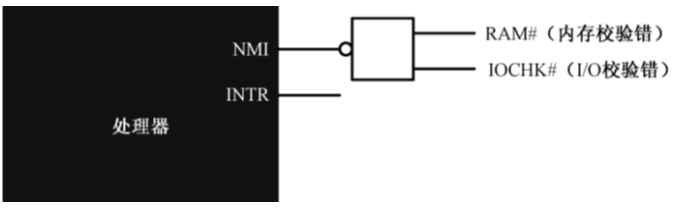
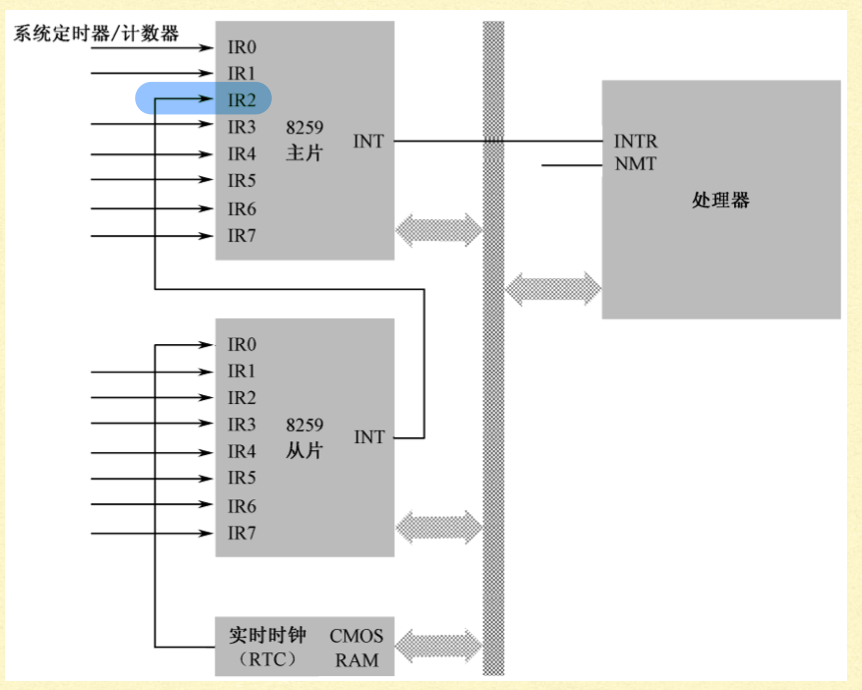
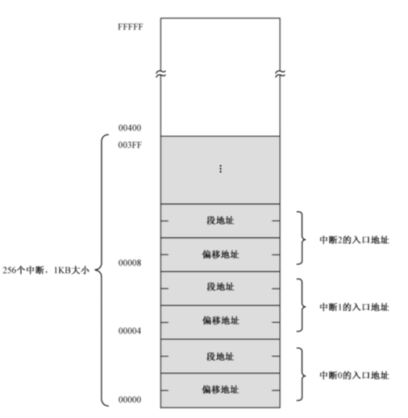
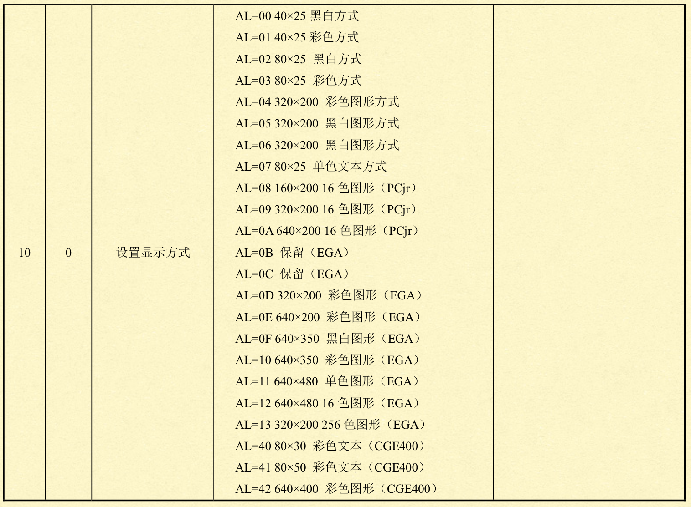
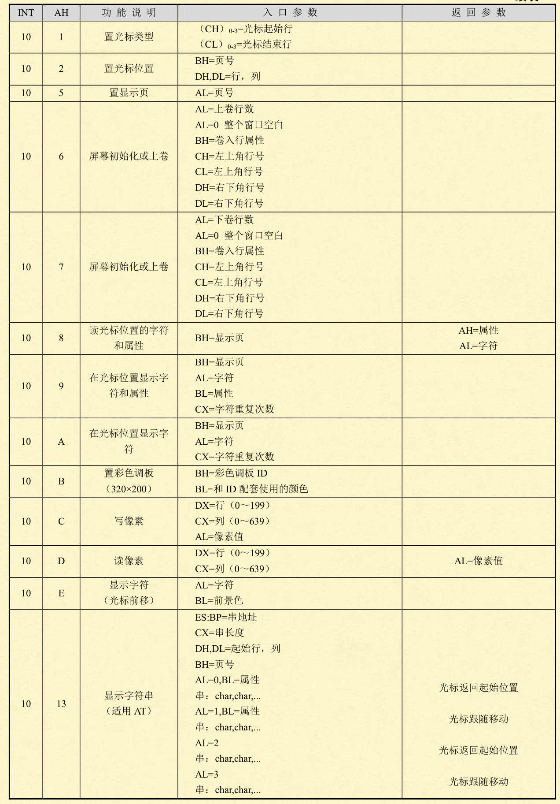
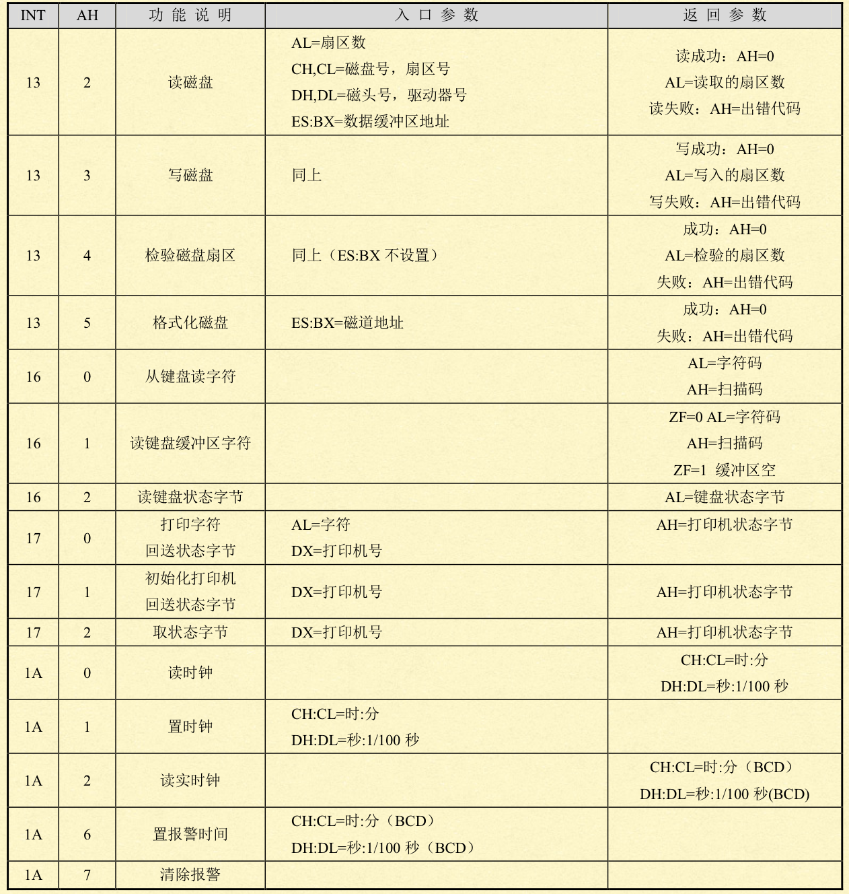

## 一、中断

处理器在运行时需要支持和外部设备的**并发工作**，即实现中断技术。中断(interrupt)是指对处理器正常处理过程的打断。

中断与异常一样，都是在程序执行过程中的强制性转移，转移到相应的处理程序。

### 1、分类

中断具有以下分类：

1. 硬中断（外部中断）——由**外部（主要是I/O设备）的请求**引起的中断
   1. 时钟中断（计时器产生，等间隔执行特定功能）
   2. I/O中断（I/O控制器产生，通知操作完成或错误条件）
   3. 硬件故障中断（故障产生，如掉电或内存奇偶校验错误）
2. 软中断（内部中断）——由**指令的执行**引起的中断
   1. 中断指令（软中断int n、溢出中断into、中断返回iret、单步中断TF=1）
3. 异常/程序中断（指令执行结果产生，如溢出、除0、非法指令、越界）

### 2、外部中断控制

x86结构的CPU最多**支持256种中断**，**外部中断**由如下两条中断请求线控制：



- NMI（Non Maskable Interrupt，不可屏蔽中断）
- INTR（Interrupt Request，可屏蔽中断）

对NMI的处理不受标志位影响，在执行完成当前指令之后，立即响应。

CPU对INTR可屏蔽中断的处理取决于标志寄存器`FLAGS`的`IF`位，当`IF=1`，响应可屏蔽中断。对IF的设置可用如下指令：

```assembly
sti	;开中断
cli	;关中断
```

一条INTR线作为中断处理无疑是不够用的，X86处理器用两个级联的**8259A芯片**作为外设向CPU申请中断的代理接口，使一条INTR线扩展成**15条**中断请求线。

8259A是一种**PIC**（Programmable Interrupt Controller，**可编程中断控制器**），是用来处理中断的，CPU使用了中断机制，虽然不用自己去持续监听外部设备，但总是需要一个设备来做这件事情，这就是PIC。



### 3、中断向量表IVT

中断处理过程，即得到**中断号**之后，处理器需要执行**对应的一段程序**，处理器可以处理256个中断，理论上共需要256段程序。这些程序可以位于内存各个位置，但需要一个表去索引其入口位置。

在**实模式**中，在内存的低位区（0~0x3FFH）共1KB的空间内，创建含256个中断的**中断向量表IVT** 。

每个中断向量占4B，格式为：16位段值（高位）:16位偏移值（低位）。




当系统进入**保护模式**，IVT（Interrupt Vector Table，中断向量表）会失效，需改用IDT（Interrupt Descriptor Table，中断描述表），必须自己编程来定义8259A的各个软中断类型号和对应的处理程序。

## 二、中断处理过程

在处理器接收到中断信号时（包括外中断和内中断），会按照以下步骤开始处理中断：

1. 硬件实现的保护断点现场：

   1. 将标志寄存器`FLAGS`压栈，**然后清除它的IF位和TF位**（在中断处理过程中，处理器将不再响应硬件中断）
   2. 再将当前的代码段寄存器`CS`和指令指针寄存器`IP`压栈
   3. 经过操作后，当前栈的构造从栈顶开始为：IP、CS、FLAGS

2. 执行中断处理程序：

   1. 由于处理器已经拿到了中断号，它将该号码乘以4（<<2），就得到了该中断入口点在中断向量表中的偏移地址。
   2. 从表中依次取出中断程序的偏移地址（低位）和段地址（高位），并分别传送到IP和CS，处理器就开始执行中断处理程序了。 
   3. 如果希望更高优先级的中断嵌套，可以在编写中断处理程序时，适时用sti指令开放中断。 

3. 返回到断点接着执行：

   1. 中断处理程序的最后一条指令必须是中断返回指令`iret`。这将使处理器依次从堆栈中弹出IP、CS和FLAGS的原始内容，转到主程序接着执行。 

   

在NMI发生时，处理器会自动生成中断号2，其他过程与上述处理相同。


## 三、8259A编程

每个可编程中断控制器8259A都有两个I/O端口：

- 主8259A所对应的端口地址为20h和21h，
- 从8259A所对应的端口地址为A0h和A1h。
- 可以通过`in/out`指令读写这些端口，来操作这两个中断控制器。
- 主8259A的中断号从0x08开始，对应0x08~0x0e。


## 四、软中断

软中断是由int指令引起的中断处理（可以理解为主动进行中断）。

使用int时对应的BIOS中断表如下：







