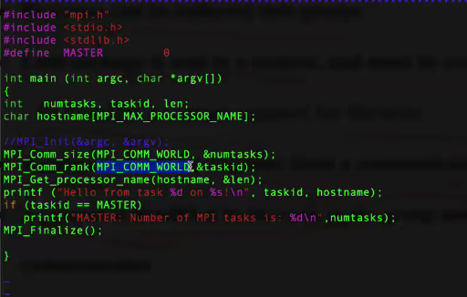
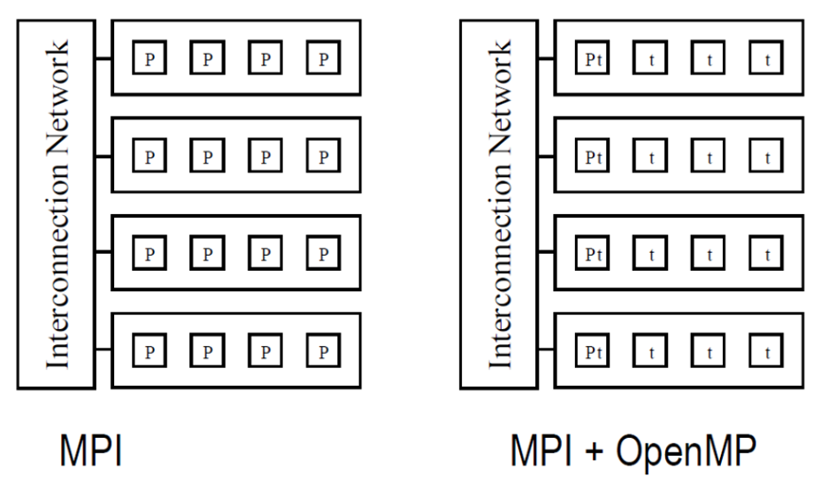
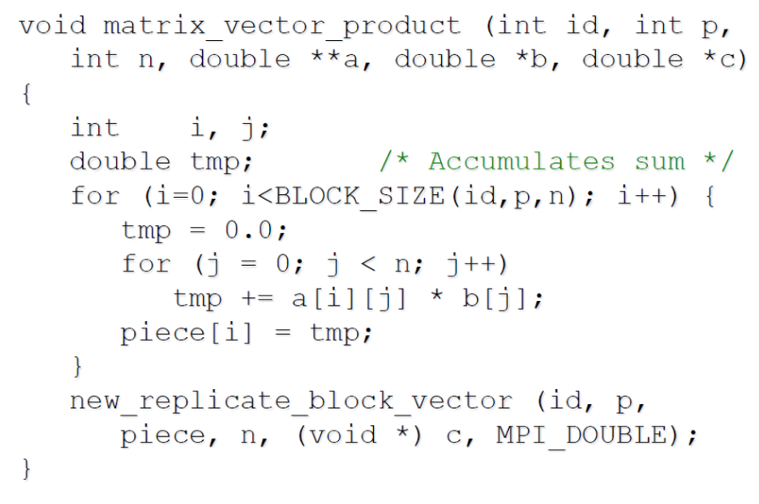
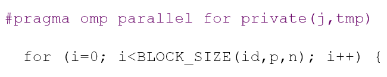
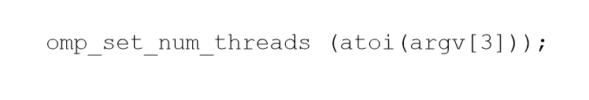
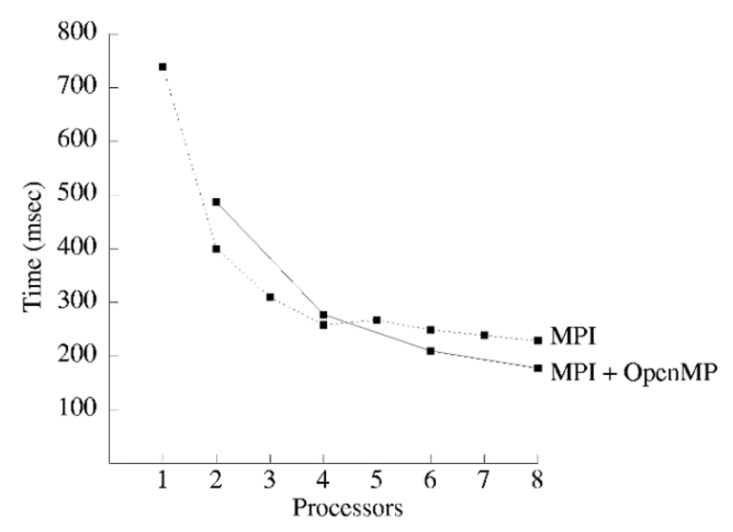

## 一、消息传递模型

消息传递模型的系统逻辑由 p 个处理器组成，每个处理器都有自己专用的内存地址空间。

### 1、消息传递模型的限制

- 每个数据元素必须属于某一个处理器的内存空间；因此，必须**显式分区和放置数据**。
- 数据所在的进程和想要访问数据的进程的所有**交互（只读或读/写）都需要两个进程的交互**。

通常使用**异步（各自独立执行）**或**松散同步（每个进程有一定自由度，某些点进行同步）**的方式编写，大多数消息传递程序是使用**单程序多数据（SPMD）**模型编写的。


### 2、Send 和 Receive 分类

#### a、Non-buffered blocking 非缓冲阻塞

- 强制 send/recv 语句的方法：send 操作仅在安全时返回；
- 非缓冲阻塞 send：send 操作在传输过程中进行空转，遇上匹配的 recv 后进行返回；
- 存在空转、死锁问题。

#### b、Buffered blocking 缓冲阻塞

- 发送方只需将发送数据复制到指定的缓冲区中，并在复制操作完成后返回。
- 数据也被复制到接收方的缓冲区中。
- 引入缓冲减少了空转的开销，而增加了复制开销。
  - 缓冲区大小可能对性能影响显著。
  - 由于接受操作块（send-recv）的存在，使用缓冲块仍然可能出现死锁。

#### c、Non-blocking 非阻塞

- 程序员必须确保发送和接收的语义正确。
- 这类非阻塞协议在语义上安全之前从发送或接收操作返回。
- 非阻塞操作通常伴**随检查状态操作**。
- 如果使用正确，这些原语的通信开销可以与计算开销重叠起来。
- 消息传递库通常同时提供阻塞原语和非阻塞原语。

## 二、MPI

> MPI是一个跨语言的通讯协议，用于编写并行计算机。支持点对点和广播。MPI是一个信息传递应用程序接口，包括协议和和语义说明，他们指明其如何在各种实现中发挥其特性。MPI的目标是高性能，大规模性，和可移植性。MPI在今天仍为高性能计算的主要模型。
>
> MPI是一种基于**消息传递**的并行编程技术。消息传递接口是一种编程接口标准，而不是一种具体的编程语言。简而言之，MPI标准定义了一组具有可移植性的编程接口。

### 1、编译要求

[MPI](http://www.mpich.org/)

mpicc：MPI编译器

```
mpicc -o file file.c
```

mpirun：MPI运行程序

```shell
mpirun -n 4 file #单节点4进程
mpirun -n 4 -f hosts file #多节点，节点由hosts说明
```


### 2、关键函数

- `MPI_Init(nt*argc,char***argv)`：起始函数，初始化；
- `MPI_Finalize()`：终止函数，结束时释放资源；
- `MPI_Comm_size`：变量，定义进程的个数；
- `MPI_Comm_rank`：变量，定义当前进程的序号；
- `MPI_Send()`：函数，发送；
- `MPI_Recv()`：函数。接收；


### 3、实例



```cpp
/*
int MPI_Init(int *argc, char **argv);//通过MPI_Init函数进入MPI环境并完成所有的初始化工作，标志并行代码的开始。
int MPI_Finalize(void);//通过MPI_Finalize函数从MPI环境中退出，标志并行代码的结束，如果不是MPI程序最后一条可执行语句，则运行结果不可知。
*/
#include <mpi.h>
#include <stdio.h>

int main(int argc, char **argv)
{

	MPI_Init(&argc, &argv);
	puts("Hello World!");
	MPI_Finalize();

	return 0;
}
```

### 4、通信子

-  通信子定义了一个通信域：**允许彼此通信的一组进程**。
- 有关通信域的信息存储在 MPI_Comm 类型的变量中。
- 通信子被用作所有消息传输 MPI 例程的参数。
- 一个进程可以属于许多不同的（可能重叠的）通信域。
- MPI 定义了一个名为 MPI_COMM_WORLD 的默认通讯子，其中包括所有进程。
- MPI_Comm_size：查询通信子大小；
- MPI_Comm_rank：查询通信子ID；

- MPI 提供了一套广泛的函数来执行公共的集体通信操作。
- 这些操作都是在通信子对应的一个进程组上定义的。
- 在同一个通信子中的处理器必须调用这些操作。

### 5、MPI消息传递

**消息**

- data：(address,count,datatype)
- message：(data,tag)
  - tag：对消息的编号，从0开始，到MPI_TAG_UB

**send，receive**

- `int MPI_Send(void *buf, int count, MPI_Datatype datatype, int dest, int tag, MPI_Comm comm)`
- `int MPI_Receive(void *buf, int count, MPI_Datatype datatype, int source, int tag, MPI_Comm comm, MPI_Status *status)`

- MPI_Send（标准模式）有缓存使用缓存，无缓存显式等待
  - 阻塞，直到可以使用缓存时才返回
- MPI_Bsend(缓冲模式)
  - 立即返回，可以使用发送缓冲
  - Related: MPI_buffer_attach(), MPI_buffer_detach()
- MPI_Ssend（同步模式）需要多次握手
  - 不会返回，直到匹配上 recv
  - Send + synchronous communication semantics\ 发送+同步通信语义
- MPI_Rsend（就绪模式）减少通信信息
  - 当且仅当匹配的 recv 已经准备好了则可以使用；
  - 发送者提供了额外的信息系统，可以节省部分开销
- MPI_Isend（非阻塞标准模式）
  - 不能立即重用 send 缓冲区
  - Related: MPI_Wait(), MPI_Test()


## 三、OpenMP+MPI

 

1. 减少网络通信
   - 只使用 MPI 时，消息在**m\*k 个进程间**传递；
   - 联合编程时，消息在**m 个含有 k 个线程的进程间**传递，代价较低。
2. 使更多部分并行化（只使用 MPI 时，不涉及消息传递的并行过程无法实现）
3. 允许更多通信与有效计算的叠加（overlap）


### 例1：

一个100s的串行程序：

- S：5s，串行
- P1：5s，不涉及消息传递的并行过程
- P2：90s，涉及消息传递的并行过程

仅用MPI（16线程）：

$speedup = 1/(0.1+0.9/16) = 6.4$

联合编程：

$speedup = 1/(0.05+0.05/2+0.9/16) = 7.6$


### 例2：

矩阵乘法



线程级优化：



多节点：



加速比分析，考虑**不同处理器数量**的情况：

- 2、4CPUs：MPI + OpenMP 较慢

  MPI + OpenMP 是共享**内存带宽（memory bandwidth）**的，MPI-only 不是。

- 6、8CPUs：MPI + OpenMP 较快，更低的通信开销。



### 总结分析：

1. Hybrid C+MPI+OpenMP program uniformly faster than C+MPI program.

   混合编程在速度上显著快于 MPI 编程。

2. Computation/communication ratio of hybrid program is superior.

   混合编程的「计算通信比」更胜一筹。理解为单位通信次数/时间内有效计算量更大。

3. Number of mesh points per element communicated is twice as high per node for the hybrid program.

   混合编程内每个通信元素的网格点数是程序节点数的两倍。

4. Lower communication overhead leads to 19% better speedup on 8 CPU.

   混合编程在 8CPU 下通过减少通信开销实现了 19%的加速。


## 参考资料


