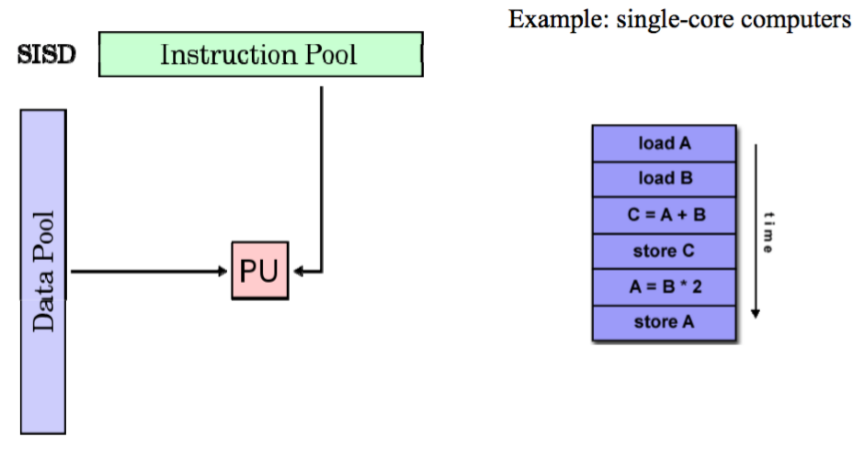
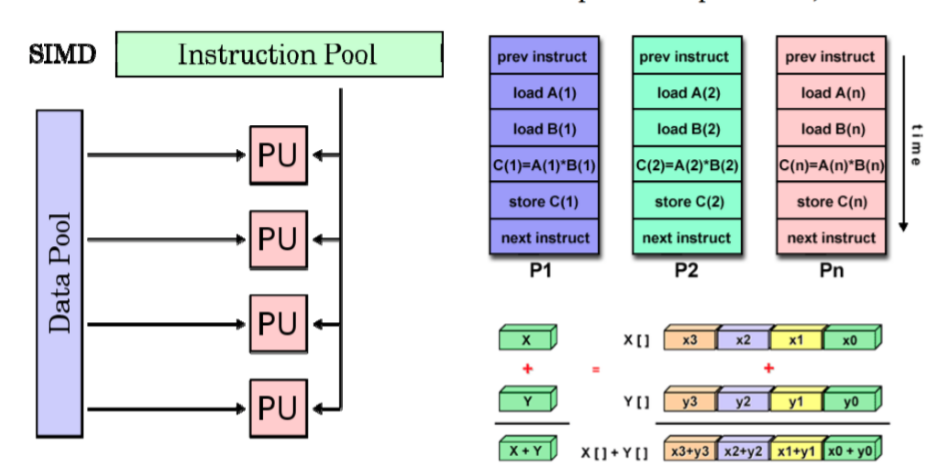
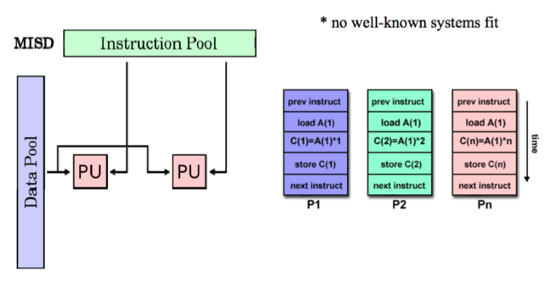
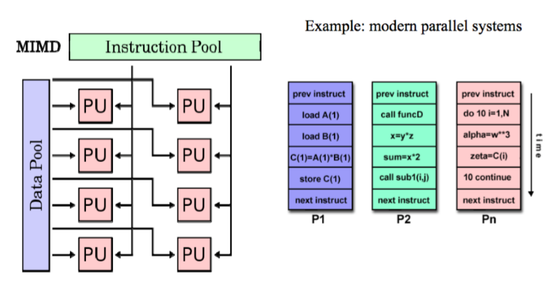
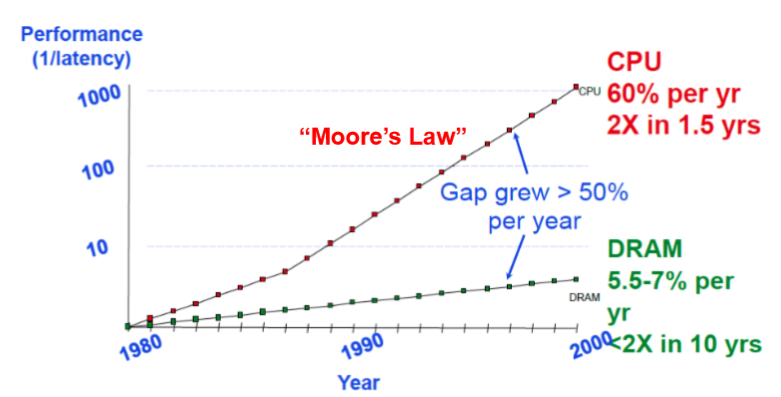

## 第一讲：并行计算概览

内容要点：

> 1. 什么是并行计算
> 2. 并行计算的优势
> 3. 并行计算的主要用途
> 4. 并行计算的主要推动力
> 5. 并行计算的粒度
> 6. 并行编程的难点
> 7. Amdahl Law计算

### 1、基本概念

并行计算可以简单定义为同时利用**多个计算资源**解决**一个计算问题**

- 程序运行在多个 CPU 上；
- 一个问题被分解成**离散可并发解决**的小部分；
- 每一小部分被进一步分解成一组指令序列；
- 每一部分的指令在**不同的 CPU 上同时执行**；
- 需要一个全局的控制和协调机制；

#### 可并行的计算问题

1. 可分解成同时计算的几个离散片段；
2. 在任意时刻可同时执行多条指令；
3. 多计算资源所花的时间少于单计算资源；

#### 计算资源

一般为：

1. 具有**多处理器／多核的单台主机**；
2. 通过**网络连接的若干数量的主机**

### 2、并行计算的优势

1. 在自然界，很多复杂的、交叉发生的事件是同时发生的，但是又在同一个时间序列中；

2. 与串行计算相比，并行计算更擅长**建模、模拟、理解真实复杂的现象**；

3. 节省**时间和花费**

   - 理论上，给一个任务投入更多的资源将缩短任务的完成时间，减少潜在的代价；
   - 并行计算机可以由多个便宜、通用计算资源构成；

4. **解决更大／更复杂问题**：很多问题很复杂，不实际也不可能在单台计算机上解决。

5. 实现**并发处理**：单台计算机只能做一件事情，而多台计算机却可以同时做几件事情（例如协作网络，来自世界各地的人可以同时工作）

6. 利用**非本地资源**：当本地计算资源稀缺或者不充足时，可以利用甚至是来自互联网的计算资源。

7. 更好地发挥**底层并行硬件**

   1. 现代计算机甚至笔记本都具有多个处理器或者核心；
   2. 并行软件就是为了针对并行硬件架构出现的；
   3. 串行程序运行在现代计算机上会浪费计算资源；

   

### 3、并行计算的用途

1. 科学与工程计算
   - 大气、地球、环境
   - 核能、粒子模拟、高分子
   - 生物科技、遗传学
2. 工业和商业应用
   - 大数据、数据挖掘
   - 石油勘探
   - 搜索引擎
   - 医学图像处理
3. 全球范围的应用

### 4、并行计算发展的驱动力

并行计算驱动力可分为两大方面：应用发展趋势和构架发展趋势。

#### （1）应用发展趋势

在硬件可达到的性能与应用对性能的需求之间存在正反馈（Positive Feedback Cycle）：应用需求提升促进硬件性能提升，反之提高性能需求。

大量用户、设备、内容涌现，大数据时代：

- 云计算兴起
- 应用种类繁多
- 负载异构型增加

#### （2）架构发展趋势

##### 发展过程

迄今为止，CPU 架构技术经历了四代即：**电子管（Tube）、晶体管（Transistor）、集成电路（IC）和大规模集成电路（VLSI）**，这里只关注 VLSI。

VLSI 最的特色是在于对并行化的利用，不同的 VLSI 时代具有不同的并行粒度：

- bit 级并行
- 指令集并行
- 线程水平的并行

其中，有摩尔定律支持芯片行业的发展：**「芯片上的集成晶体管数量每 18 个月增加一倍」**。

##### 发展趋势的变化

发展趋势不再是高速的 CPU 主频，而是「多核」。（摩尔定律失效的原因之一）

#### （3）如何提高 CPU 的处理速度

##### 1990 年之前的解决方式

1. 增加时钟频率（扩频）
   1. 深化流水线（采用更多／更短的流水阶段）
   2. 芯片的**工作温度会过高**
2. 推测超标量（Speculative Superscalar, SS） 多条指令同时执行（指令级的并行，ILP）：
   1. 硬件自动找出串行程序中的能够同时执行的独立指令集合；
   2. 硬件预测分支指令；在分支指令实际发生之前先推测执行；

局限：最终出现「收益下降（diminishing returns）」

**这种解决方法的优点：程序员并不需要知道这些过程的细节**

##### 2000 年之后的解决方式

1. 时钟频率很难增加；
2. SS 触到天花板出现「收益下降」；
3. 利用额外的额外的晶体管在芯片上**构建更多／更简单的处理器**；

后来发展，延申出了并行计算机和并行计算集群。

### 5、并行计算机

从硬件角度来讲，今天的单个计算机都是并行计算机，主要体现为：

- 多个功能单元（L1 Cache、L2 Cache、Branch、Prefetch、GPU 等）；
- 多个执行单元或者核心
- 多个硬件线程

##### 并行计算集群

多个单独的计算机**通过网络连接**起来形成计算集群

LLNL 并行计算集群

- 每个**节点**都是一个**多处理器并行机**；
- 多个计算节点通过 **Infiniband 网络**连接；

#### Moore’s law 新解

1. 每两年芯片上的**核心数目**会翻倍；
2. **时钟频率不再增加**，甚至是降低；
3. 需要处理具有很多并发线程的系统；
4. 需要处理**芯片内并行和芯片之间的并行**;
5. 需要处理异构和各种规范（不是所有的核都相同）；

**最后得出结论，需要程序员学会并行编程。**

### 6、并行编程

#### 并行编译器局限

编译器仅做到了有限的并行检测和程序转换；

需要程序员手动进行并行编程。

#### 并行编程难点

1. 找到尽可能多的并行点；
2. 并行粒度：函数及、线程级、进程级；
3. 局部性：并行后能否使用局部数据；
4. 负载均衡;
5. 协作与同步；
6. 性能模型；

#### 与串行编程比较

1. 代价不同、优势不同；
2. 需要不同的算法；
3. 需要利用不同问题的抽象；
4. 更为复杂；
5. 难以控制不同组件之间的交互；
6. 掌握更多编程工具；

**并行程序：任务并行（计算密集型）、数据并行（数据密集型）**

### 7、Amdahl’s Law

用于度量并行程序的加速效果：

$Speedup = \frac{1thread\, execution \, time }{n\, thread \, execution \, time}\\ $

$Speedup = \frac{1}{(1-p)+p/n}$

其中，p 表示程序可并发的部分占整个程序的比例。\

- 应用程序只有一部分进行并行；
- 大量串行代码降低并行性能；

## 第二讲：并行架构

## 

### 1、Flynn’s Taxonomy（费林分类）

 高效能计算机的分类方式：根据资讯流（information stream）可分成指令（Instruction）和数据（Data）两种。据此又可分成四种计算机类型：SISD, SIMD, MISD, and MIMD.

**注意：费林分类是划分计算机的，不是划分CPU的。**

SISD Architecture

例如：单核计算机

SIMD Architecture:单指令多数据流

例子：vector processor,GPUs

延申：SPMD,对称多处理器

MISD Architecture

多指令单数据流

MIMD Architecture 多指令多数据流

例子：现代并行系统

### 2、单处理器并行(Uniprocessor Parallelism)

#### 指令级并行的技术

- （流水线）Pipelining: Overlapping individual parts of instructions
- （超标量执行）Superscalar execution: Do multiple things at same time
- VLIW: Let compiler specify which operations can run in parallel
- （向量处理）Vector Processing: Specify groups of similar (independent) operations
- （乱序执行） Out of Order Execution (OOO): Allow long operations to happen

#### 流水线技术

**限制**

1. Overhead prevents arbitrary division (最小可划分部分的时间)
   - Cost of latches (between stages) limits what can do within stage（锁存的成本（阶段之间）限制了阶段内的功能）
   - Sets minimum amount of work/stage（设置了最小任务）
2. Hazards prevent next instruction from executing during its designated clock cycle（结构竞争、数据竞争、控制竞争）
   - 结构 Structural hazards: Attempt to use the same hardware to do two different things at once（使用同一硬件）
   - 数据 Data hazards: Instruction depends on result of prior instruction still in the pipeline（指令依赖的数据还在流水线中）
   - 控制 Control hazards: Caused by delay between the fetching of instructions and decisions about changes in control flow (branches and jumps)（跳转、分支造成的阻塞）
3. 超标量增加了竞争现象的发生
   - 更多冲突的指令（时钟周期）

#### 乱序执行 Out-of-Order (OOO) Execution

允许指令在阻塞后继续执行，动态调度指令。

#### 预测执行

利用处理器的空闲时间提前执行一些将来 “可能用得上，但也可能被放弃” 的计算（包括分支预测、预读内存和文件数据），从而极大提升系统的整体运行速度。

推测分支结果、依赖关系、甚至值

- 如果正确，则不需要为结果而暂停→提高性能
- 如果不正确，则浪费时间和功率
  - 如果猜测错误，必须能够撤销一个结果
- 问题：猜测的准确性随着流水线中同时出现的指令数量的增加而降低
- 巨大的复杂性：多个组件的复杂度可以扩展为$n^2$、功耗大。

#### 向量处理：VECTOR PROCESSING/SIMD

**SIMD 架构**

- 中央控制器广播指令给处理单元：Central controller broadcasts instructions to multiple processing elements (PEs)
  - 只需一个中央控制器 Only requires one controller for whole array
  - 只需要内存存程序的一份代码 Only requires storage for one copy of program
  - 计算异步 All computations are fully synchronized

- GPU（图形处理单元）有SIMD属性；
- 但是，也有多核行为，所以存在SIMD和MIMD的混合；

#### 3、多线程技术 MULTITHREADING:INCLUDING PTHREADS

##### 相关概念

Thread Level Parallelism (TLP) ：**线程级并行**

TLP明确表示为使用多个执行线程，这些线程本质上是并行的。

线程可以在单个处理器上执行，也可以在多个处理器上执行。

Concurrency vs Parallelism ：**并发和并行**

并发是指两个任务可以在重叠的时间段内启动、运行和完成。**这并不一定意味着它们永远都会同时运行。**例如，在单线程机器上进行多任务处理。

并行是指同时运行多个任务，例如：在多核处理器上运行多任务。

目标：使用多个指令流来提高：

- 运行多程序计算机的吞吐量
- 多线程程序的执行时间

##### POSIX Threads

**定义**：Portable Operating System Interface for UNIX（UNIX的可移植操作系统接口）

**特点**：共享堆，不共享栈；不支持显式通信，因为共享内存是隐式的。

**线程调度：Thread Scheduling **

**调度实现方式**：

- 多道程序设计 Multitasking operating system
- 硬件多线程
- 切换线程的时机

**超线程「Simultaneous Multithreading」**

**定义**：既有多线程，又有指令级的并行

可以更好的占用处理器资源

#### 4、内存系统 UNIPROCESSOR MEMORY SYSTEMS

##### 内存的限制

- Memory system, and not processor speed, is often the bottleneck for many applications.（内存系统，而不是处理器速度，往往是许多应用程序的瓶颈）
- Memory system performance is largely captured by two parameters, **latency and bandwidth**.（内存系统性能主要由两个参数来获取，延迟和带宽。）
- **Latency** is the time from the issue of a memory request to the time the data is available at the processor.（从发出内存请求到数据在处理器上可用的时间）
- **Bandwidth** is the rate at which data can be pumped to the processor by the memory system（内存系统将数据泵送到处理器的速率）

##### 局部性原理 Principle of Locality

###### 定义：

Program access a relatively small portion of the address space at any instant of time（程序在任何时刻访问地址空间的一小部分）

- 时间局部性
- 空间局部性

##### 分级存储 Memory Hierarchy

- 缓存对性能影响巨大
  - 不考虑内存层次就不能考虑性能
- 简单程序的实际性能可能是体系结构的复杂功能
  - 体系结构的微小变化或程序的性能显著改变
  - 要编写快速的程序，需要考虑体系结构
  - 我们需要简单的模型来帮助我们设计高效的算法
- 提高缓存性能的常用技术，称为分块或平铺
  - 思想：用分而治之的方法定义一个适用于寄存器/L1缓存/L2缓存的问题
- 自动调整：通过实验处理复杂性
  - 生成几种不同版本的代码
  - 可以（原则上）在复杂的设计选项中进行优化

命中率，内存延迟

### 5、并行架构：WHAT IS PARALLEL ARCHITECTURE

- Machines with multiple processors（多核心计算机）
- A parallel computer is a collection of processing elements that cooperate to solve large problems fast Some broad issues（并行计算机是一组处理元素的集合，它们合作快速地解决一些大的问题）
- Resource Allocation（资源分配）
  - 一个集合有多大
  - 元素的计算力如何
  - 有多少内存
- Data access, Communication and Synchronization（数据访问、通信、同步）
- Performance and Scalability（性能和可扩展性）

### 并行领域：A PARALLEL ZOO OF ARCHITECTURES

#### MIMD Machines

1. 定义：Multiple Instruction, Multiple Data (MIMD)
2. 通信方式：
   - Shared memory: Communication through Memory（共享内存）
   - Message passing: Communication through Messages（消息传递）

对于大多数机器来说，共享内存建立在消息传递网络之上

- 共享内存
- 分布式内存
- 集群

### 内容要点

### 1. Flynn’s 并行架构分类

>  基于指令流和数据流数量的计算机体系结构分类

### 2. 什么是 pipeline

- Pipelining

> 1. 流水线有助于提高**带宽**而不是降低**时延**
> 2. 带宽受限于**最慢的**流水线阶段
> 3. 加速潜力 = 流水线级数
> 4. MIPS 流水线的 5 个阶段：Fetch->Decode->Execute->Memory->Write Back
> 5. 流水线 CPI < 1

- 流水线的限制

### 3. 有哪些形式的指令级并行

- 单处理器计算机体系结构如何提取并行性?

> 通过在指令流中查找并行性，称为「指令级并行」，向程序员隐藏并行性。

- 指令级并行的例子

> 1. 流水线：指令的各个部分重叠
> 2. 超标量执行：同时执行多个操作
> 3. VLIW（极长指令字）：让编译器指定哪些操作可以并行运行
> 4. 向量处理：指定相似的操作组
> 5. 乱序执行：允许长时间操作

- 现代指令级并行的特点

> 动态调度，乱序执行
>
> > 1. 获取一堆指令，确定它们的依赖性并尽可能消除其依赖性，将它们全部扔到执行单元中，向前移动指令以消除指令间的依赖性。
> > 2. 如同按顺序执行
>
> 预测执行
>
> > 1. 预测分支的结果，若猜测错误必须能够撤销结果
> > 2. 预测的准确性随着流水线中同时运行的指令数量增加而降低
>
> 巨大的复杂性
>
> > 许多组件的复杂性按 n² 来衡量

### 4. 什么是 Pthreads

- 线程级并行

> 1. 指令级并行利用循环或直线代码段内的隐式并行操作
> 2. 线程级并行显式地表示为利用多个本质上是并行的线程执行
> 3. 线程可被用于单处理器或多处理器上

- 并发和并行

> 1. 并发性是指两个任务可以在重叠的时间段内启动、运行和完成。不一定意味着他们两个都会在同一时刻运行.例如在单线程机器上执行多任务。
> 2. 并行性是指任务同时运行，例如多核处理器。

- POSIX 线程概述

> 1. POSIX: Portable Operating System Interface for UNIX
> 2. Pthread: The POSIX threading interface
> 3. Pthread 包括支持创建并行性、同步，不显式支持通信，因为共享内存是隐式的；指向共享数据的指针传递给线程。
> 4. 只有堆上的数据可共享，栈上的数据不可共享。

- 数据共享和线程

> 1. 在 main 之外声明的变量是共享的
> 2. 可以共享堆上分配的对象（如果指针被传递）
> 3. 栈上的变量是私有的，将指向这些变量的指针传递给其他线程可能会导致问题
> 4. 通常通过创建一个大的「线程数据」结构体来完成，该结构体作为参数传递到所有线程中

- ILP 和 TLP 的联系

> 1. 在为 ILP 设计的数据路径中，由于代码中的阻塞或依赖关系，功能单元通常处于空闲状态。
> 2. TLP 用作独立指令的来源，在暂停期间可能会使处理器繁忙。
> 3. 当 ILP 不足时，TLP 被用于占用可能闲置的功能单元。

### 5. 内存局部性原则有哪些

- 内存系统性能的限制

> 1. 内存系统，而不是处理器速度，往往是许多应用程序的瓶颈。
> 2. 内存系统性能主要由两个参数（延迟和带宽）影响。
> 3. 延迟（Latency）是指从发出内存请求到处理器提供数据的时间。
> 4. 带宽（Bandwidth）是存储系统将数据泵送到处理器的速率。

- 局部性原则

> 1. 程序在任何时刻访问相对较小的地址空间。
> 2. 时间局部性：如果一个项被引用，它很快就会再次被引用（例如循环、重用）。
> 3. 空间局部性：如果引用了某个项，则其地址接近的项很快就会被引用（例如，直线代码、数组访问）。

- 局部性原则的优点

> 1. 以最便宜的技术呈现尽可能多的内存。
> 2. 以最快的技术提供的速度提供访问。

### 6. 内存分层

### 7. Caches 在内存分层结构中的重要作用

> 1. 缓存是处理器和 DRAM 之间的小型快速内存元素。作为低延迟高带宽存储，如果重复使用一条数据，缓存可以减少该内存系统的有效延迟。
> 2. 缓存满足的数据引用部分称为缓存命中率。由存储系统上的代码实现的缓存命中率通常决定其性能。

### 8. 新型存储系统的构成

### 9. 什么是并行架构

> 1. 并行结构一般是指并行体系结构和软件架构采取并行编程。主要目的是使更多任务或数据同时运行。并行体系结构是指许多指令能同时进行的体系结构；并行编程一般有以下模式：共享内存模式；消息传递模式；数据并行模式。
> 2. 并行计算机是一组处理元素的集合，它们协同快速地解决一些大问题。

### 10. MIMD 的并行架构包括哪些实现类型

> 1. 对称多处理器：内置多个处理器，共享内存通信，每个处理器运行操作系统的拷贝，例如现在的多核芯片。
> 2. 通过主机的独立 I/O 的非统一共享内存：多处理器，每个都有本地内存，通用可扩展网络，节点上非常轻的 OS 提供简单的服务，调度/同步，用于 I/O 的网络可访问主机。
> 3. 集群：多台独立机接入通用网络，通过消息沟通。

### 11. MPP 架构的典型例子及主要构成