## 第三讲：并行编程模型

内容要点：

> 1. 什么是并行编程模型
> 2. 并行编程模型包括哪些类型？主要特点是什么？
> 3. 并行编程模型包括哪几部分？
> 4. 并行编程模型有哪些实现？
> 5. 造成并行编程模型不能达到理想加速比的原因？
> 6. 任务task和线程thread之间的关系？
> 7. 什么是线程竞争？如何解决？

### 1、并行编程模型概述

#### 历史

1. 1970s – early 1990s，并行计算机由它的并行模型和语言唯一决定。

   - 架构（Architecture） = 编程模型（prog. model ）+ 通信抽象 （comm. abstraction） + 机器（machine）;
- 并行架构依附于编程模型（parallel architectures tied to programming models）;
  
2. 并行架构发展迅猛：

   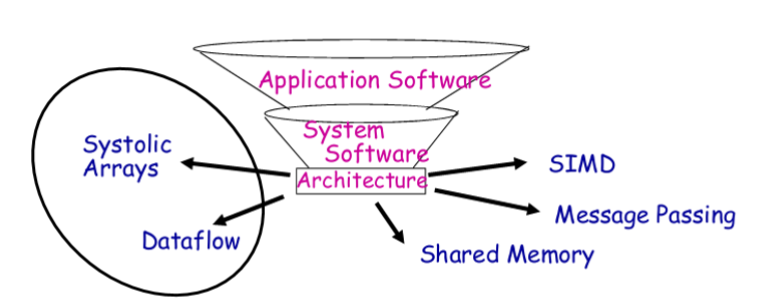

从并行机器架构中分理出**并行编程模型**

**并行编程模型是并行计算机体系架构的一种抽象，它便于编程人员在程序中编写算法及其组合。**

- 程序员在编码应用程序中所使用的（What programmer uses in coding applications）
- 具体化的通信和同步机制（Specifies communication and synchronization）
- [并行编程模型是作为对硬件和内存架构的抽象而存在的。](https://python-parallel-programmning-cookbook.readthedocs.io/zh_CN/latest/chapter1/04_Parallel_programming_models.html)

#### 并行编程模型的主要类型及特点

- 共享内存（shared address space）: **openMP**
  - 每个任务有各自的本地数据（Independent tasks encapsulating local data）
  - 任务通过**交换消息**进行交互；
- 消息传递（message passing）: **MPI**
  - 任务共享内存地址空间；
  - 任务通过异步读取和写入此空间进行交互（Tasks interact by reading and writing this space asynchronously）

- 数据并行（data parallel）：**GPU**
  
  - 要求执行一系列独立的操作（Tasks execute a sequence of independent operations）
  - 数据通常在任务之间均匀分区；
  - 也被称为「令人尴尬的并行」
- 其他：
  - 数据流（data flow）：**tensorflow**
  - 收缩阵列（systolic arrays）
  
  

#### 并行编程模型主要包括

1. 控制：如何创建并行性；应按什么顺序进行操作；不同的控制线程是如何同步的
2. 变量声明：数据是私有的还是共享的；如何访问共享数据
3. 操作：什么操作是原子操作
4. 成本：我们如何计算开销

### 2、共享内存模型

#### 特点

- 任何处理器都可以直接引用任何内存位置；

  - 由于内存的加载和存储而发生**隐式通信**；

- 便捷性：

  - 位置透明（Location transparency）

  - 编程模型相似，以便在单处理器上进行时间共享

    （Similar programming model to time-sharing on uniprocessors）

    - 进程运行在不同的处理器上；
    - 在多道程序设计的工作负载上具有良好的吞吐量；

- 一般利用进程和线程来实现；

- 任务共享一个公共地址空间，它们**异步读写**。

- 可以使用各种机制，如**锁、信号量**来控制对共享内存的访问。

- 从程序员的角度来看，该模型的一个优点是**无需数据「所有权」的概念**，因此**无需明确规定任务之间的数据通信**。（程序开发通常可以简化）

- 在性能方面的一个重要缺点是，**难以理解和管理数据的内存位置**。

  - 将数据保持在处理器的本地，这样可以节省在多个处理器使用相同数据时发生的**内存访问、缓存刷新和总线流量**。
  - 不幸的是，难以理解数据的局部性，并且超出了普通用户的控制范围。

#### 实现的两种方式

- 单机上，依赖编译器和硬件将程序变量转换成实物理地址，即全局地址。

  Native compilers and/or hardware translate user program variables into actual memory addresses, which are global。

- 在分布式系统中，内存分布在同一网络不同机器上，但是通过软件和硬件转换成全局地址。

  On distributed shared memory machines, such as the SGI Origin, memory is physically distributed across a network of machines, but made global through specialized hardware and software。

####  实现的典型架构

- SAS Machine Architecture

  - 对称多处理器SMP：

    - 所有CPU在每个领域都有相同的性能，（I/O和内存访问）

  - 共享内存处理器：

    - 非信息传递机器

  - 现在它倾向于指**基于总线**的共享内存机器：

    - 小规模：通常<32个处理器

    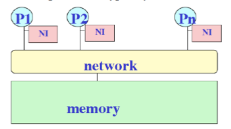

- 规模变大时会出现问题：

  - 互连的总线等成本问题 ：cost (crossbar) or bandwidth (bus)

  - 带宽不会提升：Dance-hall: bandwidth is not scalable, but lower cost than crossbar

- 改进：

  - 分布式内存或非统一内存访问（NUMA）：

    Distributed memory or non-uniform memory access (NUMA)
  
  - 利用通用网络中的简单消息事务（如读请求、读响应）构造共享地址空间：
  
    Construct shared address space out of simple message transactions across a general-purpose network (e.g. read-request, read-response)

### 3、线程模型

#### 概述

- 最典型的共享内存编程模型
- 单进程可以有多个并发的执行路径
- 类比：包含许多子例程的单个程序的概念

#### 特点

- 程序控制一组线程集合，线程可以动态创建；
- 每个线程都有一组私有变量，（栈变量）
- 也有一组共享变量，（静态变量、共享公共块，或者全局堆）
  - 线程通过**读写共享变量**进行隐式通信
  - 线程通过**同步共享变量**来协调）

#### 造成并行编程模型不能达到理想加速比

- 利用 Amdahl’s Law 定律：程序存在部分代码只能串行执行

- 还有其他的问题：

  1. 线程创建需要开销。
2. 数据划分会出现不均衡。（负载不均衡）
  3. 共享数据会出现 RC 问题、死锁问题。（加锁、解锁影响性能）

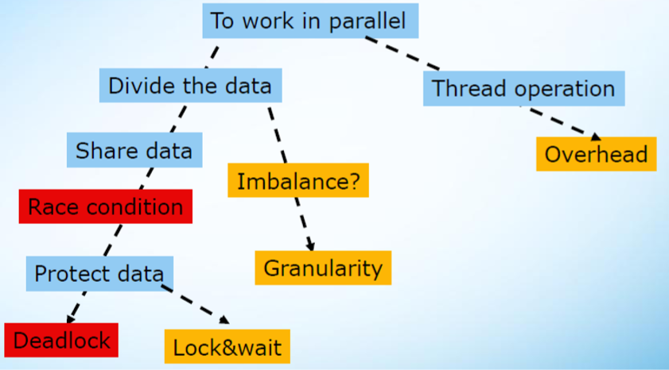

#### 解耦：Decomposition

有下列两种含义：

- 数据解耦：Data decomposition
  - 将**整个数据集**拆分为较小的离散部分，然后并行处理
  
    Break the entire dataset into smaller, discrete portions, then process them in parallel
- 任务解耦：Task decomposition
  - 基于**独立子任务**的自然集合划分整个任务
  
    Divide the whole task based on natural set of independent sub-tasks

- 注意事项：Considerations
  - 设计较少的共享数据

    Cause less or no share data

  - 避免子任务之间的**依赖性**，否则成为流水线

    Avoid the dependency among sub-tasks, otherwise become pipeline

#### 任务（Task）和线程（Thread）之间的关系

##### 任务的特点

- 任务包含数据和它的进程，任务被调度到线程上进行执行

  A task consists the data and its process, and task scheduler will attach it to a thread to be executed

- 任务比线程更轻量级 

  Task operation is much cheaper than threading operation

- 线程之间可以通过任务的 steal 达到负载均衡的目的

  Ease to balance workload among threads by stealing

- 任务适合多种数据结构：（列表、树、地图数据结构）

  Suit for list, tree, map data structure

##### 注意事项

- 任务比线程**多得多**

  - 更灵活地安排任务
  - 更轻易地负载均衡

- 任务中的**计算量必须足够大**，以抵消管理任务和线程的开销

- 静态调度：任务是独立函数调用的集合，或者是循环迭代

- 动态调度：任务执行长度可变且不可预测，**可能需要一个额外的线程来管理共享结构以保存所有任务**

  

#### 什么是线程竞争？如何解决

##### RC 问题

- 定义：

  一般来说，指的是多个线程在**同一时间**访问**同样的内存位置**，其中至少**有一个线程**进行**写操作**。

- 解决：

  - 设置临界区：
    - 互斥和同步、临界区、原子操作
  - 把全局变量变成线程的局部变量
    - 对全局变量进行局部拷贝
    - 将变量声明在线程栈中

##### 死锁

- 定义：两个或多个线程等待彼此释放资源；一个线程等待一个永远不会发生的事件。

- 解决：

  - 始终按相同顺序锁定和解除锁定，并尽可能避免层次结构；
  - 使用原子操作

##### 线程安全例程/库

可重入函数，它在多个线程同时执行期间正常工作，后者的执行流对同一个函数的操作，并不影响前一个执行流恢复执行后产生的结果。

- 可重入函数的条件：
  - 不使用全局、静态变量或堆
  - 不调用不可重入函数
  - 不适用标准IO库
  - 不返回全局、静态变量
  - 仅使用局部变量、制作全局变量的局部拷贝

##### 负载不均衡

- 所有线程以相同的方式处理数据，但一个线程分配了更多的工作，因此需要更多的时间来完成它并影响整体性能。
- 注意事项：
  - 尽量对内层循环进行并行化
  - 细粒度并行
  - 使用合适算法
  - 分治，master and work, work-stealing

##### 粒度

较大实体（任务/线程）的细分程度，粗粒度意味着划分结果大而少，细粒度意味着划分结果小而多；

- 注意事项：
  - 细粒度将增加任务调度程序的工作量；
  - 粗粒度可能导致工作负载不平衡；
  - 设定适当粒度的基准

##### 锁和等待

保护共享数据并确保任务按正确顺序执行，使用不当会产生副作用

- 注意事项
  - 选择适当的同步原语
  - 使用非锁定锁
  - 降低锁的粒度
  - 为共享数据引入并发容器

### 4、消息传递模型

- 将完整的计算机作为构建块，通过显式I/O操作进行通信
- 编程模型：
  - 直接访问本地地址空间（本地内存）
  - 通过显式消息进行通信（发送/接收）
- 编程模型进一步从基本硬件操作

- 消息传递：

  - Send指定要传输的缓冲区和发送过程
  - Recv指定接收进程和要接收到的应用程序存储
  - 消息内存到内存进行复制，但需要命名进程
  - 发送时的可选标记和接收时的匹配规则
  - 开销：复制、缓冲区管理、保护

  

### 5、GPGPU模型

硬件架构师喜欢SIMD，因为它允许非常节省空间和能源的实现。

然而，CPU上的标准SIMD指令是不灵活的，而且对于编译器来说很难使用；

CUDA以额外的硬件为代价来提供可编程性；（计算、存储的抽象——分层结构）

**计算：Kernel——Grid——Block——Thread**

**存储：Local（Thread内）——Shared（Block内）——Global、Constant、Texture**

OpenCL（全称Open Computing Language，开放运算语言）是第一个**面向异构系统通用**目的并行编程的开放式、免费标准，也是一个统一的编程环境，便于软件开发人员为高性能计算服务器、桌面计算系统、手持设备编写高效轻便的代码，而且广泛适用于多核心处理器(CPU)、图形处理器(GPU)、Cell类型架构以及数字信号处理器(DSP)等其他并行处理器。

- 数据并行：SPMD

  - 在一个工作群中的工作单元运行同一段代码
  - 工作单元的ID用于选择数据和执行
  - 显式SIMD、隐式SIMD

- 任务并行

  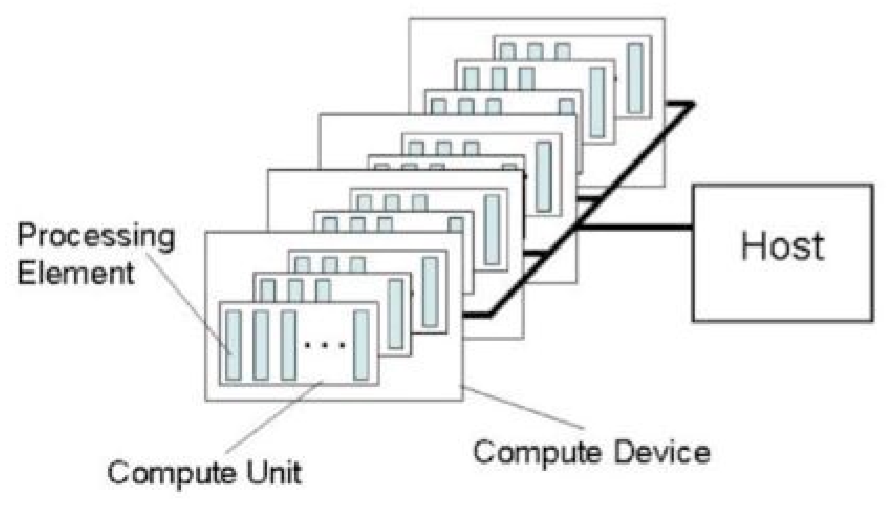

### 6、数据并行系统

- 非冯诺依曼结构：无程序计数器，每一个数据单元都有对应的处理器（process element）用于运算；
- 根据数据的类型分配不同处理器；
- 每个处理器的计算简单，效率高；
- 应用场合：科学计算领域对微分方程的求解
- Dataflow：
  - 非冯诺依曼架构
  - 指令执行序列不可预测
  - 数据流机器分为动态、静态

## 第四讲：并行编程方法论

### 内容要点

> 1. 什么是增量式并行化？
> 2. Culler 并行设计流程？
> 3. Foster 并行设计流程？
> 4. 按数据分解和按任务分解的特点？
> 5. 并行任务分解过程中应该注意的问题有哪些？ 
> 6. 归并的意义是什么？
> 7. Mapping（映射）如何决策？
> 8. 熟悉一些并行设计的例子。

问题 --> 并行问题

### 1、增量式并行化

- 一个串行程序
- Study a sequential program (or code segment)
- 寻找程序可并行部分
- Look for bottlenecks & opportunities for parallelism
- 尽量让所有的处理器做有用的工作
- Try to keep all processors busy doing useful work

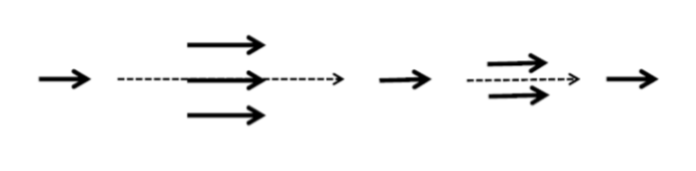

### 2、Culler 并行设计流程

主要分四个步骤：

- （Decomposition）问题解耦、划分
- （Assignment）分派、调度
- （Orchestration）配置、治理
- （mapping）映射

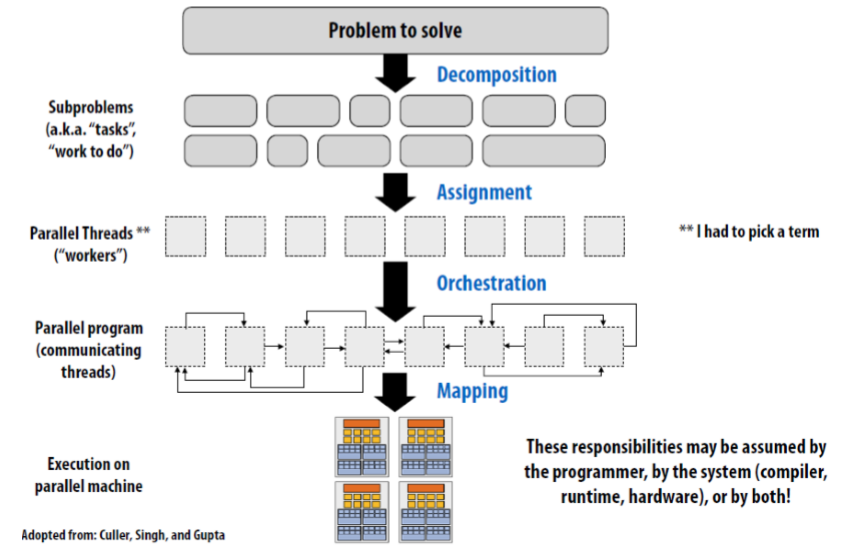

#### 1. Decomposition：问题解耦、划分

##### 定义

将任务分解成可以并行执行的部分

- Decomposition need not happen statically
- New tasks can be identified as program executes

##### 核心思想、目的

- **创建最少任务**且使得所有的机器上的**执行单元都处于忙碌状态**

##### **关**键方面

- 识别出依赖部分（子任务之间的依赖关系）。（identifying dependencies）

##### 负责的对象

- 一般是程序员来做这件事情。
- 自动化解耦：编译器分析依赖关系（数据流、控制流分析），循环易于实现自动解耦

#### 2. Assignment：分派、调度

##### 定义

- 分发任务给线程。

##### 目标

- 负载均衡，减少通信开销。

##### 特点

- 静态动态皆可，一般需要程序员来负责，也有非常多语言可以自动对此负责。

#### 3. Orchestration：配置、编排

##### 定义

##### 定义

- 结构化通信（编排线程之间的通信关系）
- 增加同步来保证必要的依赖性
- 在内存中组织数据结构
- 调度任务

##### 目的

- 减少通信和同步的开销，保护数据的局部性，减少额外开销(overhead)。

#### 4. Mapping：映射

##### 定义

- 将线程映射到硬件上

##### 执行对象

- OS：Pthread
- compiler：ISPC
- hardware：CUDA

##### 思路

- 将相关线程映射到同一处理器上（利用局部性、数据共享、减少通信同步开销）
- 将无关线程映射到同一处理器上（提高处理器利用率、资源争用）

### 3、Foster 并行设计流程

分为四个部分：

- Partitioning：划分、解耦
- Communication：通信
- Agglomeration：归并、组合
- Mapping：映射

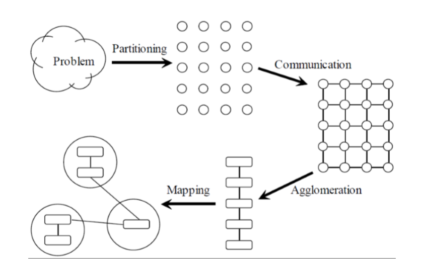

#### 1. Partitioning：划分、解耦

##### 定义

- 将任务和数据划分成子任务

##### 三种不同实现方式及目的

**数据并行**

- （数据/按域分解）
- 将数据分成几部分
- 确定如何将计算与数据关联
- 数据如何划分给处理器？
- 每个处理器如何执行任务？
- 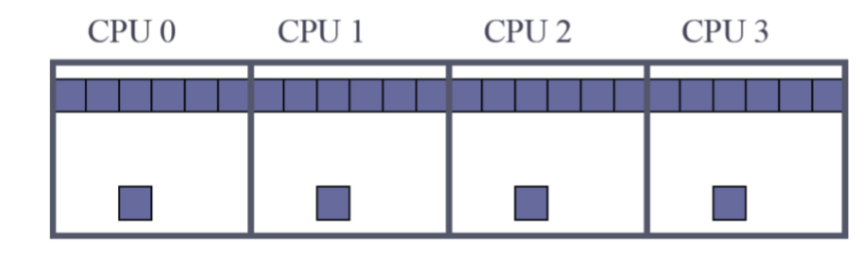

**任务并行**

- （任务/功能分解）
- 把计算分成几部分
- 确定如何将数据与计算关联
- 划分任务给处理器？
- 再确定数据的获取？
- 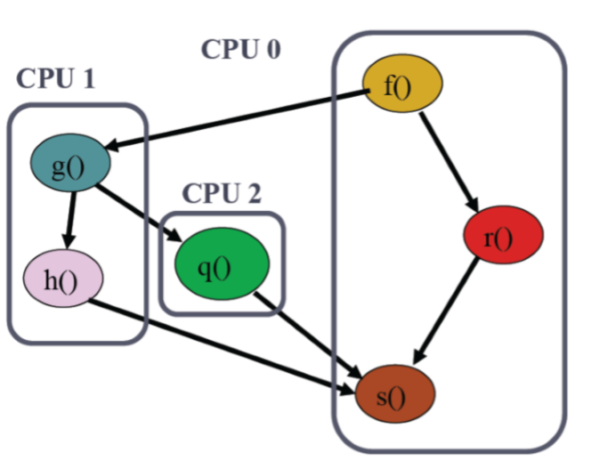

**流水并行**

- 特殊类型的任务分解
- 适用于存在明显工作流程的场景
- 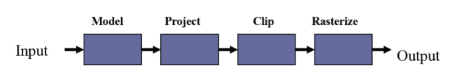

##### 分解注意的问题

- 基本任务至少比目标计算机中的处理器多10倍
  - 否则，以后的设计选项可能会受到太多约束
- 最小化冗余计算和冗余数据存储
  - 否则，当问题的规模增大时，可能无法很好地工作
- 基本任务大小大致相同
  - 否则，处理器之间的难以负载均衡
- 任务数是问题大小的一个递增函数（任务越大，划分越多）
  - 否则，就不可能使用更多的处理器来解决大型问题

#### 2. Communication：通信

##### 定义

- 确定任务之间的通信
  - Task-channel graph（任务数据依赖图）
  - 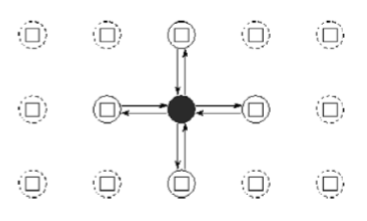

##### 分类

- 局部通信：Local communication

  - 任务需要其他任务的数据

  - 需要创建通信频道

    

- 全局通信：Global communication

  - 大量的任务提供数据来执行计算（比如计算结果的汇总）
  - 不需要创建通信频道

##### 注意事项

- 通信是并行算法的开销，我们需要最小化
- 任务之间的通信操作均衡
- 每个任务只与一小群邻居通信
- 任务可以并行通信
- 任务可以并行计算

#### 3. Agglomeration ：整合、归并

##### 定义

- 将小任务归并成大任务

##### 目标和意义

- 提升性能：Improve performance
  - 减少通信
- 维护程序的可扩展性：Maintain scalability of program：
  - 随着程序规模增加而增加
- 简化编程：Simplify programming：
  - 如果我们将一个串行程序并行化，归并可以使我们更充分地利用现有的串行代码，从而减少开发并行程序的时间和开销。

##### 注意事项

- 并行算法的局部性增加了
- 归并后的冗余计算开销少于归并前通信开销
- 数据规模增加不影响可扩展性
- 归并得到的任务具有相似的计算和通信成本
- 任务数量随着问题的大小而增加
- 适合可能的目标系统的任务数量
- 在归并和代码修改成本之间进行权衡

#### 4. Mapping：映射

##### 定义

- 把任务分配到处理器上的过程
  - Centralized multiprocessor（中心多处理器系统）: OS分配
  - Distributed memory system（分布式系统）: 用户分配

##### 目标矛盾

- 最大化处理器利用率
- 最小化通信

##### 决策树

分两种情况：静态任务和动态任务

- 静态任务（任务数量确定）

  - Structured communication（结构化通信）

    - 每个任务计算时长相对稳定

      (a) 归并、减少通信

      (b) 为每个任务映射一个CPU

    - 每个任务计算时长不稳定

      (a) **循环**为每个任务映射一个CPU

  - Unstructured communication（无结构化通信）

    - 使用静态负载均衡算法

- 动态任务（任务数量不确定）

  - 任务之间频繁通信
    - 动态负载均衡算法
  - 许多小任务
    - 运行时调度算法

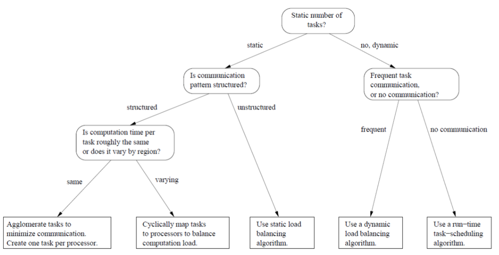

##### 注意事项

- 基于每个处理器一个任务和每个处理器多个任务的考虑设计
- 评估静态和动态任务分配
- 如果选择动态任务分配，任务分配器不能是性能的瓶颈
- 如果选择静态任务分配，任务与处理器的比率至少为10:1

### 并行设计举例——边界值、散热问题（PPT）

### 依赖图：dependency graph

- 节点
  - 函数
  - 操作符
  - 常量、变量
- 边
  - 数据流依赖
  - 控制流依赖

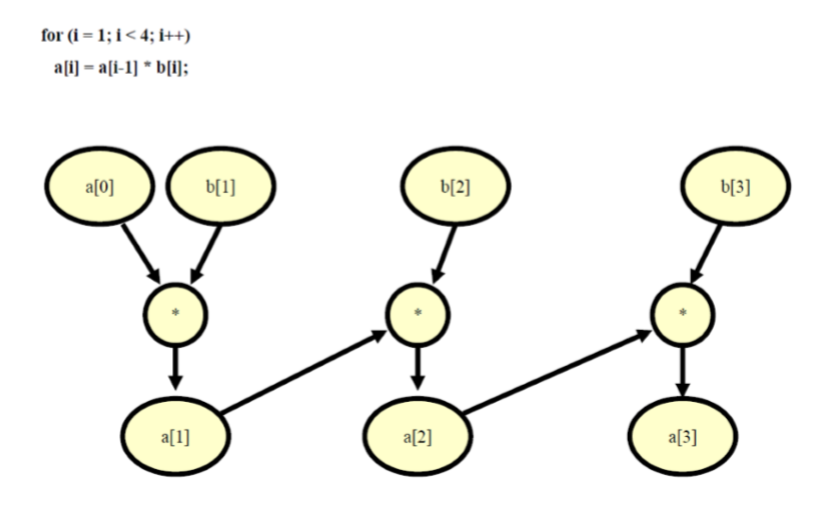

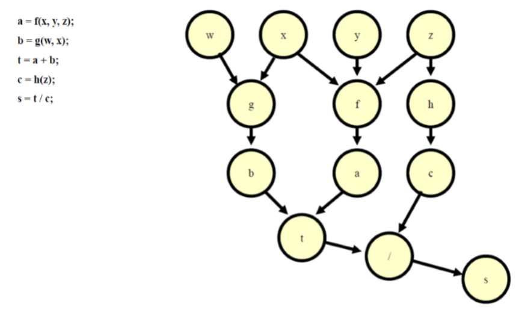

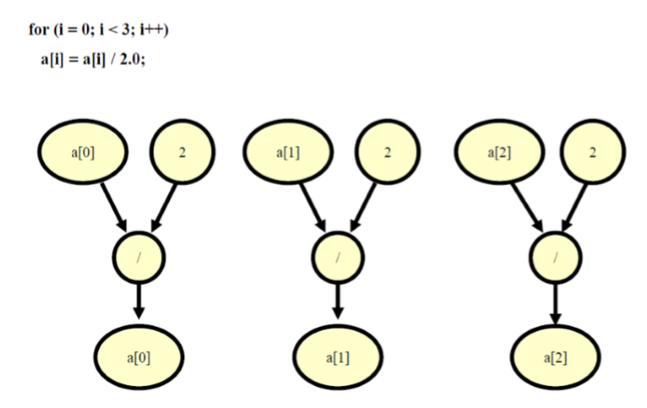