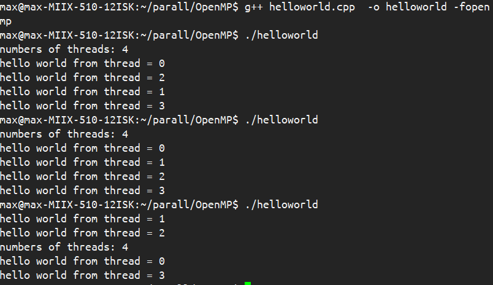
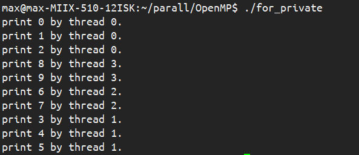

## 一、OpenMP

> OpenMP是由OpenMP Architecture Review Board牵头提出的，并已被广泛接受的，用于共享内存并行系统的多线程程序设计的一套编译指令 (Compiler Directive)。OpenMP支持的编程语言包括C语言、C++和Fortran；而支持OpenMP的编译器包括Sun Compiler，GNU Compiler和Intel Compiler等。OpenMP提供了对并行算法的高层的抽象描述，程序员通过**在源代码中加入专用的pragma**来指明自己的意图，由此编译器可以**自动将程序进行并行化，并在必要之处加入同步互斥以及通信**。当选择忽略这些pragma，或者编译器不支持OpenMP 时，程序又可退化为通常的程序(一般为串行)，代码仍然可以正常运作，只是不能利用多线程来加速程序执行。
>
> OpenMP提供的这种对于并行描述的高层抽象**降低了并行编程的难度和复杂度**，这样程序员可以把更多的精力投入到并行算法本身，而非其具体实现细节。对基于数据分集的多线程程序设计，OpenMP是一个很好的选择。同时，使用OpenMP也提供了更强的灵活性，可以较容易的适 应不同的并行系统配置。线程粒度和负载平衡等是传统多线程程序设计中的难题，但在OpenMP中，OpenMP库从程序员手中接管了部分这两方面的工作。

OpenMP是专为多处理器/核，共享内存机器所设计的。底层架构可以是UMA和NUMA。即Uniform Memory Access和Non-Uniform Memory Access。

- 其特点是**仅使用线程实现并行**（不涉及指令级并行）；
- 共享内存的并行编程模型；
- 一个线程的运行是可由操作系统调用的最小处理单元；
- 线程们存在于单个进程的资源中；
- 通常，线程数与机器的处理器/核数相匹配，实际上会取决于实际的机器；
- OpenMP采用的是Fork-Join模型（主线程-子线程）
- 所有的OpenML程序都以一个单个进程——master thread开始，master threads按顺序执行知道遇到第一个并行区域
- Fork：主线程创造一个并行线程组
- Join：当线程组完成并行区域的语句时，它们同步、终止，仅留下主线程

### 编译要求

下面的例子采用加上<omp.h>头文件。

在代码中加上`#pragma omp <directive> [clause[[,] clause] ...]`即可。

使用命令`gcc filename.c -o filename -fopenmp`进行编译即可。


## 二、指令与变量

### 1、线程创建与释放

使用最简单的hello world熟悉其指令：

```c
#include <stdio.h>
#include <stdlib.h>
#include <omp.h>

int main()
{
    int nthreads,tid;

    # pragma omp parallel private(nthreads,tid)
    {
        tid = omp_get_thread_num();
        if(tid==0)
        {
            nthreads = omp_get_num_threads();
            printf("numbers of threads: %d\n", nthreads);
        }
        printf("hello world from thread = %d\n",tid);
    }
    return 0;
}

```

`# pragma omp parallel private(nthreads,tid)`将之后的代码块都被多个线程并行各执行一遍，使用库函数`omp_get_num_threads()`可以得到总线程数，使用库函数`omp_get_thread_num()`可以得到当前的线程。



由于并行编程的不可重现性，多次运行得到的结果是不同的，原因是不同线程运行的相对速度无法预测。

#### parallel

- `#pragma omp parallel`
  - 最基本的 parallel 指令，这条指令后的代码将被并行化，线程数量将由系统自行决定，可以在 parallel 之后加上num_threads 子句指定线程数量；
- `#paragm omp parallel num_threads (thread_count)`
  - 指定我们的并行化代码将由 thread_count 个线程来进行执行
  - 程序本身只含有一个线程，在遇到该指令之后，原来的线程继续执行，另外的 thread_count – 1 个线程被启动，这 thread_count 个线程称为一个线程组，原始线程为主线程，额外的 thread_count – 1 个线程为子线程，在并行化代码块的末尾存在一个隐式路障，所有线程都到达隐式路障后子线程结束，主线程继续执行。


### 2、for

指令用在for循环之前，把for循环并行化由多个线程执行。循环变量只能是整型。

```c
# pragma omp parallel for
for(int i=0;i<10;i++)
{
  printf("print %d by thread %d.\n",i,omp_get_thread_num());
}

```

在for循环前使用指令`# pragma omp parallel for`同时启用并行和for循环优化，若代码块之前已经存在了`parallel`，则仅需要`# pragma omp for`指令。运行结果如下：



for指令官方格式如下：

```c
#pragma omp for [clause ...] newline
                schedule （type [，chunk]）
                ordered
                private （list）
                firstprivate （list）
                lastprivate （list）
                shared （list）
                reduction （operator：list）
                collapse （n）
                nowait for_loop
```

- `#pragma omp parallel for`
  - 用于并行化 for 循环，不能并行化 while 等其他循环。
  - 循环变量必须在循环开始执行前就已经明确，不能为无限循环。
  - 不能存在其他循环出口，即不能存在 break、exit、return 等中途跳出循环的语句。
  - 在程序执行到该指令时，系统分配一定数量的线程，每个线程拥有自己的循环变量，互不影响.
  - 每一个线程都含有自己的私有变量副本
  - 所有线程在 for 循环中不能访问最开始定义的那个全局变量，它们操作的都是自己的私有副本.

变量类型如下：

- OpenMP中一个变量可以有三种类型，即`shared`、`private`和`reduction`，默认为`shared`；
- 在并行for循环中紧临`parallel for`语句的循环变量是私有的；
- 并行区域代码块里的声明的变量是私有的；
- 所有通过`private`，`firstprivate`，`lastprivate`和`reduction`子句声明的变量为私有变量。

#### private

变量在线程中私有，即在线程开始时被创建，线程结束后被释放。**此时的私有变量并没有被初始化。**

```cpp
#pragma omp  parallel for private (x,y)
for (i = 0; i <= 10;i++) {
    x = i;
    y = i+1;
    printf("Thread number: %d  x: %d\n",omp_get_thread_num(),x);
}
```


#### firstprivate

变量在线程中私有，即在线程开始时被创建，线程结束后被释放。**私有变量创建时使用共享变量进行初始化。**


#### lastprivate

变量在线程中私有，即在线程开始时被创建，线程结束后被释放。**私有变量创建时没有进行初始化，结束时将最后一个离开并行化块的线程的最后一次循环迭代的私有副本赋值给原先的共享变量**


### 3、线程管理

#### single

被声明的部分仅允许一个线程执行，其余不执行这个代码块的线程会在代码块的末尾**被阻塞（隐式 barriers）**，等待所有的线程执行到该位置后，继续向后执行。

不限定所执行的线程。`#pragma omp single`

#### master

仅由主线程执行，其他线程**直接跳过**该子句后面的代码块，不存在隐式barrier。`#pragma omp master`

#### sections、section

让不同线程执行不同代码，先声明`sections`，在其中声明独立的`section`，不同的`section`由不同的线程执行，每一个`section`仅由一个线程执行。

```cpp
   #pragma omp  sections
    {
        #pragma omp section
        {
            printf("section0,threadid=%d\n",omp_get_thread_num());
            sleep(1);
        }
        #pragma omp section
        {
            printf("section1,threadid=%d\n",omp_get_thread_num());
            sleep(1);
        }
        #pragma omp section
        {
            printf("section2,threadid=%d\n",omp_get_thread_num());
            sleep(1);
        }
    }

    #pragma omp parallel sections num_threads(4)
    {
        #pragma omp section
        {
            printf("section3,threadid=%d\n",omp_get_thread_num());
            sleep(1);
        }
        #pragma omp section
        {
            printf("section4,threadid=%d\n",omp_get_thread_num());
            sleep(1);
        }
        #pragma omp section
        {
            printf("section5,threadid=%d\n",omp_get_thread_num());
            sleep(1);
        }
    }
```


#### reduction

归并，对应一类数据类型，一般应用在`parallel`、`for`、`sections`中，将每个线程中的 result 变量的值相加，最后在所有从线程结束后，放入共享变量中。

声明方式如下：

```assembly
#pragma omp ... reduction (op:list)
```

op：操作类型，`+  -  *  ^  &  |  &&  ||`

list：操作数

```cpp
int sum = 0;

#pragma omp parallel for reduction (+:sum)
for(int i=0;i<10;i++)
	sum += i;

return sum;
```


### 4、竞争与同步

#### barrier

显式：`#pragma omp barrier`

隐式：`for、single`会在代码块结尾处自动添加障碍；

```c
#include <stdio.h>
#include <stdlib.h>
#include <omp.h>

int main()
{
    int nthreads,tid;

    # pragma omp parallel private(tid)
    {
        tid = omp_get_thread_num();
        printf("hello world from thread = %d\n",tid);
        #pragma omp barrier
        printf("hi world from thread = %d\n",tid);
    }
    return 0;
}
```

```assembly
# 执行结果
max@max-MIIX-510-12ISK:~/parall/OpenMP$ gcc barrier.c  -o barrier -fopenmp
max@max-MIIX-510-12ISK:~/parall/OpenMP$ ./barrier 
hello world from thread = 0
hello world from thread = 2
hello world from thread = 3
hello world from thread = 1
hi world from thread = 0
hi world from thread = 2
hi world from thread = 1
hi world from thread = 3
```


#### nowait

取消屏障：`#pragma omp nowait`，优先级比`barrier`更高，可在`for、single`中使用；


处理数据竞争的方法：

- 1、变量私有化
    - 使用OpenMP的private子句将变量变为私有
    - 在线程函数内声明变量，这样变量将属于这个线程
    - 在线程堆栈上进行分配

- 2、将共享变量放置进入临界区

-   3、互斥访问
    - 信号量
    - 互斥锁机制

### 5、临界区

#### critical

确保一次只有一个线程执行结构化代码，后面跟的语句相当于串行执行；

#### atomic

只对一条指令形成临界区，而且只能用在形如 x = 、x++、x--之类的临界区中。执行速度更快。

```cpp
#pragma omp parallel for
    {
        for(int i = 0; i < n; i++) {
            #pragma omp critical
            x[index[i]] += WorkOne(i);
            y[i] += WorkTwo(i);
        }
    }

#pragma omp parallel for
    {
        for(int i = 0; i < n; i++) {
            #pragma omp atomic
            x[index[i]] += WorkOne(i);
            y[i] += WorkTwo(i);
        }
    }
```


### 5、循环调度

#### schedule

设置for循环的并行化方法，有 dynamic（动态）、static（静态）、guide、runtime 四种方法。

```cpp
#pragma omp parallel for schedule (dynamic, 2)
```

static：静态分配，每个线程分配chunk个迭代，按照线程顺序划分；

dynamic：动态分配，每个线程分配chunk个迭代，每次线程迭代完成后，请求下一组任务；

guided：动态分配的一种，以较大的任务块开始动态调度，任务块大小减小，但任务块大小有下界。第一个bolck：`num_of_iterations/num_of_threads`；接下来的block：`remain_num_of_iterations/num_of_threads`

```cpp
//static

//dynamic

//guided

```


### 6、循环转换

循环分离fission、循环融合fusion、循环交换exchage；

#### 循环分离fission

- 循环存在依赖关系；
- 分离循环编程多个循环；
- 这多个循环**可以并行执行**

```cpp
//例
float *a, &b;
for(int i=1; i<N; i++)
{
	if(b[i]>0.)	a[i] = 2.;
	else	a[i] = 2. * fabs(b[i]);
	b[i] = a[i-1]; //这一句包括依赖关系
}


//进行优化
float *a, &b;
#pragma omp parallel
{
  #pragma omp for
  for(int i=1; i<N; i++)
  {
    if(b[i]>0.)	a[i] = 2.;
    else	a[i] = 2. * fabs(b[i]);
  }
  #pragma omp for
  for(int i=1; i<N; i++)
  {
    b[i] = a[i-1];
  }
}

```


#### 循环融合fusion

- 融合循环，增加并行粒度；
- 每个线程迭代都有开销；
- 将变量进行拷贝，可能能让程序更快（避免barrier，减少同步开销）

```cpp
//例子
for(int i=1; i<N; i++)
{
  a[i] = foo(i);
}
x = a[0]/a[N-1]; //进行了同步
for(int i=1; i<N; i++)
{
  b[i] = x*a[i];
}
y = x*b[0]/b[N-1]; //进行了同步


//进行优化
#pragma omp for
for(int i=1; i<N; i++)
{
  a[i] = foo(i);
}
#pragma omp single 
x = a[0]/a[N-1]; //进行了同步
#pragma omp for
for(int i=1; i<N; i++)
{
  b[i] = x*a[i];
}
#pragma omp single
y = x*b[0]/b[N-1];


//
```


#### 循环交换exchage

- 嵌套 for 循环可能具有阻止并行化的数据依赖关系；
- 交换的嵌套 for 循环可以：
  - 使循环并行
  - 提高操作粒度
  - 提高并行程序的局部性

```cpp
//例子
for (int j =1; j < n; j++)
	for (int i = 0; i < m; i++)
		a[i][j] = 2 * a[i][j-1];


//优化
for (int j =1; j < n; j++)
  #pragma omp parallel for
  for (int i = 0; i < m; i++)
    a[i][j] = 2 * a[i][j-1];
//内循环每次计算一列，一个线程一次得到的任务只有数组中一个元素

//循环交换
#pragma omp parallel for
for (int i =0; i < n; i++)
  for (int j= 1; j < m; j++)
    a[i][j] = 2 * a[i][j-1];
//直接将数组按行划分给线程，
//一个线程一次得到的任务有一行的，并行循环粒度较高
```


## 附录

附录内容来自参考资料[OpenMP入门教程](https://www.cnblogs.com/lfri/p/10111315.html)系列博客，感谢。

### 指令（directive）

共11个

- atomic 内存位置将会原子更新（Specifies that a memory location that will be updated atomically.）
- barrier 线程在此等待，直到所有的线程都运行到此barrier。用来同步所有线程。
- critical 其后的代码块为临界区，任意时刻只能被一个线程运行。
- flush 所有线程对所有共享对象具有相同的内存视图（view of memory）
- for 用在for循环之前，把for循环并行化由多个线程执行。循环变量只能是整型
- master 指定由主线程来运行接下来的程序。
- ordered 指定在接下来的代码块中，被并行化的 for循环将依序运行（sequential loop）
- parallel 代表接下来的代码块将被多个线程并行各执行一遍。
- sections 将接下来的代码块包含将被并行执行的section块。
- single 之后的程序将只会在一个线程（未必是主线程）中被执行，不会被并行执行。
- threadprivate 指定一个变量是线程局部存储（thread local storage）

### 从句（clause）

共13个

- copyin 让threadprivate的变量的值和主线程的值相同。
- copyprivate 不同线程中的变量在所有线程中共享。
- default Specifies the behavior of unscoped variables in a parallel region.
- firstprivate 对于线程局部存储的变量，其初值是进入并行区之前的值。
- if 判断条件，可用来决定是否要并行化。
- lastprivate 在一个循环并行执行结束后，指定变量的值为循环体在顺序最后一次执行时获取的值，或者#pragma sections在中，按文本顺序最后一个section中执行获取的值。
- nowait 忽略barrier的同步等待。
- num_threads 设置线程数量的数量。默认值为当前计算机硬件支持的最大并发数。一般就是CPU的内核数目。超线程被操作系统视为独立的CPU内核。
- ordered 使用于 for，可以在将循环并行化的时候，将程序中有标记 directive ordered 的部分依序运行。
- private 指定变量为线程局部存储。
- reduction Specifies that one or more variables that are private to each thread are the subject of a reduction operation at the end of the parallel region.
- schedule 设置for循环的并行化方法；有 dynamic、guided、runtime、static 四种方法。shared 指定变量为所有线程共享。
  - schedule(static, chunk_size) 把chunk_size数目的循环体的执行，静态依序指定给各线程。
  - schedule(dynamic, chunk_size) 把循环体的执行按照chunk_size（缺省值为1）分为若干组（即chunk），每个等待的线程获得当前一组去执行，执行完后重新等待分配新的组。
  - schedule(guided, chunk_size) 把循环体的执行分组，分配给等待执行的线程。最初的组中的循环体执行数目较大，然后逐渐按指数方式下降到chunk_size。
  - schedule(runtime) 循环的并行化方式不在编译时静态确定，而是推迟到程序执行时动态地根据环境变量OMP_SCHEDULE 来决定要使用的方法。
- shared 指定变量为所有线程共享。

### 库函数（Run-Time Library Routines）

共22个：

1.void omp_set_num_threads(int _Num_threads);

在后续并行区域设置线程数，此调用只影响调用线程所遇到的同一级或内部嵌套级别的后续并行区域.说明：此函数只能在串行代码部分调用.

2.int omp_get_num_threads(void);

返回当前线程数目.说明：如果在串行代码中调用此函数，返回值为1.

3.int omp_get_max_threads(void);

如果在程序中此处遇到未使用 num_threads() 子句指定的活动并行区域,则返回程序的最大可用线程数量.说明：可以在串行或并行区域调用，通常这个最大数量由omp_set_num_threads()或OMP_NUM_THREADS环境变量决定.

4.int omp_get_thread_num(void);

返回当前线程id.id从1开始顺序编号,主线程id是0.

5.int omp_get_num_procs(void);

返回程序可用的处理器数.

6.void omp_set_dynamic(int _Dynamic_threads);

启用或禁用可用线程数的动态调整.(缺省情况下启用动态调整.)此调用只影响调用线程所遇到的同一级或内部嵌套级别的后续并行区域.如果 _Dynamic_threads 的值为非零值,启用动态调整;否则,禁用动态调整.

7.int omp_get_dynamic(void);

确定在程序中此处是否启用了动态线程调整.启用了动态线程调整时返回非零值;否则,返回零值.

8.int omp_in_parallel(void);

确定线程是否在并行区域的动态范围内执行.如果在活动并行区域的动态范围内调用,则返回非零值;否则,返回零值.活动并行区域是指 IF 子句求值为 TRUE 的并行区域.

9.void omp_set_nested(int _Nested);

启用或禁用嵌套并行操作.此调用只影响调用线程所遇到的同一级或内部嵌套级别的后续并行区域._Nested 的值为非零值时启用嵌套并行操作;否则,禁用嵌套并行操作.缺省情况下,禁用嵌套并行操作.

10.int omp_get_nested(void);

确定在程序中此处是否启用了嵌套并行操作.启用嵌套并行操作时返回非零值;否则,返回零值.

互斥锁操作 嵌套锁操作 功能

11.void omp_init_lock(omp_lock_t * _Lock); 12. void omp_init_nest_lock(omp_nest_lock_t * _Lock);

初始化一个（嵌套）互斥锁.

13.void omp_destroy_lock(omp_lock_t * _Lock); 14.void omp_destroy_nest_lock(omp_nest_lock_t * _Lock);

结束一个（嵌套）互斥锁的使用并释放内存.

15.void omp_set_lock(omp_lock_t * _Lock); 16.void omp_set_nest_lock(omp_nest_lock_t * _Lock);

获得一个（嵌套）互斥锁.

17.void omp_unset_lock(omp_lock_t * _Lock); 18.void omp_unset_nest_lock(omp_nest_lock_t * _Lock);

释放一个（嵌套）互斥锁.

19.int omp_test_lock(omp_lock_t * _Lock); 20.int omp_test_nest_lock(omp_nest_lock_t * _Lock);

试图获得一个（嵌套）互斥锁,并在成功时放回真（true）,失败是返回假（false）.

21.double omp_get_wtime(void);

获取wall clock time,返回一个double的数,表示从过去的某一时刻经历的时间,一般用于成对出现,进行时间比较. 此函数得到的时间是相对于线程的,也就是每一个线程都有自己的时间.

22.double omp_get_wtick(void);

得到clock ticks的秒数.

## 参考资料

[OpenMP--private, shared变量](https://blog.csdn.net/s170262941/article/details/11521981)

[OpenMP入门教程（一）](https://www.cnblogs.com/lfri/p/10111315.html)

